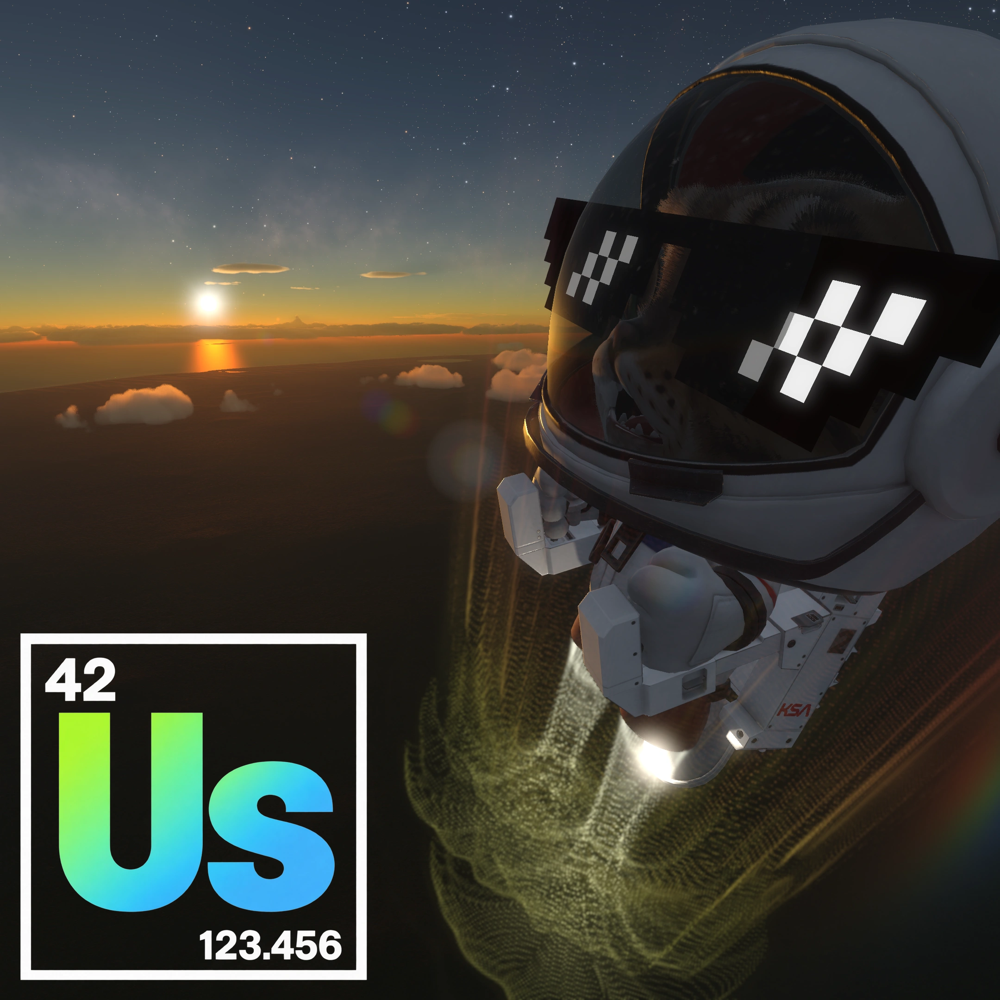
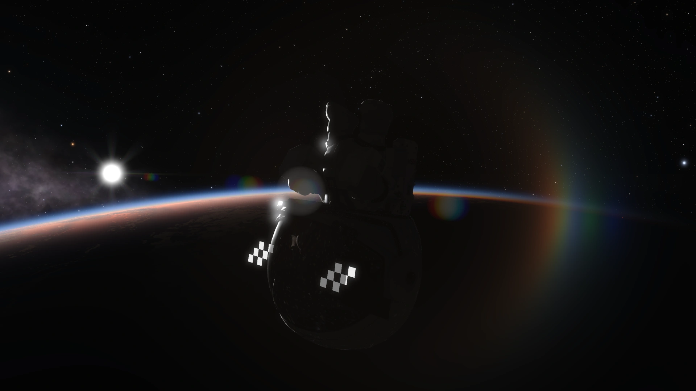
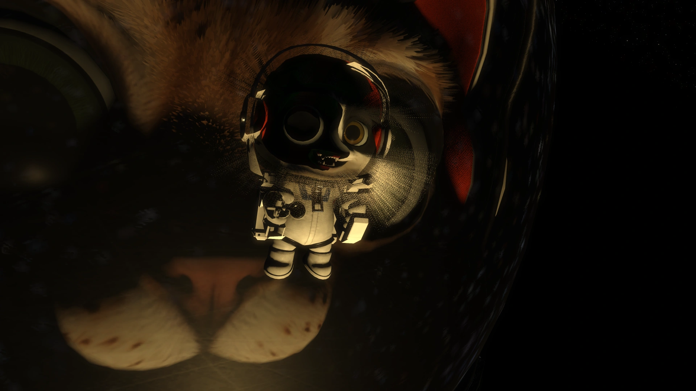

# unscience

**unscience** is a Kitten Space Agency mod that lets you do ubsurd, silly things to KSA.

It breaks physics, moves things around, resizes things, makes noises, changes colors and textures, and much more.

I describe it as a *supermod* that includes a suite of *submods*, each one has a fun unique name tangentially related to what it does, usually from some kind of pop culture reference.

# game compatibility

Built against KSA **2026.9.22.5482** (previously 2026.9.10.5438). This build has passed compilation
and managed tests only; in-game acceptance is pending. See
[KSA compatibility](unscience/README.md#ksa-compatibility) for user-visible changes and
[ISSUES.md](ISSUES.md) for known gaps.

# releases

GitHub Actions uses `1.${GITHUB_RUN_NUMBER}.0` for stable releases from `main`
and `1.${GITHUB_RUN_NUMBER}.0-beta` for prereleases from `feature/*` branches.
The major version is fixed at `1` and the patch version at `0`. The same version
is used in `mod.toml`, the release title, and the ZIP filename; Git tags add a `v`
prefix. Reruns preserve an existing release. After publishing, main retains its
10 newest releases and all beta branches share the five newest prereleases.
Older releases and their tags are deleted, including releases using the previous
date-based main and timestamp-based feature formats. Other branches build only.

# media

