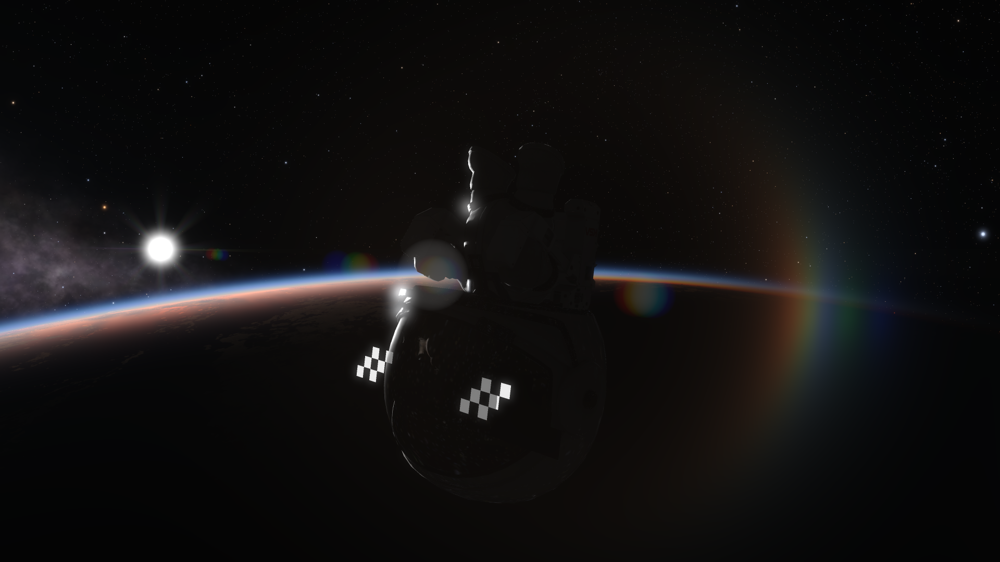
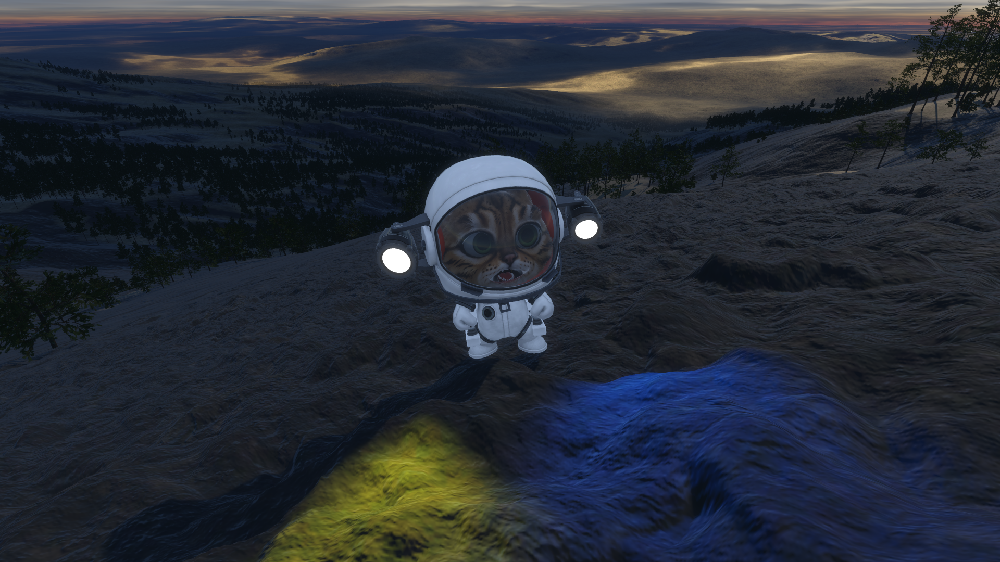
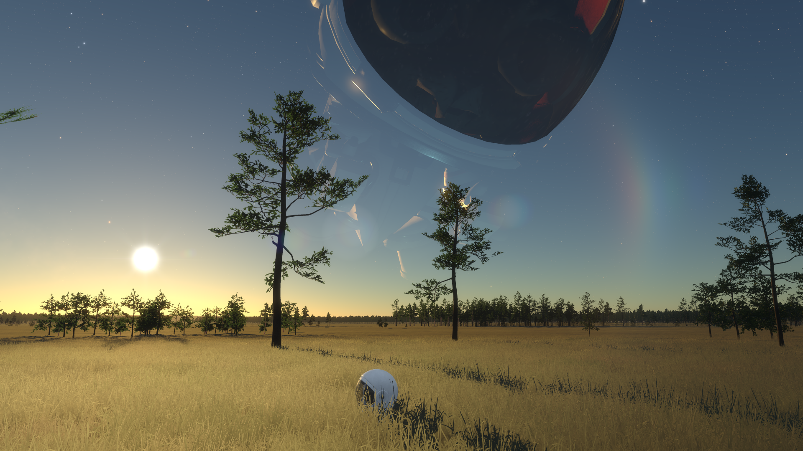
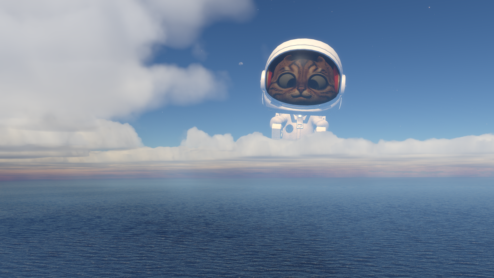
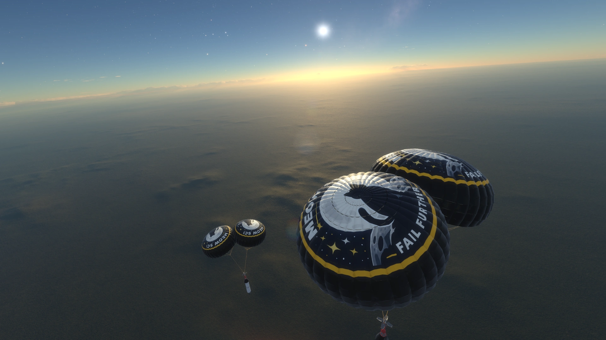

# unscience

**unscience** is a Kitten Space Agency mod that lets you do ubsurd, silly things to KSA.

It breaks physics, moves things around, resizes things, makes noises, changes colors and textures, and much more.

I describe it as a *supermod* that includes a suite of *submods*, each one has a fun unique name tangentially related to what it does, usually from some kind of pop culture reference.

# media

