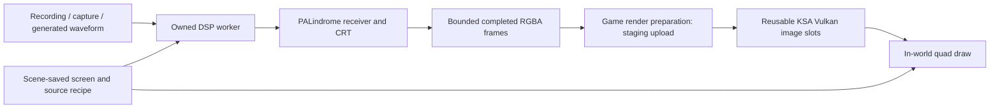

# PALindrome inside KSA: feasibility and implementation design

Research date: 2026-09-18 (America/New_York). This is a source investigation and proposed design, not an implemented Unscience feature.

Follow-up research, 2026-09-19: [section 13](#13-producing-a-shared-six-channel-rf-feed) examines sender-generated PAL signals, a server that combines them without decoding pictures, and practical sample rates and transport contracts.

## Verdict

**Yes: PALindrome can practically supply the image for a CRT screen on an in-world KSA quad.** The most direct architecture is a small native C++ library, a C ABI called from C#, and a reusable Vulkan texture owned by the mod. Separate Windows and Linux binaries are a sensible distribution model. PALindrome does not need to own a window, graphics context, or game renderer: its existing CPU implementation returns ordinary pixel buffers.

The recommendation is to start with **one simulated receiver, prerecorded or generated baseband composite input, CPU decoding, and an asynchronously uploaded texture**. Multiple quads can share that receiver's output. Establish the visual result and CPU budget before undertaking a GPU port or physical capture integration.

There are material qualifications:

- **Redistribution permission is unresolved.** The inspected PALindrome checkout has no project license grant. Public GitHub availability does not by itself establish permission to ship its source or native binaries.
- **Real-time performance alongside KSA is unproven.** Upstream's real-time demonstration uses substantial CPU parallelism on an 18-core machine. The GPU texture upload is likely a smaller cost than the receiver and phosphor simulation, but that must be measured in KSA.
- **RGB-to-PAL encoding is new work.** The CLI's `encode` and `decode` commands are stubs. The working decoder is reached through `render` or the native library. Existing RGB frames from a terminal or game camera are not PAL waveforms.
- **Windows is a porting task, not an existing release target.** The library is much more portable than the POSIX-oriented CLI. Fix build configuration and native lifetime issues before integrating it into the game process.
- **This is a behavioral CRT model, not a microscopic tube simulation.** It models the beam, receiver, phosphor accumulation and decay, and several analog imperfections. It does not currently draw a physical shadow mask or spatial RGB phosphor-dot lattice.

## 1. Evidence and scope

| Input | Inspected baseline |
|---|---|
| PALindrome | `/Users/asherwin/repos/github/PALindrome`, commit `03da0f5d901874b4cd4ac85b48ffbd46e543a46a`, remote `mattgodbolt/PALindrome` |
| Unscience | `/Users/asherwin/repos/meow-sci/unscience`, commit `a2c12d227742391d012b5be2f1736d69212becc3` |
| Current KSA sources and assets | Sibling `ksa-game-assemblies/current`, repository commit `93eb864fcb4ade430f77812196b0b0ed8e4ece4c`; KSA `2026.9.10.5438` per [the integration baseline](../scope/FULL_SCOPE.md) |
| Existing world quad | [Thug Life renderer](../thug-life.lib/ThugLifeQuadRenderer.cs), [texture factory](../thug-life.lib/ThugLifeTextureFactory.cs), [render hooks](../thug-life.lib/ThugLifeRenderPatches.cs), and [save adapter](../thug-life.lib/ThugLifeSubmod.Persistence.cs) |
| Companion terminal | Sibling `purrtty`, commit `efff151b30321d7010fd55041753ebb04c7d22a9`; inspected its in-world texture producer and lifetime contract |
| Lifecycle and persistence | [Architecture](../scope/00-architecture-and-abstractions.md), [render scope](../scope/pixel-grids-and-render.md), [save scope](../scope/saves.md), [save acceptance](saves-acceptance.md) |

PALindrome links below are pinned to the inspected revision. KSA references use the sibling checkout; its proprietary sources are not reproduced here. Historical `unscience/decomp/ksa` and `.agents/skills/ksa/quad.md` are not authoritative for the current renderer: notably, their `Program.OffScreenPass` instructions predate dynamic rendering.

Three parallel investigations covered PALindrome's signal/CRT pipeline, native builds, and the KSA renderer. Findings distinguish code that exists, experiments actually run, and implementation proposals. No game integration was added by this research.

## 2. What PALindrome actually contains

### 2.1 The pipeline is already suitable for embedding

The reusable boundary is [`video::Decoder`](https://github.com/mattgodbolt/PALindrome/blob/03da0f5d901874b4cd4ac85b48ffbd46e543a46a/lib/include/palindrome/decoder.hpp#L72), not the executable's `main()`:

```text
Sampled RF / IF ── receiver front end ─┐
                                     ├─ normalized receiver envelope
Sampled CVBS ── CompositeInput ────────┘
   → AGC
   → sync low-pass → sync separator → horizontal and vertical timebases
   → chroma decoder, aligned with the timing rails
   → Screen: gun drive, beam location, analog loading effects
   → CpuDepositBackend: phosphor accumulation, decay, readout
   → owned grayscale or RGB byte buffer
```

For already normalized synthetic receiver-envelope samples, the caller can enter directly at `Decoder`, bypassing both RF and CVBS input conversion. These are distinct input contracts; a wrapper should name them separately to prevent polarity/level mistakes.

The important native calls are:

| Existing interface | Meaning for the mod |
|---|---|
| `Decoder(DecoderConfig)` | Construct one persistent receiver/tube instance with its own state. |
| `prepare(max_in)` | Allocate stage buffers for a declared maximum block size. |
| `decode_into(DecodedBlock&, span<const float>)` | Advance AGC, synchronization, timebases, and chroma; copy aligned output rails into an owned block. |
| `deposit(block, on_field)` | Advance the CRT and call back at field boundaries. This work has one owner. |
| `FieldEvent::frame()` | Produce the current field-boundary readout synchronously, while inside the callback. |
| `snapshot()` / `latched_frame()` | Obtain pixel output; these can flush pending deposits and are not safe to race against `deposit`. |

`DecodedBlock` contains separate owned picture, horizontal-beam, and vertical-beam arrays. This deliberately permits ordered decoding and deposit stages on different workers. The native API uses C++ types (`std::span`, `std::vector`, exceptions, `std::function`), so it should remain behind a C ABI rather than being marshalled directly into C#.

[`Frame`](https://github.com/mattgodbolt/PALindrome/blob/03da0f5d901874b4cd4ac85b48ffbd46e543a46a/lib/include/palindrome/deposit_backend.hpp#L13) owns a row-major byte vector, width, height, and channel count. Output is one-channel gray or three-channel interleaved RGB. It is not a PNG, not BGRA, and not a Vulkan image. PNG encoding is an optional consumer of these pixels; there is no need to encode/decode PNG or JPEG between PALindrome and KSA.

### 2.2 It is stateful sample processing

The pipeline carries FIR histories, oscillator phases, AGC, synchronization lock, PAL color identification, delay-line history, beam loading, and phosphor state across calls. Constructing a new decoder for every game frame would continually restart the television and erase persistence.

PAL timing in [`video_types.hpp`](https://github.com/mattgodbolt/PALindrome/blob/03da0f5d901874b4cd4ac85b48ffbd46e543a46a/lib/include/palindrome/video_types.hpp#L8) is nominally 15,625 lines/s and 50 fields/s, or 25 two-field interlaced frames/s. The field callback is an observation point on a continuously advancing receiver, including while its free-running timebases are not locked. It is not proof that a broadcast field was correctly detected.

The driver's responsibilities include block sizing, pacing, source loops, warmup, cancellation, and deciding which field readouts to publish. Input chunks may change size within the prepared limit, but sample order and continuity must be preserved. See [architecture](https://github.com/mattgodbolt/PALindrome/blob/03da0f5d901874b4cd4ac85b48ffbd46e543a46a/docs/architecture.md).

### 2.3 The modeled CRT effects

The inspected [screen implementation](https://github.com/mattgodbolt/PALindrome/blob/03da0f5d901874b4cd4ac85b48ffbd46e543a46a/lib/screen.cpp) and [configuration](https://github.com/mattgodbolt/PALindrome/blob/03da0f5d901874b4cd4ac85b48ffbd46e543a46a/lib/include/palindrome/screen.hpp) include:

- Black-level restoration from the back porch and a nonlinear electron-gun response.
- Luma/color-difference matrixing into RGB gun intensity.
- Horizontal/vertical beam motion, yoke shear, retrace blanking, and configurable overscan/centering.
- A Gaussian beam footprint at subpixel positions, including variable focus.
- Persistent floating-point phosphor brightness and exponential fade at field boundaries.
- EHT supply sag: brightness-dependent raster expansion, dimming, and defocus.
- Line loading/pull and average/peak beam-current limiting.
- Readout transfer and quantization into a displayable image.

The receiver also models PAL burst locking, line-alternating color, delay-line behavior, color killing, and imperfect synchronization. This matters if the desired result includes rolling pictures, false color, unstable reception, or realistic acquisition after signal changes.

The default chroma comb is `post` (demodulate first, then combine), a convenience approximation. The more physical fixed-glass delay-line model is an opt-in `glass` mode; `delay-line` and `off` also exist. Choose and record the mode when assessing period fidelity. “PAL-D” in this part of the project denotes delay-line PAL decoding, not a claim of support for every RF broadcast system or every PAL variant.

The implementation has **RGB values at each framebuffer location**, not separately positioned phosphor dots with a metal shadow mask. Field-wide decay approximates continuous emission; it does not decay each pixel independently according to the precise instant the beam last passed it. Upstream documents an interlace-comb compromise, and the API does not expose an explicit field-parity output contract. Glass curvature, bezel geometry, reflections, bloom/halation, and a visible phosphor mask would be additional rendering features.

If the desired close-up look includes individual phosphor dots, add a tube-coordinate mask in a KSA fragment shader after validating the base image. Its pitch should follow physical screen dimensions and viewing distance, with minification filtering to avoid moiré. A mask added to the final image is a visual approximation; it does not make the receiver a physical subpixel simulation.

### 2.4 Library defaults do not reproduce the CLI picture automatically

[`ScreenConfig`](https://github.com/mattgodbolt/PALindrome/blob/03da0f5d901874b4cd4ac85b48ffbd46e543a46a/lib/include/palindrome/screen.hpp#L15) defaults to neutral settings in several places. The CLI applies a period-TV recipe in [`render_command.hpp`](https://github.com/mattgodbolt/PALindrome/blob/03da0f5d901874b4cd4ac85b48ffbd46e543a46a/cli/render_command.hpp#L48) and [`decoder_config`](https://github.com/mattgodbolt/PALindrome/blob/03da0f5d901874b4cd4ac85b48ffbd46e543a46a/cli/render_command.cpp#L544).

| Setting | Library value | CLI recipe |
|---|---:|---:|
| Gun gamma | 1.0 | 2.6 |
| Readout gamma | 1.0 | 2.2 |
| EHT sag | 0 | 0.06 |
| Line pull | 0 | 0.003 |
| Beam-current threshold | 0, disabled | 0.7 |
| Visible scan window | Full scan | Active picture with 6% overscan |
| Color | Off | Opt-in with `--colour` |
| Persistence | 1.6 fields | Same |
| Deposit lanes | 12 | Same |

The CLI also chooses contrast/saturation calibrated provisionally for its console captures. Those values should not be copied blindly onto a generated standard-level source. Extract a named, versioned preset function, then calibrate with gray ramps and color bars. Dimensions and sample rate must be set explicitly.

## 3. Ways to get a signal into the game

### 3.1 Prerecorded sampled PAL: lowest-risk first demonstration

Use a known recorded waveform and preserve its actual sample rate, sample representation, amplitude scale, polarity, and RF carrier/IF information where relevant. PALindrome already has SigMF metadata/data support and raw sample paths. The corpus uses Git LFS; check that a file contains sample data rather than an LFS pointer before trying to decode it.

The current CLI paths accept real int16/u8 samples and explicitly reject complex SigMF recordings; do not assume an arbitrary SDR I/Q recording is accepted. The proposed native float input is a separate in-memory bridge contract. Adapting other capture formats requires a defined conversion stage.

Prefer **baseband CVBS** for an initial feature if RF reception itself is not the point. It bypasses the IF filter/detector cost while retaining downstream synchronization, chroma decoding, and CRT behavior. A pre-normalized envelope is even simpler for a controlled internal source.

A recording is processed according to its sample clock, not as fast as the file can be read. For a loop, decide whether to preserve receiver state over an intentionally discontinuous splice, splice at a suitable signal boundary, or reset and reacquire. A raw loop can create sync/color transients. Pre-decoding a loop into RGB frames is another useful quad/upload demonstration, but it no longer exercises a running receiver or editable analog controls.

### 3.2 Generate PAL from a terminal, test card, or camera

This is achievable, but PALindrome does not supply a production encoder. [`ConvertCommand::run`](https://github.com/mattgodbolt/PALindrome/blob/03da0f5d901874b4cd4ac85b48ffbd46e543a46a/cli/convert_command.cpp#L35) prints that it is unimplemented and returns success. Its exit code is therefore not an encoder capability check.

[`VideoSynth.hpp`](https://github.com/mattgodbolt/PALindrome/blob/03da0f5d901874b4cd4ac85b48ffbd46e543a46a/lib/test/VideoSynth.hpp#L18) is useful test scaffolding: simple line pulses, a white bar, and synthetic color burst/chroma. It is explicitly crude and is not a complete arbitrary-image, correctly interlaced PAL encoder.

A new encoder would:

1. Accept a bounded CPU RGB image or procedurally generate a test card/telemetry panel.
2. Resample it to the chosen active-picture geometry and field cadence. Preserve a declared display aspect ratio; the 720×576 raster's numeric ratio is not automatically the intended physical screen ratio.
3. Produce luma and bandwidth-limited color-difference signals from appropriately gamma-encoded RGB. Linear HDR game pixels need an explicit exposure/tone/transfer conversion first.
4. Generate horizontal sync, front/back porches, blanking, vertical equalizing/broad pulses, half-line interlace timing, and an uninterrupted sample clock.
5. Generate the 4.43361875 MHz chroma subcarrier, alternating PAL V phase and the correctly phased swinging burst. Keep oscillator phase and line/field sequence across calls; do not restart the subcarrier at each RGB frame.
6. Apply the desired composite amplitude convention, then feed `CompositeInput`, or directly produce the receiver-envelope convention expected by `Decoder`.

The existing internal envelope geometry is sync tip 1.0, blanking 0.76, and peak white 0.20. For ideal CVBS expressed as volts above its sync tip, the nominal affine mapping is `envelope = 1 - 0.8 × volts`: 0 V sync, 0.3 V blanking, and 1.0 V white map to those three anchors. Real inputs use the tracking clamp in [`CompositeInput`](https://github.com/mattgodbolt/PALindrome/blob/03da0f5d901874b4cd4ac85b48ffbd46e543a46a/lib/composite.cpp#L22). This level mapping is not a complete PAL encoding algorithm.

A native encoder avoids millions of per-sample managed/native transitions: submit one RGB frame or one block, generate waveforms in native code, and retain the latest source image while it scans. For an unchanged terminal image, reuse its pixels while continuing the PAL waveform and receiver clock.

Suggested order: monochrome test card → complete timing and stable interlace → color bars/burst → changing RGB images → the companion terminal → optional KSA camera. Do not begin by adding RF modulation to an internally generated picture; add it later only if RF impairments are a feature.

### 3.3 A physical live PAL source

The computer must digitize the analog signal before the mod can consume it. PALindrome has RF/IF and sampled-CVBS paths; its live tools demonstrate AirSpy and `cxadc` workflows. These are upstream examples, not a cross-platform device abstraction for KSA.

There are two materially different capture classes:

| Capture output | Integration |
|---|---|
| Raw RF/IF or CVBS samples | Feed PALindrome's receiver pipeline with the declared rate/levels. Preserve actual PAL artifacts. |
| Already decoded USB/OS video frames | Feed the new RGB-to-PAL encoder or a CRT-only path. The capture device has already performed PAL decoding; its original waveform cannot be recovered exactly. |

A sampled stream needs a source interface with format, sample rate, sequence/sample index, discontinuity and EOF/error information. Handle capture overruns explicitly. Keep device drivers or subprocess I/O off the game/render thread. Native Windows/Linux receiver binaries do not imply that a particular capture device and its driver work on both systems.

For an early physical-input experiment, an external capture helper producing a documented local byte stream is reasonable. Do not embed the browser MJPEG/JPEG demonstration as the texture transport; consume the decoder's raw pixels or move the decoder behind the C ABI.

### 3.4 CRT-only operation is a useful second mode

It is possible to bypass PAL reception and feed aligned `ChromaSample`, `BeamSample`, and `VSample` rails to `Screen`. That preserves its gun/beam/phosphor/loading model but requires deliberate level/color scaling and synthesized timing. `Screen` is not a ready-made `RGB image → CRT texture` function.

A custom Vulkan image-space CRT shader would be simpler for hundreds of screens or very constrained CPU budgets. It would have a different fidelity target: scanline/mask/decay effects without PALindrome's sample-level receiver. The decision should be explicit in the UI and design, rather than silently substituting a different effect.

### 3.5 The existing terminal and KSA-camera sources

The identifiable companion is **purrTTY**. Its [in-world instance](../../purrtty/purrTTY.GameMod/InWorld/InWorldTerminalInstance.cs) constructs a UNorm RGBA8 offscreen target, secondary ImGui context and renderer. [PerFrameRenderer](../../purrtty/purrTTY.GameMod/InWorld/PerFrameRenderer.cs) records private command buffers and submits to KSA's graphics queue. Its producer uses a private classic Vulkan render pass; that can coexist with KSA's dynamic-rendering world pass on the same device. There is no OpenGL conversion to solve here.

However, the terminal's `_target` is private. It does not expose a supported public video-source API. A cooperative adapter should provide dimensions, format/transfer, a readiness sequence, stable terminal identity, and a texture lifetime lease with resize/invalidation notifications. Avoid reflection into private fields as the long-term integration contract.

For the recommended CPU PAL pipeline, a GPU-only terminal texture must be **read back asynchronously** to CPU RGB, or the terminal renderer must expose a CPU raster output. A texture handle alone cannot feed `Decoder`. The complete path is then terminal rendering → bounded GPU readback → native PAL encoder/decoder/CRT → GPU upload → screen. This adds synchronization, latency and bandwidth in both directions. Read only at the source's required cadence and downsample before readback if appropriate. Terminal character cells alone are not the final raster; reproducing its fonts/layout is another renderer. Composite the terminal's premultiplied alpha against an intentional opaque screen background before PAL encoding.

A KSA camera can similarly use a secondary viewport's completed final image. [Hot Pursuit](../hot-pursuit.lib/README.md) already manages camera mounts and shared secondary viewport leases, but its stock secondary path has documented scene-effect omissions and a finite slot budget. Prefer a post-tone-map output for ordinary PAL video, or explicitly convert HDR scene color. Use a completed previous frame or an ordered producer/consumer stage: never sample/read back a render target while it is being written. Screens visible to their own source camera need an explicit feedback policy.

These source adapters are why a generated CPU test card is the best first signal. A later same-device Vulkan encoder/CRT path could avoid the readback, but that is significantly more than exporting PALindrome's current CPU decoder.

## 4. Proposed native bridge

### 4.1 Build a small runtime target

PALindrome already defines a CMake library, but its public build target also pulls file/CLI-adjacent dependencies. A maintained fork should separate these concerns:

```text
palindrome-core      DSP, receiver, Screen, CPU deposit; no file or image codec requirement
palindrome-io        optional SigMF/JSON, WAV and PNG helpers
palindrome-cli       CLI, POSIX/live helpers, optional stdexec stage driver
unscience-pal        shared C ABI bridge linked to palindrome-core
```

The core should continue to use upstream algorithms, not duplicate them in C#. Keep the bridge and any PAL encoder small and independently testable. Compile the reusable core into the shared bridge, hiding C++ symbols and exporting only a versioned C surface. A static core linked into the `.so` needs position-independent code.

NVIDIA `stdexec` is a CPU scheduling dependency here, **not a CUDA or NVIDIA-GPU requirement**. The existing ordered stage pipeline uses it, but the decoder and its separate standard-C++ deposit worker pool can be embedded without that driver. A serial native worker is sufficient for a correctness prototype; add bounded stage parallelism when measurements justify it.

The extraction experiment compiled these 17 unchanged implementation files: `agc`, `biquad`, `chroma_decoder`, `composite`, `cpu_deposit`, `dc_blocker`, `decoder`, `demod`, `fft`, `fir`, `gaussian`, `horizontal_sweep`, `mixer`, `screen`, `splat`, `sync_separator`, and `vertical_sync` (all `lib/*.cpp`). Only `sigmf.cpp`, `image.cpp`, and `wav.cpp` were omitted from the current library's source list. RF objects were compiled, but the CVBS probe did not exercise the RF front end.

| Dependency in the existing build | Purpose | Needed by the demonstrated numeric-samples-to-pixels core? |
|---|---|---|
| nlohmann/json 3.11.3 | SigMF metadata and CLI profiles | No |
| lodepng, pinned commit | Image file I/O | No |
| stdexec, pinned commit | Optional stage-pipeline driver | No; retain if using that driver |
| Lyra 1.7.0 | CLI parsing | No |
| Catch2 3.8.0 | Tests/benchmarks | Development only |
| CPM 0.40.5 | Build-time dependency fetching | No runtime role |

If retaining the stdexec build, also pin/cache its ancillary bootstrap downloads: the current helper references moving RAPIDS/sender-receiver branch files despite pinning stdexec itself. Preserve upstream tests separately when introducing the smaller core target.

### 4.2 C ABI contract

An illustrative interface, to be implemented and tested, would look like:

```c
typedef struct pal_session pal_session;

uint32_t pal_abi_version(void);
int32_t pal_create(const pal_config_v1* config, pal_session** out_session);
int32_t pal_push_envelope_f32(pal_session*, const float* samples, uint32_t count);
int32_t pal_push_cvbs_f32(pal_session*, const float* samples, uint32_t count);
int32_t pal_copy_latest_rgba8(pal_session*, uint8_t* destination,
                             uint64_t capacity, pal_frame_info_v1* info);
int32_t pal_reset(pal_session*);
int32_t pal_get_status(pal_session*, pal_status_v1* status);
void    pal_destroy(pal_session*);
```

These are **proposed exports**, not upstream functions. Keep them distinct from a later `pal_submit_rgb8` encoder API. Use opaque handles, fixed-width integers, declared calling convention, struct byte-size/version fields, and UTF-8 copied error messages. Define row stride, orientation, RGBA order, alpha=255, output transfer function, sequence number, sample timestamp, and discontinuity flags. Do not expose C++ `bool`, STL layouts, exceptions, or compiler-owned allocations across the boundary.

Catch exceptions at every exported operation, including creation, allocation, processing and snapshot conversion. Validate dimension/count arithmetic, finite configuration and float input, maximum samples per block, input mode and output capacity before touching native state. The source specifically notes that a NaN can permanently poison the composite clamp. An arbitrary caller is less constrained than an integer recording loader.

For the simplest implementation, one dedicated managed worker owns each session and performs push/read/reset operations sequentially. It publishes copied frames to a bounded mailbox; the render thread never calls `snapshot()` on that session. If a future bridge owns internal workers, define thread-safe polling and shutdown explicitly rather than inheriting it accidentally from the C++ classes.

Use `SafeHandle` or equivalent managed ownership, but perform normal orderly shutdown explicitly. Stop feeding input, cancel blocking I/O, drain/join workers, then destroy decoder state. Do not unload a native module while its code, callbacks, or buffers remain in use. Avoid reverse-P/Invoke callbacks in the first bridge; polling completed buffers makes lifetime management simpler.

### 4.3 Packaging Windows and Linux

Proposed distribution:

```text
unscience/
  MeowSci.Unscience.dll
  MeowSci.PalCrtLib.dll
  runtimes/win-x64/native/unscience_pal.dll
  runtimes/linux-x64/native/libunscience_pal.so
  THIRD-PARTY-NOTICES/...
```

These are illustrative names, not added projects. The existing repository ships only the consolidated Unscience host; do not introduce a second installed host merely to package the native bridge.

Select the architecture and OS explicitly and resolve an absolute path relative to the bridge assembly/mod installation. A loose mod folder is not automatically equivalent to a NuGet package's runtime-asset resolution. .NET provides `NativeLibrary.SetDllImportResolver` for this purpose; register it for the importing assembly and avoid duplicate resolver registration in that assembly. Keep P/Invoke declarations and ownership in a single managed library. See [Microsoft's native-loading documentation](https://learn.microsoft.com/en-us/dotnet/standard/native-interop/native-library-loading).

Build each target natively in CI first. Cross-compilation is possible in principle, but a Windows binary still needs its target CRT, standard library, export handling and runtime validation. Avoid adding a cross-toolchain problem before a normal Windows build works.

| Target | Proposed strategy and remaining work |
|---|---|
| Linux x64 | Follow upstream GCC 15 initially. Build in an environment with an intentional minimum glibc baseline; audit linked dependencies and `GLIBCXX` requirements. Test the actual distributed `.so` on that baseline. |
| Windows x64 | Evaluate a current MinGW-w64/GCC toolchain as the closest upstream match, or port the extracted core to clang-cl/MSVC. Validate the selected C++ standard-library features, alignment and attributes. Package required runtime DLLs, or deliberately choose permitted static-runtime linkage. |
| CPU instruction baseline | Replace `-march=native` for release artifacts with an explicit baseline. Start with a portable x64 build; optionally add an AVX2/FMA variant with real feature dispatch. `x86-64-v3` excludes older CPUs and is a stated minimum, not a universal binary. |
| macOS ARM64 | Useful for development experiments here; not one of the requested shipping KSA targets. Its success does not establish Windows/Linux support. |

The managed target in current `Directory.Build.props` is `net10.0` with `LangVersion` 13.0. Use repository build settings rather than the older shorthand that all mods are “C# 10.”

### 4.4 Concrete build and lifecycle issues to fix

1. **Build dependencies remain unconditional.** Disabling CLI/tests does not by itself turn the current CMake library into a minimal DSP-only build. JSON, PNG and stdexec are still wired into the library/root configuration. Tests are correctly wired from `lib/CMakeLists.txt` to `lib/test`; preserve them when splitting the target.
2. **Compiler/preset assumptions.** CMake requires 3.30+, requests C++26, and the supplied preset selects GCC 15/Ninja. GNU attributes, alignment allocation paths and warning policies need auditing for a Windows compiler. The CLI's `unistd.h`, `write`, and `SIGPIPE` usage should be excluded from the bridge or abstracted separately. The extracted core also compiled as C++23 in this investigation, but that is not evidence that all upstream targets support C++23.
3. **Unsafe deposit-pool destruction order.** In [`WorkQueue`](https://github.com/mattgodbolt/PALindrome/blob/03da0f5d901874b4cd4ac85b48ffbd46e543a46a/lib/include/palindrome/work_queue.hpp#L37), the destructor sets `stop_` and notifies, relying on `jthread` member destruction to join. But `workers_` is declared before the mutex, condition variables and task state. Reverse member destruction destroys that shared state before joining the workers. A waking/exiting worker can therefore access destroyed synchronization/state. Explicitly join all workers in the destructor body while members are alive, after releasing the mutex, and stress-test shutdown/reset with multiple lanes. A short successful run does not disprove this race. Also harden partial construction/thread-start failures; forbid concurrent `run` and destruction.
4. **Floating-point environment ownership.** The x86 denormal helper changes the calling thread's MXCSR behavior. Configure it only on owned DSP workers, or save/restore it around borrowed-thread use. Do not silently change KSA's floating-point behavior by running initialization on its game thread.
5. **Configuration/reset surface.** The native decoder does not expose a general live reconfiguration, reset, seek or state-serialization API. Reconstruct it at a controlled worker boundary for the prototype; later add explicit support if seamless tuning/checkpointing is required.

## 5. Connecting pixels to KSA

### 5.1 Reuse the current quad pattern

Thug Life already proves the local shape of the draw: a sampled image, a descriptor, a small mesh, a model/view/projection transform, and a postfix inside `SuperMeshRenderSystem.RenderMainPass`.

The key current calls are in [ThugLifeQuadRenderer.cs](../thug-life.lib/ThugLifeQuadRenderer.cs):

- `Program.OffscreenTarget.SetupGraphicsPipeline(ref info)` establishes dynamic-rendering attachment and sample compatibility. Do not resurrect `Program.OffScreenPass.Pass` or manually assume a one-sample target.
- Reverse-Z depth testing/writing and `CullNone` match the scene's geometry convention.
- The active viewport's camera supplies the draw transform; do not use a global main-camera matrix for every viewport.
- The source uses `UnlitMeshVert`/`UnlitMeshFrag`, with position/UV vertex data, an MVP push constant, and one combined image sampler.

Create target-dependent pipelines lazily after both renderer and render targets exist. The all-mods-loaded hook alone does not prove this: current `Program` loads mod assets before building its render targets. Thug Life's manager already documents that ordering. Record a target format/sample compatibility signature and rebuild when it changes; KSA's renderer rebuild does not automatically rebuild mod-owned pipelines.

Thug Life's mesh is actually a cutout made of opaque-pixel quads because the stock fragment shader forces alpha to 1. A rectangular TV screen should instead use four vertices and six indices. The analog image itself is opaque; a shaped bezel/cutout can be separate geometry or a dedicated shader.

### 5.2 A streaming texture needs different ownership from a static texture

[ThugLifeTextureFactory](../thug-life.lib/ThugLifeTextureFactory.cs) creates a tiny texture, uploads once, and synchronously waits for staging submission. It proves allocation and format compatibility. Repeating its pool allocation and wait for every video frame would risk game-frame stalls.

Proposed stream layout:



Implementation requirements:

1. Create image(s) with `TransferDstBit | SampledBit`, a suitable sampler, and persistent or reusable staging resources after the KSA renderer is available.
2. Expand gray/RGB output to opaque RGBA8 outside the render critical path, ideally in the native readout/copy step. Reuse bounded buffers instead of allocating large managed arrays every field.
3. Consume the newest completed frame without waiting for decoding. Publish immutable ownership of a complete frame; a producer must not overwrite bytes the consumer is uploading.
4. Record image copies **outside an active rendering scope**, before any draw samples the image. Keep the `RenderMainPass` postfix focused on drawing.
5. Track layouts and dependencies: first use may begin at `Undefined`; subsequent updates transition from the actual shader-readable state to `TransferDstOptimal`, then back to `ShaderReadOnlyOptimal`, with transfer-write to shader-read visibility. KSA's generic `VkUtils.UploadBufferToImage` assumes `Undefined` as the old layout; it is not a complete recurring-update synchronization policy.
6. Use KSA's existing graphics queue/command infrastructure where possible. Queue access needs the engine's serialization; a background native worker must not submit arbitrarily to a borrowed queue. A separate transfer queue adds ownership transfers and semaphore coordination.
7. Tie image/staging reuse and destruction to actual GPU completion. Double/triple buffering alone is not proof of safety. A slot can be recycled only after all submissions that read it or its staging memory have completed.
8. Keep descriptor bindings stable per slot, or update only descriptor sets no in-flight command buffer still uses. Include all viewports that might sample a slot in its lifetime tracking.

For a one-image implementation, all previous shader reads must be ordered before its next write and all new reads after that write. A ring of images can avoid that contention, at the cost of resource/descriptor tracking. Both are viable; benchmark them. Vulkan's [synchronization examples](https://docs.vulkan.org/guide/latest/synchronization_examples.html) document the relevant copy and sampling dependencies; the engine's actual recording/fence lifecycle must supply their placement.

Using `Undefined` to discard contents for a complete overwrite is not inherently forbidden, but it does not remove synchronization requirements against earlier readers. Also, an upload fence covers the upload, not subsequent world draws that consume the image. Current GUI/update callbacks occur before the renderer's acquire/frame-fence boundary, so do not infer safe reuse from a game-frame index. For private uploads use private completion tracking and ordered same-queue submission. KSA's `StagingPool.Dispose` submits and waits; do not treat disposal of a partially recorded upload as harmless cancellation.

### 5.3 Color, presentation and geometry

For a first match to the CLI picture, use its gamma-encoded RGB readout, expand to RGBA, and upload as **`R8G8B8A8UNorm`** when using KSA's stock `UnlitMeshFrag`. That shader performs `gammaToLinear()` itself. An sRGB image format would apply an additional hardware decode before the shader, darkening the result. Linear output similarly needs a shader path that does not decode it again.

The CLI readout's power-2.2 approximation and KSA's exact shader transfer should be checked with ramps; correct transfer count does not guarantee pixel-identical output after game exposure/tone mapping. A custom emissive/unlit shader can add controllable brightness to the LDR image. **True HDR phosphor output also needs a new native float/HDR readout/export**: the existing backend clips and quantizes to 8-bit RGB, so a shader cannot recover discarded energy. Define the linear-light contract across both components. A bright-looking texture does not automatically cast illumination on neighboring objects; actual light emission into the world requires separate lighting support.

Choose linear filtering for normal CRT presentation, test mipmapping/minification for distant screens, and verify vertical UV orientation with an asymmetric test image. Use a declared physical display aspect ratio, typically a chosen 4:3 television preset, rather than blindly making the quad 720:576. Overscan and aspect controls should be independent.

Anchor the quad with the current part/subpart-to-ego-space pattern, using high-precision world positioning before packing the final render transform. Screen local offset, rotation and physical size are separate from source raster dimensions. Test occlusion, coplanar mounting offsets, both viewing sides, MSAA changes and secondary viewports.

### 5.4 Lifecycle and ownership in Unscience

Implement a feature library registered by the consolidated `unscience` host, with `ISubmod` controls and shared Harmony ownership. The host's `HotkeyGuard` covers source-path and tuning text inputs; any optional standalone development host must also apply the required guard. Keep worker progress alive while the UI is hidden through the existing host frame/lifecycle arrangements.

Separate logical receivers from displays:

```text
VideoSource → ReceiverSession → PublishedTexture
                                  ↑
                       Screen A, Screen B, Screen C
```

Three quads showing the same tube output should not instantiate three full DSP chains. Different tuning/phosphor histories do require separate receiver/tube state, even if an upstream source can be shared.

On source replacement or native scene reconstruction, increment a generation token, stop old producers, discard stale completed frames and clear old anchors. Rebind at the save coordinator's established safe boundary. On renderer rebuild, retain logical recipes but recreate/revalidate incompatible GPU resources. On unload, join workers, retire GPU resources after their final use, and then release native sessions and module ownership.

Verify the actual shutdown hook order. purrTTY's [lifetime notes](../../purrtty/docs/gotchas.md) document both device-loss bugs from freeing in-flight resources and an unload path reached after Vulkan-device destruction. Stop future draws before retirement, but account for already submitted consumers. Release resources while the device is alive, or explicitly avoid device calls once it is gone; wrapping stale Vulkan calls in managed `try/catch` does not make them safe. Do not destroy shader modules owned by `ModLibrary`.

## 6. Performance: the likely limiting factor

### 6.1 What upstream measured

Upstream's [performance notes](https://github.com/mattgodbolt/PALindrome/blob/03da0f5d901874b4cd4ac85b48ffbd46e543a46a/docs/performance.md) identify an i9-9980XE with 18 physical cores, release optimization, LTO and `-march=native`. Its documented examples include approximately 0.87 seconds to process one second of a 20 MS/s color live path after threaded deposit work, and approximately 0.45–0.49 seconds for a particular RX888 /2 corpus case with eight deposit lanes. These are historical upstream measurements of specific configurations, not measurements on the user's KSA machine.

The pipeline has several near-saturated stages; moving work between stages can merely move the bottleneck. A baseband-only source eliminates RF front-end work, but cannot be assumed to reduce wall time proportionally if decode or deposit already dominates.

The CLI's default live readout is every fifth field, around **10 images/s**, while receiver/phosphor processing continues at 50 fields/s. Changing output to 25 or 50 images/s adds snapshot/transfer costs. Reducing output cadence saves those costs but does not reduce the underlying waveform processing by the same factor.

Twelve deposit lanes include the deposit caller and eleven helper workers. The complete threaded CLI also has source/decode stages. Do not assign twelve lanes per screen by default inside a game; choose a measured global/per-receiver budget.

### 6.2 Data-volume estimates

These are arithmetic estimates, using decimal MB, not measured bus throughput or total CPU cost:

| Data | Size/rate |
|---|---:|
| 720×576 RGB8 readout | 1,244,160 bytes/image |
| 720×576 RGBA8 upload | 1,658,880 bytes/image |
| RGBA8 at 10 / 25 / 50 images/s | 16.59 / 41.47 / 82.94 MB/s |
| 720×576 RGB float phosphor | 4,976,640 bytes, about 4.75 MiB |
| Float waveform at 20 MS/s | 80 MB/s |
| Int16 capture at 20 MS/s | 40 MB/s, about 2.4 GB/minute |
| Maximum 24-byte splat stream after nominal 16% horizontal blanking at 20 MS/s | About 403 MB/s of record writes, before binning/accumulation |

This explains why pixel upload bandwidth alone is a poor predictor of total cost. The beam touches many more samples than the output has pixels, and each splat can update several pixels/channels.

Memory is also larger than a framebuffer. [`Screen::prepare`](https://github.com/mattgodbolt/PALindrome/blob/03da0f5d901874b4cd4ac85b48ffbd46e543a46a/lib/screen.cpp#L249) reserves a field plus a block of records. [`SplatDeposit`](https://github.com/mattgodbolt/PALindrome/blob/03da0f5d901874b4cd4ac85b48ffbd46e543a46a/lib/splat.cpp#L17) creates up to three bands per lane and reserves worst-case record indices in every band. At 20 MS/s, 50 fields/s, 65,536-sample blocks and 12 lanes, that is 465,536 records: about 11.17 MB of record capacity and 67.04 MB of band-index capacity, before framebuffers, pipeline pools, stage buffers, thread stacks or staging textures. Reserved capacity and resident memory are different; measure both.

The CLI additionally permits 16 in-flight blocks. With common ABI layouts the three decoded rails total roughly 24 bytes/sample, so those blocks alone can approach 25 MB of capacity. Verify actual type sizes on each target and tune pool depth against latency and burst behavior.

### 6.3 Clock and overload policy

Use a monotonic media clock for live video. Tying sample production directly to KSA simulation time would make time warp demand absurd signal rates. A scene may intentionally choose a simulation-time source, but it needs an explicit capped policy; a real capture always follows its device clock.

For file playback, pace input to the chosen media clock and bound prefetch. For live input, distinguish two cases:

- **Output backlog:** discard superseded completed images; keep decoding contiguous samples so the receiver's history remains valid.
- **Input overrun:** lost waveform samples invalidate continuity. Report the discontinuity and reset/reacquire or deliberately model dropout; do not concatenate unrelated blocks while pretending no time elapsed.

Specify pause/power behavior. If no samples are fed, PALindrome's sample-driven phosphor does not decay with wall time on its own. A power-off fade needs continued blank signal/timing, a new explicit state-advance operation, or a documented presentation approximation. Freezing playback and switching off a television are different controls.

Use a bounded latest-frame queue, with source sample timestamps for latency measurements. Lower raster resolution reduces deposition/readout work but leaves much of receiver sample work intact. Lowering the waveform sample rate requires correct anti-alias filtering and adequate chroma bandwidth; merely telling the decoder a smaller rate changes the signal. Turning off color can reduce cost but changes the result.

Recheck brightness when changing sample rate or raster dimensions. By source inspection, splat additions do not include an explicit per-sample dwell/density compensation, while readout normalization accounts for temporal phosphor accumulation. Resolution-relative beam width therefore does not by itself prove invariant brightness. This is an unmeasured calibration risk: test gray/white levels across quality presets rather than assuming identical exposure.

### 6.4 Optimization order

1. Establish one receiver on actual Windows/Linux KSA hardware with a known signal.
2. Remove unnecessary RF stages for generated/CVBS input.
3. Reuse buffers; tune block/pool depth and readout cadence; share one output across quads.
4. Sweep output resolution, color mode and deposit lanes while recording KSA frame-time percentiles and media latency.
5. Profile the actual limiting stage before modifying algorithms.
6. Consider GPU deposition or a CRT-only mode only if the measured CPU budget requires it.

## 7. What a GPU implementation would require

PALindrome has a useful [`DepositBackend`](https://github.com/mattgodbolt/PALindrome/blob/03da0f5d901874b4cd4ac85b48ffbd46e543a46a/lib/include/palindrome/deposit_backend.hpp#L32) interface and compact [`SplatRecord`](https://github.com/mattgodbolt/PALindrome/blob/03da0f5d901874b4cd4ac85b48ffbd46e543a46a/lib/include/palindrome/splat.hpp#L15) representation. However, `Screen` currently constructs `CpuDepositBackend` directly. Comments about a GPU backend describe an intended extension point; there is no implemented Vulkan/CUDA/OpenGL renderer to compile and attach.

A Vulkan version would retain receiver and screen-control processing on CPU initially, then upload ordered beam records/kernels, accumulate into a floating-point image, apply decay, and expose the image directly to KSA. Required work includes:

- Dependency injection of the backend and lifetime-safe asynchronous field/output handling. Current synchronous snapshot accessors reject a backend that completes later.
- An accumulation strategy for overlapping splats. Naive floating-point atomic scatter has portability, contention and nondeterministic-order concerns; ordered tile/band accumulation is a more faithful starting point but still needs benchmarking.
- Explicit C++/shader layout definitions. The packed 16-bit fields and 24-byte C++ record do not automatically match a GLSL `std430` struct.
- A linear-light storage image plus transfer/readout/display policy, barriers, completion tracking and cleanup.
- Use of **KSA's Vulkan device** or a deliberately designed cross-device/external-memory path. A `VkImage` created on another logical device cannot simply be handed to KSA as a usable texture.
- Revalidation of numerical drift, long-run lock, decay, brightness and color against the CPU reference. A visually accepted GPU result may require tolerance-based regression checks rather than exact PNG hashes.

Avoid a GPU implementation that immediately reads every frame back to CPU and uploads it again. It loses much of the integration advantage. On the other hand, GPU deposition still leaves the sample-level screen-control and chroma work on CPU, and competes with KSA for GPU time. It is not a guaranteed complete performance solution.

## 8. Scene saves and restore behavior

An implemented screen feature must join the existing `ISaveParticipantSource` / `ISaveParticipant` lifecycle and native-save `unscience.json` sidecar. In-memory receivers and display registrations are not automatically session-only.

Use a distinct feature record and stable logical source/receiver IDs, separate from display anchor records. Preserve compatibility through versioned DTOs and explicit migrations. Base anchoring on [`SavedPartReference`](../ksa-abstractions.lib/Persistence/SavedPartReference.cs) and the exact vehicle resolver; never substitute the controlled vehicle for an unresolved saved screen.

| State | Proposed persistence policy |
|---|---|
| Display anchor, local transform, dimensions, visibility, selected receiver | Scene sidecar, exact stable part/vehicle identity. |
| Source type, imported-file identity/hash, source rate/format, tuning/channel, generator recipe | Scene sidecar; externally stored media referenced, not embedded. |
| Receiver preset/version, analog knobs, output size, presentation settings, power/pause, looping/speed and media position | Scene sidecar; restore reusable user intent and playback recipe. |
| Physical capture device | Save configuration/stable device identity; restore disconnected or paused if absent. Report the dependency. |
| Imported waveform/video library and global reusable presets | Global external library with content identity; scene records reference it. |
| KSA vehicle/part existence and physical world state | KSA native save; the adapter rebinds after reconstruction. |
| FIR/PLL/AGC/chroma histories, phosphor pixels, EHT integrators | Explicitly excluded from an initial portable recipe save; reconstruct and warm up from available source history, or visibly reacquire. Exact electrical continuity is not promised. |
| Native handles, worker queues, GPU buffers/images/descriptors/fences, pending UI edits | Transient implementation state; clear/recreate. Never serialize addresses or handles. |

For file sources, preserving a position alone is insufficient for exact receiver output: seeking into the middle loses filter/lock/phosphor history. Restore with configurable pre-roll from preceding media, or a documented restart/reacquisition policy. For generated sources, retain generator phase/sample position where continuity matters. For live capture, previous samples may be unavailable, so reacquisition is inherent. If exact electrical checkpoint/resume becomes a requirement, it needs a separate native state format and compatibility strategy; upstream has none.

Capture a detached logical snapshot at a defined worker boundary without serializing a mutable decoder. Validate limits and external identities before replay. On vanilla saves/new scenes/repeated loads, stop old sources, clear old registrations and queued work, then replay through normal creation APIs after native reconstruction. Missing source/anchor/device diagnostics must be visible and preserve unresolved records through the coordinator's existing recovery behavior.

Use the [Thug Life save adapter](../thug-life.lib/ThugLifeSubmod.Persistence.cs) as the anchor/reset example, with the richer media policies above. During implementation update the project README, root README, repository index, [save acceptance](saves-acceptance.md), render/save area documents and both scope indexes. This research does not add the proposed feature to the implemented-feature inventory.

## 9. Phased implementation and acceptance

These are proposed work packages, not promises of completion dates. A developer familiar with this repository could reasonably plan a small spike first; full portability, live capture and GPU work should be estimated separately after measurement.

| Phase | Deliverable | Exit criterion |
|---|---|---|
| 0: permission and baseline | Resolve license, pin revision, fix shutdown, separate core target while preserving tests. | Reproducible native build and meaningful upstream tests on chosen toolchains. |
| 1: native bridge | One source/session, bounded C ABI, RGBA output, diagnostics and cancellation. | Windows/Linux load/process/reset/destroy checks; deterministic synthetic signal and real-signal reference output. |
| 2: one world screen | Reusable texture upload, current quad hook, explicit color contract. | Live KSA renders correctly with occlusion, MSAA, hidden UI, secondary viewport and source stop/restart; no per-frame blocking GPU wait. |
| 3: usable saved feature | Source/receiver/display registry, tuning, file playback, sidecar adapter. | Save/load and A→B→A reconstruction without leaked workers, stale GPU resources, duplicate quads or wrong targets. |
| 4: generated PAL | Proper waveform encoder and companion-source adapter. | Stable monochrome/color patterns, field timing, color bars, scrolling text and moving-image tests. |
| 5: additional sources/performance | Physical capture, multiple independent receivers, optional GPU backend. | Each addition meets measured CPU/GPU/latency budgets on supported platforms. |

The first useful playable target should be modest: one source, one receiver, a 360×288 or 720×576 output option, selectable readout cadence, a mounted quad and saved configuration. Choose the defaults from measurements, not the upstream 12-lane default. Keep a higher-fidelity preset available if hardware permits.

### Required validation matrix

- **Native correctness:** continuous vs differently chunked samples; serial vs threaded deposit; grayscale and color; field-boundary output; incomplete/invalid input; expected startup/lock; reset and repeated destruction with work in flight. Run sanitizers and targeted lifetime stress tests where supported.
- **C ABI:** target architecture/export names; config/struct version mismatch; invalid handles and capacities within the defined API contract; exceptions converted to errors; output buffers copied before reuse; `SafeHandle` cleanup and explicit shutdown; missing native binary and unsupported CPU diagnostics.
- **Visual:** gray ramp, black/white levels, RGB bars, asymmetric orientation image, fine text, interlaced motion, clipping/overscan, loss/reacquisition, bright-to-dark persistence and supply sag. Compare against the pinned native reference before judging the in-world tone-mapped result.
- **GPU:** synchronization validation, multiple frames in flight, image/descriptor reuse, texture resize, renderer/MSAA recreation, multi-viewport use, bounded memory over repeated source and scene changes.
- **Game performance:** KSA baseline and added receiver at identical scene/camera/settings; p50/p95/p99 frame times, DSP throughput, readout cadence, input-to-display latency, per-stage CPU, lane count, resident memory, upload duration and GPU frame time. Test at least one constrained CPU and the intended Windows/Linux targets.
- **Persistence:** real adapter round-trip, repeated/cross-scene loads, vanilla save, missing/changed media, missing/ambiguous anchors, unsupported legacy/future records, disconnected capture and worker/GPU cleanup during load. Managed fixtures do not replace native game acceptance.

## 10. Validation performed for this investigation

### 10.1 Native extraction and foreign-function proof: passed

Host: **macOS ARM64, AppleClang 21.0.0, CMake 4.4.3**. Exact CPU model was not verified. The provided GCC 15/Ninja release preset could not configure because Ninja was absent; GCC 15 was also unavailable. This was a host-tooling limitation, not a demonstrated failure of the upstream Linux build. No dependencies were installed.

An isolated CMake project compiled the 17 unchanged computational sources listed in section 4.1 with no fetched third-party dependencies, first as C++26 and then as C++23. It used Release, PIC and standard thread support, without upstream LTO/`-march=native` or pedantic warnings-as-errors. Selecting the installed Xcode 26.5 SDK resolved the default command-line SDK/linker mismatch. Two ignored GCC `gnu::optimize` attribute warnings remained under AppleClang; with upstream `-Werror` they would need a portability adjustment.

A temporary C ABI wrapper linked this core into `libpalindrome_probe.dylib`. Python `ctypes` created persistent contexts, streamed composite samples, and copied RGBA output into caller-owned buffers. The dylib was about 238 KiB and linked only system libc++/libSystem on this host; that is not a Windows/Linux package-size prediction. The experiment did **not** use .NET P/Invoke, and the temporary wrapper is a probe rather than the hardened ABI proposed above.

Fixture: 0.2 seconds of 16 MS/s CVBS-like float samples, with horizontal sync, simplified broad vertical pulses, a white bar, and alternating burst/active chroma. Output was 360×288, gun gamma 2.6/readout gamma 2.2, with every fifth field read out. This tests the pipeline and ownership boundary; it is not a standards-conforming PAL encoder or a corpus golden.

Observed for every run:

- 10 detected vertical fields, 3,100 accepted horizontal edges, 9 screen-field callbacks and 2 readouts during cold startup.
- Exactly 414,720 RGBA output bytes, opaque alpha, and a red-channel range of 0–255. The color output had 53,576 pixels whose RGB channels differed.
- Byte-identical output within each color mode across 65,536/32,768-sample blocks and one/four deposit lanes.
- Oversized input blocks and undersized output buffers were rejected. All six contexts destroyed successfully; this is not a shutdown-race stress test.

| Mode | Deposit lanes | Block samples | Wall seconds for 0.2 seconds of signal | Process CPU seconds |
|---|---:|---:|---:|---:|
| Mono | 1 | 65,536 | 0.1312 | 0.1298 |
| Mono | 1 | 32,768 | 0.1289 | 0.1287 |
| Mono | 4 | 65,536 | 0.1195 | 0.1362 |
| Color | 1 | 65,536 | 0.5278 | 0.5229 |
| Color | 1 | 32,768 | 0.5363 | 0.5321 |
| Color | 4 | 65,536 | 0.5401 | 0.5530 |

These are short single-run smoke timings of sequential decode/deposit with periodic native readout. Signal generation, context creation and final RGBA copying were excluded. The explicit x86 AVX2/FMA kernels were unavailable on this host; compiler auto-vectorization could still operate. No inference of target-platform real-time performance should be drawn. In particular, the color probe ran slower than real time, while upstream's separately staged x86 pipeline has different hardware and optimization behavior.

Exact final RGBA SHA-256 values, shared by the three runs in each mode:

```text
mono   015ab90ba43a8a222d88aa9d058646beea2e4d797f7b68e7e371a7b5f550b466
color  e18472cf8e72f77ce65828acb01a49ae0b2e8552d06e29abef4d4819b078be62
```

Temporary experiment artifacts were written under `/private/tmp/pal-build-check`: `CMakeLists.txt`, `probe.cpp`, `smoke.py`, `results.json`, and mono/color PPM readouts. They are outside the repository and may be cleaned by the host; the method and results are retained here. The successful commands were:

```sh
cmake -S /private/tmp/pal-build-check -B /private/tmp/pal-build-check/core-sdk \
  -G 'Unix Makefiles' -DCMAKE_BUILD_TYPE=Release \
  -DCMAKE_OSX_SYSROOT=/Applications/Xcode.app/Contents/Developer/Platforms/MacOSX.platform/Developer/SDKs/MacOSX26.5.sdk
cmake --build /private/tmp/pal-build-check/core-sdk -j 6
python3 /private/tmp/pal-build-check/smoke.py
```

The separate C++23 build used `-DCMAKE_CXX_STANDARD=23` in another build directory. The measured foreign-function runs used C++26.

### 10.2 Unscience full solution build: passed

```sh
dotnet build ksa-mod-experiments.slnx -m:1 -p:UseSharedCompilation=false \
  -p:KSAFolder=/Users/asherwin/repos/meow-sci/ksa-game-assemblies/current/dll/ \
  -p:UNSCIENCE_DIST_DIR=/private/tmp/unscience-palindrome-analysis-dist
```

Result: **build succeeded, 0 warnings, 0 errors**, elapsed 1 minute 11.48 seconds. Build output was redirected away from the installed mod directory. Log: `/private/tmp/unscience-palindrome-analysis-build.log`. Shared compilation was disabled after the first invocation progressed very slowly; that first invocation was stopped, not recorded as a passing run.

### 10.3 Not performed

No Windows/Linux native build, upstream Catch2 suite, corpus golden comparison, sanitizer run, .NET P/Invoke bridge test, actual Vulkan upload from PALindrome, live KSA visual/performance test, physical RF/CVBS capture, or long-duration resource/shutdown stress was performed. The existing managed solution compiling validates the repository baseline; it does not validate the proposed native/game integration. PALindrome and companion source checkouts were left unchanged.

## 11. Licensing and distribution gate

The inspected project has no root `LICENSE`/`COPYING` or project-wide license declaration. The MIT/SPDX header in `cmake/CPM.cmake` licenses that dependency bootstrap file; it does not license PALindrome's decoder/CRT source. No permissive project license should be inferred from the author's other work, a repository description, or dependency licenses.

Ask the maintainer for an explicit license covering the desired source and binary redistribution before shipping a fork or bundled bridge. GitHub's [licensing guidance](https://docs.github.com/en/repositories/managing-your-repositorys-settings-and-features/customizing-your-repository/licensing-a-repository) distinguishes public viewing/forking from a license to reuse and distribute. No maintainer was contacted during this investigation.

Audit retained third-party dependencies and their notices for the exact shipped build, and separately check rights to distribute recordings, example game footage and bundled reference material. A minimal DSP core reduces packaging dependencies but does not resolve PALindrome's own missing grant. Generated test cards are a better distributable demo asset than assuming the captured console corpus is cleared for inclusion.

## 12. Decision

Proceed with a **bounded CPU-native feasibility spike**, conditional on redistribution permission before release. There is no fundamental incompatibility between PALindrome's CPU framebuffer and KSA's Vulkan quad. The existing native stages and KSA draw path are enough to define a concrete bridge.

The unresolved engineering question is whether the desired receiver fidelity fits the game's frame-time budget on the supported machines. Separate native builds address platform packaging; they do not remove that computational cost. A correct one-receiver prototype will answer it much more cheaply than a full GPU rewrite. RGB-source encoding, physical capture and microscopic phosphor presentation are distinct follow-on features with their own work and acceptance criteria.

## 13. Producing a shared six-channel RF feed

### 13.1 Conclusion and existing precedent

**Yes: each sender can generate its own television waveform, and a server can combine the waveforms using signal-processing mathematics without decoding or encoding video frames.** This is frequency-division multiplexing. The result can be one sampled RF waveform containing six independently tunable television channels. One PAL composite signal carries one picture; the shared RF signal carries several separately modulated PAL channels.

There is an unusually direct software precedent. [HackTV's README](https://github.com/fsphil/hacktv#readme) documents simultaneous transmission of two PAL System I channels using separate frequency offsets and a passthrough input. It also supports baseband file output and sources read through FFmpeg. In the inspected [video.c](https://github.com/fsphil/hacktv/blob/master/src/video.c), `_vid_passthru_process` reads complex signed-16-bit samples and adds their components to its output. This establishes an existing implementation of waveform addition; it is not a six-channel performance benchmark or a ready-made network server.

The GitHub repository was archived and identifies [Codeberg](https://codeberg.org/fsphil/hacktv) as the new upstream. The Codeberg page was unavailable to the research browser, so this investigation inspected the archived GitHub source, not the current development branch. HackTV is a candidate reference generator for offline experiments. Its source headers specify GPL version 3 or later; no code was copied or linked into Unscience during this research.

### 13.2 Recommended division of responsibility

```text
Each sender, outside KSA:
  raw/rendered pixels, capture frames, or locally decoded media
    -> configured image size and 25 pictures/s
    -> continuous PAL composite encoder (50 interlaced fields/s)
    -> timestamped sample blocks

Aggregation server, outside KSA:
  one bounded input queue per sender
    -> align samples onto the server's timeline
    -> RF modulation with vestigial-sideband filtering
    -> interpolate and place each channel at its assigned frequency
    -> sum, apply headroom, quantize once
    -> one shared sampled wideband RF feed

KSA native receiver:
  shared RF feed -> selected-channel tuner and decimation
    -> PAL/CRT pipeline -> texture readout at 25/s -> world quad
```

The server never needs RGB, YUV image planes, motion vectors, codec reference frames, or the identity of objects in the picture. Its work is filtering, sample-rate conversion, frequency translation, addition, and transport. PAL encoding still occurs, on the sender. If a sender starts with H.264 or another compressed source, somebody must decode it to obtain the picture; doing that once at the sender keeps the codec out of both the aggregation server and the game. A sender that already owns raw frames can avoid compressed-video encoding and decoding altogether.

Matching source resolution to the desired display reduces image scaling work. It does not remove PAL line timing, blanking, color burst, or its approximately 4.43 MHz chroma carrier. A smaller output texture therefore does not proportionally reduce a conventional PAL waveform's sample rate.

### 13.3 What the mux mathematics actually does

Let `a_k[n]` be channel `k`'s complex, VSB-shaped envelope after interpolation to the common output sample rate `Fs`. Its magnitude and phase together describe the channel around its declared reference frequency. The real wideband output is:

```text
x[n] = Re { sum_k g_k * a_k[n] * exp(j * (2*pi*f_k*n/Fs + phi_k)) }
```

Here `g_k` controls received strength, `f_k` places the channel in the spectrum, and `phi_k` is a continuous oscillator phase. Normalization conventions can absorb a fixed factor into `g_k`. Interpolation must suppress its spectral images before summation. No picture decoder appears in this formula.

When senders provide real composite samples rather than complex RF envelopes, the server first maps voltage to the negative-modulation envelope and applies the transmitter's VSB shaping. These are affine/linear signal operations for the vision path. The input contract must distinguish CVBS voltage from PALindrome's normalized receiver envelope; section 2 describes the existing decoder boundary. Optional broadcast audio has its own modulation and should be explicitly specified or omitted in the first profile.

Two shortcuts are incorrect:

- Adding six unmodulated composite streams places all six pictures in the same frequency region, making them inseparable by tuning.
- Multiplying each real composite stream by a cosine without sideband shaping produces double-sideband AM. With roughly 5.5 MHz of System I vision bandwidth, this occupies roughly 11 MHz around the carrier before allowing for sound and guards. The earlier six-times-eight-MHz plan requires proper VSB shaping, not six unfiltered cosine modulators. HackTV labels its optional VSB filter experimental; its documented example is evidence of the method, not certification of a broadcast spectral mask.

The RF parameters come from [ITU-R BT.1701-1, Table 1](https://www.itu.int/dms_pubrec/itu-r/rec/bt/R-REC-BT.1701-1-200508-I!!PDF-E.pdf): System I uses an eight-MHz channel, nominal 5.5 MHz main sideband, 1.25 MHz vestigial sideband and negative vision modulation. This RF specification is distinct from the PAL baseband definition. The proposed simulation profile should declare its deviations explicitly.

[Digital upconversion](https://www.mathworks.com/help/dsp/ref/digitalupconverter.html) provides the established interpolation and complex-to-real frequency-translation building blocks. The actual transmitter/receiver filter pair must be validated together for picture levels, sync, color, group delay, and channel isolation.

### 13.4 Three useful sender contracts

| Contract | Sender provides | Server work | Assessment |
|---|---|---|---|
| PAL composite samples | One continuous real CVBS waveform, including sync, blanking and burst | VSB modulation, interpolation, frequency placement, sum | Best first implementation: straightforward diagnostics and relatively economical uplinks. No server video codec. |
| Prepared RF channel envelope | Complex I/Q samples of one VSB-shaped channel, with a declared frequency reference | Interpolation, frequency placement, sum | Moves more DSP to senders; useful if server CPU is the constraint. Complex samples have two components. |
| Full-rate channel contribution | Each sender emits its contribution at the final wideband sample rate and assigned carrier | Align, scale and sum samples | Closest to an addition-only server, but duplicates wideband-rate transport for every sender. Poor default for networking. |

An I/Q sample is two numbers, not two video feeds. It preserves the information needed to shift an asymmetric RF channel without reconstructing a picture. Moving to I/Q does not automatically save bandwidth.

The prepared envelope should cover only one channel's bandwidth. Each sender should not transmit a mostly empty 128 MS/s waveform just to make server addition trivial. Some interpolation work on the server is generally a better tradeoff than that aggregate input volume.

### 13.5 Concrete rates for six channels

Illustrative first profile: 16 MS/s per real CVBS sender, fixed six-channel capacity, eight-MHz RF slots, and 128 MS/s real output. Six slots span 48 MHz. A placement from 8 to 56 MHz leaves room below the output's 64 MHz Nyquist edge. Exact occupied bands, carrier offsets and filter transitions remain profile parameters.

At 16 MS/s, a nominal 64-microsecond PAL line contains exactly 1,024 samples. This is convenient for generation and tests. The color oscillator still needs continuous fractional phase; it must not restart at line, packet or frame boundaries.

All following figures are raw payload, decimal MB/s, excluding packet overhead and copies:

| Signal representation | Per sender | Six senders into server |
|---|---:|---:|
| CVBS, 16 MS/s, 8-bit real | 16 MB/s | 96 MB/s |
| CVBS, 16 MS/s, 16-bit real | 32 MB/s | 192 MB/s |
| Channel envelope, 16 million complex samples/s, 8-bit I + 8-bit Q | 32 MB/s | 192 MB/s |
| Channel envelope, 16 million complex samples/s, 16-bit I + 16-bit Q | 64 MB/s | 384 MB/s |

The server's one 128 MS/s real output is **128 MB/s at 8-bit** or **256 MB/s at 16-bit**, independent of which channel one game receiver selects. At 8-bit this is already **1.024 Gbit/s of payload**, exceeding a one-Gbit/s link even before overhead. The eight-bit six-CVBS-input case is 768 Mbit/s of aggregate input payload. Local shared memory and a suitably provisioned LAN are materially different deployment cases from home Internet uploads.

These are intentionally simple rates, not theoretical minima. A narrower, correctly centered complex channel can use a lower rate if its occupied spectrum and the resampling filters permit it. Do not simply substitute eight million complex samples/s without designing those transitions. Six active slots in a fixed-capacity feed have bounded cost, but increasing capacity while preserving channel quality increases bandwidth and processing.

For correctness experiments, retain floating-point internal arithmetic and a 16-bit reference path; evaluate 8-bit transport against it. Sum in a wider accumulator and quantize the final mixture once. Six independent peaks require headroom; wrapping or clipping the sum creates intermodulation that contaminates other channels. Quantization performance must be tested with unequal station strengths, not only equally strong color bars.

A 10 ms queue contains 160 kB per eight-bit CVBS sender, or 960 kB for six; the eight-bit output queue contains 1.28 MB. Real deployments need additional jitter, filter and socket buffers. A small resident queue does not imply low sustained bandwidth: an hour of the eight-bit wideband output is 460.8 GB uncompressed.

### 13.6 The useful mathematical optimization: synthesis filter banks

The naive implementation independently upsamples, filters and frequency-shifts each channel at the full output rate. A polyphase synthesis filter bank reorganizes the operations so much of the filtering happens at lower rates and frequency placement can share a small inverse FFT. This is established multirate DSP, not a new video codec. [MathWorks describes this construction](https://www.mathworks.com/help/dsp/ref/channelsynthesizer.html); [GNU Radio provides a C++ synthesis block](https://www.gnuradio.org/doc/doxygen/classgr_1_1filter_1_1pfb__synthesizer__ccf.html) with channel mapping.

One candidate design, to benchmark rather than assume optimal:

1. Prepare each channel as a centered VSB-shaped complex envelope at 16 million complex samples/s.
2. Feed an eight-slot, two-times-oversampled synthesis bank with six active inputs and two unused inputs. Choose the passbands to fit the actual occupied television spectra within eight-MHz spacing.
3. Produce 64 million complex wideband samples/s. With a suitable global frequency offset, six centers can be -20, -12, -4, +4, +12 and +20 MHz, spanning slots from -24 to +24 MHz.
4. Interpolate by two, translate the combined band to a 32 MHz center, and take the real part, giving a 128 MS/s real signal occupying the proposed 8-to-56-MHz region.

The rate relationship is supported by the [liquid-dsp two-times-oversampled synthesis API](https://www.liquidsdr.org/api/firpfbch2_crcf/): an eight-channel synthesis step consumes one complex sample per input and emits four wideband complex samples. Filter design, band ordering, gain normalization, overlap and alias rejection still require implementation and validation. These references are design evidence, not a dependency selection or performance guarantee.

The final real format remains useful because the inspected PALindrome CLI does not accept complex SigMF input. An augmented receiver could instead consume complex wideband samples directly, but 64 million I/Q pairs at eight bits per component still occupy 128 MB/s. Halving the sample count while doubling components is not a byte-rate reduction.

### 13.7 Can clients perform the transforms too?

Yes, with a more specialized protocol. Clients could send phase-preserving spectral or filter-bank blocks whose basis, timing and normalization are agreed with the server. The server could assemble their frequency regions and perform a shared synthesis operation. The underlying identity is linearity:

```text
IFFT(A + B + C) = IFFT(A) + IFFT(B) + IFFT(C)
```

That identity applies to compatible arrays on the same transform grid. It does not mean independently generated FFT blocks can be concatenated arbitrarily. A practical streaming design needs the right windows, overlap/filter histories, phase origins, fractional-frequency handling and packet discontinuity policy. Magnitudes alone lose necessary information. A rectangular-block experiment that looks correct in one spectrum can still produce visible interference at every block boundary.

This is a plausible second-stage optimization if profiling identifies server synthesis as expensive. It moves work to senders and can omit unused spectral regions. It does not inherently compress occupied spectrum. If the server sends this representation directly to the game rather than materializing RF samples, it becomes a new receiver input format with its own reconstruction path; it is no longer the existing raw-sample contract. Linear tuning can operate on such a representation, while full-band nonlinear overload/intermodulation effects require separate treatment.

### 13.8 Timing and transport are essential engineering work

Use a session/profile message describing PAL variant, real/complex format, sample rate, voltage or envelope scale, channel frequency reference, occupied-band limits and version. Each data block needs a stream ID, sequence number, first-sample index or timestamp, sample count and discontinuity indication. Keep packet sizes and queues bounded.

Software-generated senders can count samples against one nominal timeline and pace network delivery separately. Camera frames arriving irregularly should be selected, repeated or interpolated at the sender while the PAL generator continues its regular scan. If already-sampled hardware streams have independent clock drift, asynchronous sample-rate conversion is needed somewhere; assign it to the sender where possible or budget it in the server. Network packet arrival time is not the sample clock.

The six channels do not need identical picture content, aligned vertical sync, or mutually locked carrier phases to coexist. Each channel does need internally continuous timing, and the server needs a defined mapping into its output sample timeline. In particular, repeating a frozen image should not restart the PAL burst sequence. Replaying arbitrary 40 ms waveform buffers can introduce phase discontinuities even though the picture is unchanged.

On a missing sender, continue the other channels and mute or smoothly fade the failed channel. A last-picture fallback can be generated by the sender, or by a separately configured server fallback generator. Blindly repeating the most recent arbitrary packet produces a periodic RF artifact. Loss, late data and rejoin behavior should be deliberate, observable receiver events rather than unbounded queue growth.

### 13.9 Practical source cases and limits

| Source | How to create the PAL input | Where work remains |
|---|---|---|
| Terminal, emulator, test card, telemetry application | Feed owned raw pixels into a sender PAL encoder, or generate scan-line content directly | Pixel transfer, PAL timing/chroma/filtering; no compressed-video codec required. |
| Desktop or game capture | Obtain capture frames on the sender, adapt cadence, generate PAL continuously | Capture/readback and color conversion still cost time. A GPU encoder may avoid some CPU transfers if integrated with the source. |
| Existing movie or compressed live stream | Decode once on the sender, then generate PAL; prerecorded sources can be generated offline | The original codec cannot be skipped merely by frequency multiplexing its compressed bytes. |
| Real composite capture | Capture at a suitable waveform rate with known levels and clock, then send samples | Most ordinary USB video capture devices return decoded pixels or compressed video, not raw CVBS samples; their output requires PAL regeneration. |

At 360 by 288 and 25 pictures/s, even uncompressed RGB24 is only 7.776 MB/s per source, compared with the illustrative 16 MB/s eight-bit CVBS input. Thus waveform transport can be larger than raw low-resolution pictures, quite apart from compressed video. The justification here is a shared RF simulation and relocating codec work, not an assumption that analog-style representation is the cheapest transport.

For bandwidth-constrained deployments, a compact image/component input with server PAL generation is another codec-free option, but it moves image-to-PAL work back onto the server. Ordinary forwarding of already-compressed streams can also avoid server transcoding; it would change the game-side decoding contract. Neither alternative is silently substituted for the requested combined RF feed.

### 13.10 Recommended experiment and acceptance criteria

Start with **sender-generated real CVBS at 16 MS/s, server VSB modulation/frequency multiplexing, and a single tunable receiver**. This directly satisfies the proposed division of responsibility. Make a complex-envelope input optional later. A filter-bank server optimization should follow a measured simple reference, so there is a trustworthy waveform to compare against.

1. Generate two distinguishable, continuous PAL sources outside the game. Use a reference transmitter and establish a known-good composite decode before adding RF.
2. Combine them with correct channel spacing and VSB shaping; tune the receiver between both. Compare extracted composite and rendered output against the corresponding single-channel reference, accounting for known gain and delay.
3. Expand to six channels. Test equal/unequal levels, moving imagery, fine text, saturated color, sync, frequency offsets and channels at both spectrum edges.
4. Verify chunk-size independence, continuous phase, long-run clock drift, late/lost blocks, source dropout/rejoin and bounded queues.
5. Compare 16-bit and 8-bit transport, direct upconverters and the filter-bank implementation. Measure sample throughput, CPU time, memory traffic, network load and latency independently of the later 25/s texture readout.
6. Validate on intended Windows/Linux machines, then measure KSA frame times with the real receiver. A mathematical operation count is not a real-time acceptance result.

No transmitter, six-channel mux, networking path or filter-bank benchmark was built in this follow-up. The arithmetic was checked, the PALindrome input restrictions were reread, and the external implementation/documentation above was inspected. Existing section 10 results concern the earlier native decoder extraction only. Updating a CRT texture at 25/s remains compatible with the proposal; it does not lower the continuous waveform rate or remove the receiver's 50-field/s time evolution.
