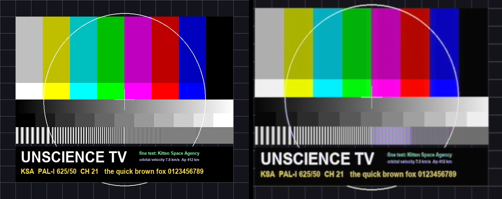
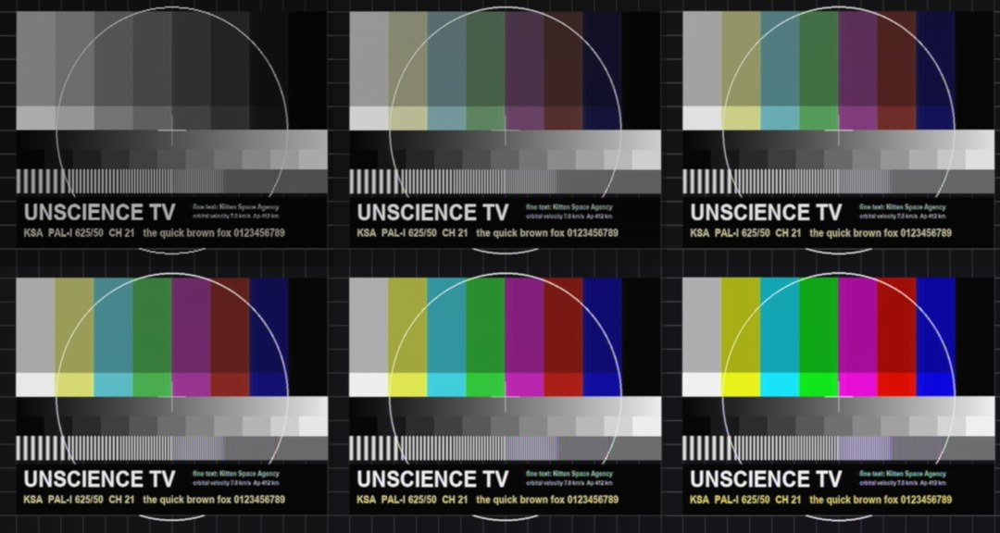

# PALindrome as an in-world CRT television in KSA — deep dive, experiments and design

Research for Unscience, 2026-09-18. **Research only: no feature, project, patch or native binary
was added to the mod.** Audience: whoever decides whether to build this, and whoever builds it.

| Baseline | Revision |
|---|---|
| PALindrome | `mattgodbolt/PALindrome` @ `03da0f5` (2026-08-30), local clone `~/repos/github/PALindrome` |
| Unscience | `a2c12d2` |
| KSA | 2026.9.10.5438, decompiled sources in the sibling `ksa-game-assemblies/current/decomp` (paths below written `decomp/…`) |
| Companions | sibling `purrtty`, `gatOS`, `StarMap` (0.4.6 sources; unscience references StarMap.API 0.3.6) |
| Host used for experiments | macOS 27 arm64, Apple M4 Pro (14 cores), Apple clang 21, zig 0.16.0 (clang 21.1.8 + libc++ 21.1), .NET 10.0.100. No GCC 15, no Rosetta, no Docker daemon, no Windows machine |

Evidence tags: **[RAN]** we executed it for this study · **[READ]** verified by reading source ·
**[EST]** estimate or inference · **[UP]** upstream's own documentation or measurements.
Prototype code and figures live beside this file in [`prototype/`](prototype/README.md) and `img/`.

## Contents

0. [Verdict](#0-verdict)
1. [What PALindrome is, and is not](#1-what-palindrome-is-and-is-not)
2. [What was actually run](#2-what-was-actually-run)
3. [Gate zero: PALindrome has no license](#3-gate-zero-palindrome-has-no-license)
4. [Embedding surface: samples in, pixels out](#4-embedding-surface-samples-in-pixels-out)
5. [Performance](#5-performance)
6. [Building it for Windows and Linux](#6-building-it-for-windows-and-linux)
7. [Shipping and loading the native library in Unscience](#7-shipping-and-loading-the-native-library-in-unscience)
8. [Where the picture comes from](#8-where-the-picture-comes-from)
9. [Getting the pixels onto a quad](#9-getting-the-pixels-onto-a-quad)
10. [Architecture options and recommendation](#10-architecture-options-and-recommendation)
11. [Fit with Unscience's rules](#11-fit-with-unsciences-rules)
12. [Phased plan](#12-phased-plan)
13. [Risks and open questions](#13-risks-and-open-questions)
14. [Relationship to `PALINDROME_KSA_FEASIBILITY.md`](#14-relationship-to-palindrome_ksa_feasibilitymd)
- Appendices: [A reproduction](#appendix-a--reproduction) · [B proposed C ABI](#appendix-b--proposed-c-abi) · [C integration points for `scope/`](#appendix-c--integration-points-for-scope) · [D alternatives](#appendix-d--alternatives-and-complements) · [E references](#appendix-e--references)

---

## 0. Verdict

**It is practical. Every link of the chain was exercised for real, except running inside the game.**

```text
RGB frame ──► PAL encoder ──► composite samples ──► PALindrome decoder + CRT ──► RGBA frame ──► Vulkan texture ──► world quad
 (camera,       (new code,       16 MS/s float         (native lib, C ABI,          8-bit          in-band copy       Thug Life
  PNG, card)     prototyped)                            P/Invoke verified)                          per frame         pattern)
```

What this study established:

1. **The library compiles for both shipping targets with no source changes** (one upstream bug
   fix is advisable, §4.5). `zig c++` on this Mac
   produced `palindrome.dll` (win-x64) and `libpalindrome.so` (linux-x64), ~770 KB each, statically
   linked, importing only `KERNEL32` + UCRT / needing only glibc ≥ 2.17, bit-for-bit reproducible
   **[RAN]**. The Linux build passed upstream's complete unit-test suite (3.5 M assertions) under an
   emulated x86-64 machine with a real glibc 2.28 **[RAN]**. The Windows DLL was inspected but
   **never executed** — that is the main unverified step (§13).
2. **.NET can drive it.** A .NET 10 P/Invoke program loaded the native build, ran the real
   `video::Decoder`, got a 720×576 RGB frame back and had a C++ exception converted to an error
   code at the boundary **[RAN]**.
3. **We can make our own PAL.** PALindrome has no encoder (`encode` is a stub), so a prototype
   encoder was written; PALindrome locked to its output and decoded a correct colour picture on
   the first attempt, including the "set warming up" colour fade-in and authentic cross-colour
   **[RAN]** (§8.3, figures below).
4. **CPU cost is about one fast core, not the 12–15 threads upstream's notes suggest.** With
   vectorised FIR kernels, full-quality colour (720×576, 16 MS/s, 25 readouts/s) costs **0.77 s of
   one M4 Pro core per second of video**; monochrome 0.48; 360×288 colour 0.65; split across two
   threads it runs 3× faster than real time **[RAN]**. Upstream's alarming numbers come from a
   2018 HEDT part, 20 MS/s, the RF front end and a 12-lane deposit that mostly burns CPU (§5).
5. **KSA's side is known territory.** A streaming texture can be updated inside the engine's own
   frame command buffer with no stall, the quad is Thug Life's draw with a custom fragment shader,
   and a live game camera can be read back to the CPU using public game APIs only **[READ]**.

What stands in the way, in order:

1. **No license (§3).** The repository grants no rights. Prototyping privately is fine; *shipping a
   binary built from it is not* until the author adds a license or gives permission. Ask first.
2. **It has never run on Windows, in the game, or on x86 hardware.** The x86 performance figure
   is an extrapolation from Apple Silicon (§5.3). Phase 1 exists to replace it with a measurement.
3. **Everything between "RGB frame" and "composite samples" is new code** — cheap to run
   (< 1 ms per field natively) but it has to be written and calibrated (§8.4).
4. **A live game camera shows an incomplete world.** KSA's secondary viewports render no terrain,
   ocean, clouds, atmosphere, plumes, particles or glass (§8.6). It is a good *orbital* camera.

Recommended route: an **in-process native library with CPU decode** (Option A, §10) fed by a native
PAL encoder, with quality presets sized from measurements; keep a **shader-only mode** as the
fallback for weak CPUs and for extra/far screens; treat the **GPU deposit** as the later
optimisation that returns ~43 % of the CPU cost. Start with Phase 0 + 1 of §12.



*Left: generated 768×576 test card. Right: the same card after `pal_encode.py` → 16 MS/s PAL CVBS →
`palindrome render --input composite --colour`. Note the 6 % overscan crop, chroma bandwidth smear,
cross-colour in the fine gratings, gamma, and the picture sitting slightly left (the documented
sync-filter delay; one `--h-shift` away).*

---

## 1. What PALindrome is, and is not

PALindrome (Matt Godbolt, first commit 2026-05, 179 commits, sole author, no releases) decodes
**real PAL RF captured with an SDR "the way a 1980s television did it: as an analog machine"**
[UP README]. It is C++ (nominally C++26), CMake + CPM, CI on Linux/g++-15 only.

The signal chain [READ `docs/architecture.md`, `lib/decoder.cpp`]:

```text
real IF samples ─► SAW-shaped IF filter + quasi-sync detector ─┐          (RF front end; skipped for composite)
CVBS samples ────► 5.5 MHz low-pass ─► CompositeInput clamp ───┴─► "envelope rail" (sync tip 1.0, blanking 0.76, white 0.20)
   ─► AGC ─► 63-tap sync low-pass ─► sync separator ─► horizontal flywheel PLL ─► h_phase
                                                   └─► vertical integrator + flywheel ─► v_phase
   ─► chroma decoder: 4.43 MHz band-pass, burst-locked crystal (APC), PAL switch + ident, colour killer, 1H comb ─► Y/U/V
   ─► Screen: DC-restored black, gun gamma, RGB matrix, yoke shear, Gaussian beam spot, EHT sag/breathing,
              line pull, beam-current + peak-white limiters ─► 24-byte splat records
   ─► CpuDepositBackend: additive float phosphor buffer, per-field exponential decay ─► 8-bit readout
```

Every stage is `prepare(max_in)` / `process(span) → span` with all state carried across calls;
block size never changes the result (a tested invariant). `video::Decoder` wraps the whole graph as
`decode_into()` (everything up to the three rails) and `deposit()` (paint the phosphor), so the two
halves can run on different threads.

It **is**: a stateful, sample-level model of a receiver and a tube — flywheels that take time to
lock, a colour killer with hysteresis, AGC and clamp dynamics, beam-load feedback loops.

It **is not** [READ, by grep]: a shadow-mask/aperture-grille renderer, tube curvature, convergence
error, halation/glass, per-colour phosphor persistence, or audio. Those belong in our fragment
shader if wanted. It also has **no encoder**, **no C API**, **no runtime knob changes** (all
configuration is constructor-time), **no `reset()`**, and **no license**.

A composite (CVBS) baseband input landed upstream on 2026-08-16 (issue #83, PR #90): "Composite
replaces the front end object and *nothing else*". That is the seam an in-game encoder feeds; it
removes a whole pipeline stage (the RF front end, ~0.2–0.35 core) and the need to run at ≥ 20 MS/s.

Also relevant: the author's BBC Micro emulator **jsbeeb uses a GLSL PAL shader for real time** and
uses PALindrome as the *reference* it is tuned against (jsbeeb #962, v2.1.0/2.2.0, 2026-09-16).
Upstream's own plan for heavy real-time use is a GPU deposit backend (issues #59/#103; the
`DepositBackend` seam landed in PR #105).

---

## 2. What was actually run

| # | Experiment | Result |
|---|---|---|
| E1 | Native build, macOS arm64, Apple clang 21 (and zig c++), upstream CMake configured by hand (the presets pin g++-15 + Ninja) | lib + CLI + tests build at `-std=gnu++26 -Werror` after a 4-line patch; all 150 unit tests pass; decodes the real RF corpus clips; **3 of 4 upstream golden pixel hashes reproduce exactly**. An x86-64 `-march=haswell` cross-compile (AVX2 path active) also compiles clean but could not be run **[RAN]** |
| E2 | Static portability audit with probe compiles | `lib/` is C++20 + two C++23 library features; **zero C++26 usage**; no POSIX, no globals, no `thread_local`; stdexec only in `pipeline_run.hpp` (CLI + one test) **[RAN/READ]** |
| E3 | Cross-compile with `zig c++` → `libpalindrome.so`, `palindrome.dll`, `libpalindrome.dylib` with a C ABI shim | Works for all targets, v3 and baseline ISA; 60/60 upstream lib TUs compile; 79-line patch only to keep upstream's `-Werror` and fix one latent bug **[RAN]** |
| E4 | Linux `.so` executed under `qemu-system-x86_64` (TCG, `-cpu max`) with real Debian 10 glibc 2.28 | Frame hash bit-identical to arm64; upstream unit tests **all pass (3,512,412 assertions, 150 cases)** **[RAN]** |
| E5 | .NET 10 P/Invoke → native lib → `video::Decoder` → frame (re-run independently for this report) | `locked=1 fields=10 frame=720x576x3`, managed byte-sum = native, FNV `0x7f74d47edba8b595`, exception → `-2 "FIR needs at least one tap"` **[RAN]** |
| E6 | StarMap-like `AssemblyLoadContext` harness for native loading | Flat-beside-assembly works with plain `DllImport`; `native/<rid>/` and `runtimes/<rid>/native/` **fail** without a resolver; explicit `NativeLibrary.Load(fullPath)` works **[RAN]** |
| E7 | Prototype PAL encoder (Python/numpy) → PALindrome composite input | H-lock 7320 edges @ 15625.0 Hz, V-lock 24 fields @ 50.00 Hz, APC pull +2.6 Hz, burst swing 42°, killer gate 0.99; correct colour picture **[RAN]** |
| E8 | Same signal, per-field dump | Field 0 dim + monochrome (killer shut, phosphor building) → full colour by ~field 10 **[RAN]** |
| E9 | Same signal with noise/ghost/hum | 12 mV RMS + 30 % ghost: authentic weak-signal picture; ≥ 20 mV RMS: H-lock lost, colour killed; 120 mV: never locks **[RAN]** |
| E10 | Per-stage single-thread benchmark, embed-style driver ([`stage_bench.cpp`](prototype/native/bench/stage_bench.cpp)), NEON port of the FIR kernels; ~50 configurations × 3 runs, spot-checked independently (0.73 on an idle machine, 0.72 on the prototype encoder's own output) | §5.2 **[RAN]** |
| E12 | **Continuous live demo** ([`prototype/live/`](prototype/live/live_tv.py)): moving source → real-time numpy PAL encoder → `palindrome render --live --input composite` → MJPEG in a browser, with live impairment controls | Real time on this Mac: 25 frames/s fed, 50 fields/s decoded, encoder 12 ms/frame, decoder 80–100 % of one core. Phosphor trails behind moving objects, monochrome snow with the aerial out, re-lock with colour fading back, limiter response to a white flash — all observed **[RAN]** |
| E11 | `WorkQueue` destructor-order bug | Reproduced twice independently on macOS/libc++: a CLI render hung at exit "in the wild" (run 19 of a 12-lane benchmark); upstream's unit tests hung 3/3; a construct/run/destroy loop hung 5/5 within 4–74 iterations. With the one-line fix: 3 × 20,000 iterations clean **[RAN]** |

Not done: any Windows execution, any x86 hardware timing, anything inside KSA, any Vulkan code,
GCC 15 builds (no GCC on the host), physical capture.

---

## 3. Gate zero: PALindrome has no license

**Facts [RAN/READ].** No `LICENSE`/`COPYING`/`NOTICE` at HEAD or in any of 61 refs
(`git log --all --diff-filter=A --name-only | grep -iE "licen|copying"` is empty); no SPDX or
copyright headers in PALindrome-authored files (the only SPDX tag is vendored `cmake/CPM.cmake`);
`gh api repos/mattgodbolt/PALindrome` → `"license": null`; no issue mentions licensing.

**Consequence.** Default copyright applies: "nobody else can copy, distribute, or modify your work"
(choosealicense.com/no-permission). GitHub's terms grant viewing and forking only. We may build
and experiment privately; we may **not** ship a DLL/`.so` built from it, a patched fork, or its
corpus/PDFs. A patch file that quotes upstream lines has the same problem, which is why §6.4
describes the portability edits in prose and the only patch stored in `prototype/` is a
zero-context diff of pure additions (the NEON measurement aid).

**Remedy.** Ask. Open an issue: *"Would you add a license? We'd like to embed the decoder as a
native library in a (free) game mod."* The author's other projects are permissive (Compiler
Explorer BSD-2, seasocks BSD-2, specbolt BSD-3, `pal-decoder` MIT) — except **jsbeeb, GPL-3.0**,
which is the stated future consumer of a PALindrome encoder. MIT/BSD would be ideal. A GPL answer
would need thought: a GPL native library loaded into a proprietary game by a redistributed mod is
the uncomfortable case; an out-of-process helper (Option C) is the usual mitigation.

**Not blocked:** our own encoder (own code; colour math cross-checked against the author's
**MIT** `pal-decoder`), all KSA-side code, and the shader-only mode.

Dependencies are all permissive (stdexec Apache-2.0 WITH LLVM-exception, nlohmann_json MIT,
lodepng zlib, Catch2/Lyra BSL-1.0) and **none is needed by the decode path** (§6.1).

---

## 4. Embedding surface: samples in, pixels out

Everything below is [READ] unless tagged. There is no C API today; we write one (Appendix B).

### 4.1 Call sequence for composite input

```cpp
dsp::Fir vision_lp{dsp::lowpass_kernel(127, fs, 5.5e6)};      // optional; CLI default. Costs ~60 ms/s (§5.2)
video::CompositeInput ci{{.sample_rate_hz = fs}};             // volts → envelope rail, tracking sync-tip clamp
video::Decoder dec{cfg};                                      // cfg.sample_rate_hz, cfg.colour, cfg.screen.{width,height,...}
vision_lp.prepare(max); ci.prepare(max); dec.prepare(max);    // the only allocations; bigger blocks THROW later
for each block x (std::span<const float>, ≤ max):
    auto env = ci.process(vision_lp.process(x));
    dec.decode_into(block, env);                              // AGC, sync, H/V flywheels, chroma → 24 B/sample rails
    dec.deposit(block, on_field);                             // control pass → splat records → phosphor; callback per field
```

`on_field(const FieldEvent&)` fires synchronously on the depositing thread once per v-phase wrap
(locked or not); inside it `e.frame()` returns `Frame{std::vector<uint8_t> pixels; width; height;
channels}` — interleaved 8-bit RGB (or grey), freshly allocated per call. The RF variant replaces
the first two objects with `demod::VisionIf{fs, carrier_hz, saw80_template(), Detector::quasi_sync,
255, Hamming, decimation}`.

**About 200 lines of necessary glue live in the CLI, not the library**: front-end assembly
(`cli/cli_util.cpp:236-320`), the flag → `DecoderConfig` mapping including the overscan → scan
window maths (`cli/render_command.cpp:544-658`), block sizing, and the profile JSON → flag table.
A shim must replicate them (it is mechanical).

### 4.2 Defaults trap

The library's `ScreenConfig` defaults are *neutral* (gamma 1.0, readout gamma 1.0, no EHT sag, no
limiters, full-scan window, colour off). The "period look" is the **CLI's** recipe
(`cli/render_command.hpp:48-91`): gun gamma 2.6, readout gamma 2.2, overscan 0.06, EHT sag 0.06,
line pull 0.003, BCL 0.7. The CLI's `saturation 0.085 / contrast 1.6` are calibrated to an
under-modulating Sega Master System; **a standard-level source wants contrast ≈ 1.0 and
saturation ≈ 0.21** (ACC normalises chroma by burst: 0.15 V / 0.7 V = 0.214 [EST]; E7 used exactly
that and the bars came out right).

### 4.3 Output

- Phosphor: private `std::vector<float>`, `width × height × channels`, **linear light, additive**.
  Whole-buffer multiply by `exp(-1/persistence_fields)` (0.535 at the 1.6 default) once per field.
- Readout "camera": `px = 255·clamp(bright/white)^(1/readout_gamma)` with one shared RGB scale; a
  pure power law. With gun 2.6 / readout 2.2 the net tone curve is ≈ `code^1.18`.
- Resolution is a pure remap of the visible scan window; `beam_sigma` is in scanline pitches so
  the spot scales with resolution (7×7 px at 720×576, ~5×5 at 360×288). 720×576 is non-square
  (PAR 1.067): show it on a 4:3 quad.
- **Brightness depends on samples-per-pixel** (deposits are not density-normalised): steady white
  at 720×576 is code 252 at 20 MS/s, 228 at 16 MS/s, 211 at 13.5 MS/s [EST from code]. Measured
  [RAN]: with contrast unchanged, going from 720×576 to 360×288 clips even the 75 % grey bar to
  255. The fix follows from the 2.6-power gun: **`contrast ∝ (raster pixels)^(1/2.6)`** — 0.732 at
  480×384 and 0.587 at 360×288 restore white/grey/red to within a few codes of the 720×576
  picture. Every quality preset needs its own contrast (and burst gate, §8.2).
- No zero-copy access and no float/HDR readout without a small library patch (`bright_` and the
  backend are private). Without a patch: one copy of `Frame.pixels` plus RGB→RGBA expansion.

### 4.4 Threads

- The library creates threads **only** for the deposit pool: `deposit_lanes - 1` parked
  `std::jthread`s per `Screen` (default **12** → 11 threads). Set it explicitly. `lanes = 1`
  creates none and the result is bit-identical.
- `pipe::run` (stdexec) is the CLI's three-stage driver. We do not need it; a worker thread calling
  `decode_into` → `deposit`, or two threads with a bounded queue, is enough.
- `flush_denormals_to_zero()` sets MXCSR FTZ|DAZ **per thread and never restores it**. Without it
  a powered-but-unsynced TV (exactly our "no signal" state) halves throughput (upstream #126).
  It must run on **threads we own** — never on a game or CLR thread (MXCSR is callee-saved; the
  JIT's float maths on that thread would change). `WorkQueue::run` also executes tasks on the
  *calling* thread, so every `deposit` call must come from an owned, flushed thread.

### 4.5 Lifecycle

| Event | Behaviour |
|---|---|
| Cold start | AGC/clamp settle in ~1 line; H flywheel locks after 16 coincident edges (~1.3 ms); V snaps at the first broad-pulse train (≤ 1 field); phosphor ~85 % in 3 fields; colour hard-muted ~160 lines, 50 % by ~67 ms, 90 % by ~220 ms. Confirmed visually in E8 |
| Knob change | Constructor-time only → rebuild the decoder → it re-locks (upstream's live viewer restarts the *process*). A knob twiddle looks like a channel change unless the library is patched |
| Signal loss | Flywheels coast, raster keeps scanning and decaying, field callbacks continue at nominal 50 Hz; killer closes in ~100 lines |
| NaN/Inf input | **Permanently poisons** the clamp's tip tracker (`lib/composite.cpp:45-51`). Sanitise at the ABI |
| Several instances | Fine: no global or `thread_local` state. Each owns its lanes |
| Teardown | `~Decoder` joins the pool. **Bug:** `WorkQueue` declares `workers_` before its mutex/condvars, so they are destroyed before the threads join (UB). Reproduced as a hang on macOS/libc++ (E11) whenever `deposit_lanes > 1`; not reproduced on Linux/glibc (40,000 cycles clean under emulation); untested on Windows. In the game this would be a hang on TV destroy or scene unload. Fix: `workers_.clear();` in the destructor body |

### 4.6 Hazards at a C boundary

Hot-path throws (`std::length_error` when a block exceeds `prepare()`; `std::invalid_argument` on
rail mismatch; ~90 constructor validations) → every export wraps `try/catch(...)`; an exception
crossing P/Invoke is fatal, and on Linux .NET does not support it at all. Steady-state allocations
exist (a `Frame` vector per readout, `std::function` closures per field) → fine on a worker
thread, a reason not to call from the render thread. `snapshot()` is `const` but mutates and is not
safe against a concurrent `deposit()`; mid-field snapshots also show a hard brightness step at the
beam position (×0.75 after gamma) that would crawl at 10 Hz under a 60 fps game — **consume
`on_field` frames only and display the latest one** (§9.5).

---

## 5. Performance

### 5.1 Upstream's numbers [UP `docs/performance.md`]

i9-9980XE (18 cores, 2018 Skylake-X), `-march=native`, LTO, 720×576 colour:

| Fixture | Lanes | Wall s / user CPU s | Core-equivalents |
|---|---|---|---|
| Composite u8, 20 MS/s, 5.0 s | 4 / 8 / 12 | 5.24/16.6 · 4.69/18.9 · 4.05/20.3 | 3.3 / 3.8 / 4.1 |
| RF 20 MS/s, 1 s looped ×10 | 12 | 7.72 / 41.1 | 4.1 |

"AirSpy /1 live path ~0.87 s for a 1.0 s second (~13 % margin)". Thread busy fractions: source
80 %, decode 94 %, sink 82 %. Deposit side = 60–64 % of program CPU. Read alone these say "needs
a workstation". They are misleading for our case for three reasons: that 2018 CPU is markedly
slower per core than current parts (1.3–1.6× on the vectorised kernels, more on the scalar
control pass, §5.2); the threaded pipeline's CPU-seconds include contention the author himself
attributes to "the fanned-out deposit hitting the memory system"; and we skip the RF front end
and run at 16 MS/s, not 20.

### 5.2 Our measurements [RAN] — Apple M4 Pro, one thread, embed-style driver

Driver: int16 file in memory → s16→float → optional 127-tap 5.5 MHz low-pass → `CompositeInput` →
`decode_into` → `deposit` → `FieldEvent::frame()`. 10 s fixtures (a real corpus clip demodulated to
CVBS and resampled), `deposit_lanes = 1`, 65,536-sample blocks, CLI-default CRT settings, 3 runs,
median. **The FIR kernels were ported to NEON for this measurement** (+136 lines in a scratch copy
of `lib/fir.cpp`; output bit-identical to the scalar tier — 0 of 1,244,160 subpixels differ — and
all 150 upstream unit tests pass) because upstream's hand-vectorised tiers are AVX2-only and the
scalar fallback is 5–7× slower. These numbers are therefore the closest available proxy for an
x86 AVX2 build, not a measurement of one. Per-kernel sanity check against the author's published
i9-9980XE/AVX2 figures: `ChromaDecoder` 0.78 ms per 64 k-sample block here vs 1.22 ms there;
`VisionIf` quasi-sync 1.01 ms vs 1.28 ms — the vectorised kernels are within 1.3–1.6× of each
other; the larger gap in *total* CPU (§5.1) comes from the scalar control pass and the
memory-bound deposit on that older platform.

Milliseconds of CPU per second of video (= % of one core ÷ 10):

| Configuration | vision LP | clamp | `decode_into` | deposit + readout | **Total** |
|---|---:|---:|---:|---:|---:|
| 16 MS/s **colour** 720×576, readout every field (50/s) | 60 | 24 | 337 | 382 | **803** |
| 16 MS/s colour 720×576, readout every 2nd field (25/s) | 60 | 24 | 336 | 351 | **772** |
| … same, no 5.5 MHz low-pass | 0 | 24 | 338 | 352 | **715** |
| 16 MS/s **mono** 720×576, 25/s | 60 | 24 | 148 | 244 | **477** |
| 20 MS/s colour 720×576, 25/s | 75 | 30 | 423 | 450 | **980** |
| 12 MS/s colour 720×576, 25/s, no LP | 0 | 18 | 251 | 265 | **535** |
| 16 MS/s colour **360×288**, 25/s | 61 | 24 | 346 | 215 | **647** |
| 12 MS/s colour 360×288, 25/s, no LP | 0 | 18 | 261 | 161 | **441** |
| 16 MS/s colour 720×576, 25/s, **4 lanes** (calling thread only) | 60 | 24 | 340 | 237 | **662** |

Observations:

- **Real time on a single thread** for every configuration at ≤ 16 MS/s on this core — but with
  only 20–28 % margin at full quality, and none at 20 MS/s (0.98).
- Cost is **linear in sample rate**: ≈ 46 ms of CPU per MS/s per second of video in colour, ≈ 28
  in mono. Colour's extra cost is all in `decode_into` (81-tap chroma band-pass, two 41-tap U/V
  low-passes, 121-tap luma notch, on top of the 63-tap sync low-pass and the double-precision
  AGC/NCO/flywheel recurrences). Halving the raster saves only ~16 % because the per-sample
  control pass does not shrink. With vectorised FIRs the split is roughly decode 45 % / deposit
  43 % / composite front end 11 %.
- The 8-bit readout itself is cheap: **≈ 1.15 ms per 720×576 RGB frame** (+28 ms/s at 25 frames/s,
  +59 at 50). (The per-field "landing" of splat records is lazy, so it shows up under whichever
  call triggers it.)
- **Latency spikes at field boundaries**: the worst 4.1 ms block took 9–10 ms because a whole
  field of splat records (5–7 ms on one thread) lands at once; feeding whole-field blocks gave a
  worst case of 19.95 ms per 20 ms. Buffer ≥ 1 field, split decode and deposit across two threads,
  and never call this from the render thread. Four lanes cut the burst from 7.1 to 2.4 ms.
- **Two threads is the sweet spot.** The library's own split — one thread in `decode_into`, one in
  `deposit` — runs 16 MS/s colour at **0.33× real time (3× headroom) for 0.74 core-s/s**; 0.39×
  with a 50 frames/s readout; 0.25× at 12 MS/s; 0.43× at 20 MS/s. More deposit lanes buy *nothing*
  for colour (the decode thread is the limiter at every lane count from 2 to 12) while raising
  total CPU (RF: 1.11 → 1.60 core-s/s from 1 → 12 lanes). Twelve lanes was slower and noisy on
  this 10P + 4E part because efficiency cores end up inside the per-field barrier — relevant to
  every hybrid Intel desktop CPU. **Use `deposit_lanes` 1–2.**
- RF path for comparison (CLI, threaded): 20 MS/s colour 0.41× wall, 1.1–1.3 core-s/s; serial 1.11×.
- Peak RSS 13–57 MB across all modes (12 lanes at 20 MS/s reserves ~67 MB of band buckets;
  4 lanes at 16 MS/s ~18 MB [EST]; the float framebuffer is `w × h × channels × 4` bytes).
- **Unvectorised builds are useless for real time**: upstream as-is on arm64 (scalar FIR tier),
  RF 20 MS/s colour = 5.5× *slower* than real time (8.9 core-s/s) whatever the lane count;
  composite 16 MS/s colour on one thread = 3.6–3.8× slower (`decode_into` 2246 ms/s, vision
  low-pass 990 ms/s — the FIRs swamp everything). A baseline (non-AVX2) x86 build would be worse
  still, since there `fmaf` becomes a libm/compiler-rt call per tap.
- Output is reproducible across toolchains: the arm64/clang renders reproduce **upstream's
  x86-64/GCC golden pixel hashes exactly for 3 of the 4 corpus clips**; the fourth (`wb3`) differs
  identically in every build we made (scalar, NEON, zig), i.e. a platform difference or a stale
  golden, with a visually correct picture.

### 5.3 What this means for players' PCs [EST]

M4 Pro single-thread performance is near the top of the 2024–26 range. Scaling by typical
single-thread ratios, and assuming upstream's AVX2 (8-lane) kernels do at least as well as the
4-lane NEON port (the per-kernel comparison in §5.2 supports that):

| CPU class | 16 MS/s colour 720×576 | 16 MS/s mono | 12–13.5 MS/s colour 360×288 |
|---|---|---|---|
| Measured: M4 Pro P-core, NEON port | 0.77 core | 0.48 | 0.44–0.5 |
| Current desktop (Zen 4/5, Raptor Lake P-core) [EST] | ~1.0–1.3 core | ~0.6–0.8 | ~0.55–0.75 |
| 2019–21 desktop (Zen 2/3, Comet Lake) [EST] | ~1.4–1.9 cores | ~0.9–1.2 | ~0.8–1.1 |
| Upstream's i9-9980XE, threaded, 20 MS/s composite [UP] | 3.3 (4 lanes) | — | — |

So: **a two-thread pipeline (decode | deposit + readout) at roughly 45–70 % each on a current
CPU**, and a single thread for the reduced presets. Steam's August 2026 survey: 56 % of players
have 6–8 physical cores, 95.4 % have AVX2, 95.6 % FMA. Whether KSA leaves one to two cores idle
during a busy flight scene is **unmeasured** and is the real question for Phases 1–2.

### 5.4 Cost knobs, in order of effect [RAN unless tagged]

Measured at 16 MS/s composite, one thread, against the 0.72 (colour) baseline of the CLI run:

| Knob | Effect |
|---|---|
| Colour → mono | **−37 %** |
| Sample rate 16 → 13.5 → 12 MS/s | −16 % → **−25 %**. 12.67 MS/s is upstream's own floor for colour; 10 MS/s locks but is visibly degraded; the hard floor is `fs > 8.87 MS/s` **even for mono**, because `Decoder` always constructs the `ChromaDecoder`. Burst gate, h-shift and contrast must be retuned per rate (§8.2) |
| Spot size: `--beam-sigma 0.3`, or `--beam-sigma-x 0` | −16 % … −21 % (and `--beam-sigma 0.8` costs +17 %) |
| Raster 720×576 → 480×384 → 360×288 | −8 % → −16 % (1024×768 +13 %, 1440×1152 +43 %) |
| Beam-load simulations off (`--eht-sag 0 --line-pull 0 --bcl 0 --pwl 0`) | −9 % — but these are the clean-signal effects that make it look alive |
| Bypass the 5.5 MHz input low-pass when our encoder already band-limits | −7 % (emitting the envelope rail directly and skipping `CompositeInput` would save another ~3 %, at the price of the clamp's authentic reaction to hum and impulses) |
| Readout 50 → 25 frames/s | −4 % |
| Gun/readout gamma LUTs off; comb mode; deposit lanes | ≈ 0 to −3 % |
| Cheapest colour tried (10 MS/s, 360×288, `--beam-sigma-x 0`) / cheapest mono | 0.32 / 0.19 core |

Beyond the library's own knobs [EST]:

- **"Slow-scan"**: run TV time at half wall-clock rate while always encoding the *newest* source
  image. CPU halves; motion stays correct; persistence looks twice as long.
- **GPU deposit** (§10 Option B): removes the deposit side ≈ 43 % of the serial cost.

What cannot be reduced: the decoder must see *every* sample of a continuous signal to stay locked.
When the CPU cannot keep up, the only valid responses are a cheaper preset (a visible re-lock,
like a channel change), slow-scan, or switching the set off.

---

## 6. Building it for Windows and Linux

### 6.1 Portability facts [RAN/READ]

| Claim upstream's build suggests | Reality |
|---|---|
| "C++26, g++-15 only" | `lib/` uses C++20 plus `std::expected` and `std::unreachable`. No pack indexing, reflection, `<simd>`, `std::execution`, `inplace_vector`, etc. Compiles clean at `-std=c++23`; clang 21 + libc++ accepts all 20 lib TUs unpatched |
| "Needs NVIDIA stdexec" | Only `pipeline_run.hpp`, included by `cli/render_command.cpp` and one test. No lib `.cpp` needs it. (It is a CPU scheduling library, not CUDA.) |
| "Needs nlohmann_json, lodepng" | Only `sigmf.cpp` and `image.cpp`. The decode path is **12 TUs with zero third-party dependencies**: `decoder agc fir sync_separator horizontal_sweep vertical_sync chroma_decoder screen cpu_deposit splat gaussian composite` (+ `demod fft` for RF) |
| "POSIX" | None in `lib/`. `<unistd.h>`, `::write`, `SIGPIPE` are all in `cli/render_command.cpp` (the one CLI TU that fails for Windows) |
| GCC-isms | `[[gnu::optimize]]` ×2 (ignored by clang with a warning, no codegen effect: clang emits `vsqrtps ymm` either way), `[[gnu::always_inline/cold/noinline]]`, `__restrict`, `__builtin_sqrtf` — all accepted by clang. **No GNU vector-operator arithmetic**: every SIMD op is an intrinsic call |
| AVX2 | Compile-time only: `#if defined(__AVX2__) && defined(__FMA__)` at four sites in `fir.cpp`; everything else relies on `-march` auto-vectorisation. **No runtime dispatch.** |

**Do not use upstream's CMake for the mod build**: it requires CMake ≥ 3.30, presets force g++-15 +
Ninja, defaults to `-march=native` (the same flag that gave purrTTY an in-game access violation
with libghostty), forces LTO, `-Werror`, and performs unpinned configure-time downloads
(`RAPIDS.cmake` from a moving branch, `execution.bs` from `main`) even with CLI and tests off.

### 6.2 Verified recipe: `zig c++` from any host [RAN]

[`prototype/native/build.sh`](prototype/native/build.sh) (≈100 lines, no CMake):

```sh
zig c++ <TARGET> -std=c++26 -O2 -fPIC -fvisibility=hidden -fvisibility-inlines-hidden \
    -ffunction-sections -fdata-sections -I src/lib/include  -c src/lib/<tu>.cpp -o obj/<tu>.o
#   TARGET = -target x86_64-windows-gnu    -mcpu=x86_64_v3
#          | -target x86_64-linux-gnu.2.28 -mcpu=x86_64_v3
#          | -target aarch64-macos                                   (dev box / CI only)
# pal_cpu.cpp (the ISA guard) is ALWAYS compiled with -mcpu=x86_64 so it can run anywhere.
link linux: … -shared -s -Wl,--version-script=exports.map -Wl,--gc-sections -Wl,-z,relro -Wl,-z,now
link win:   … -shared -s -Wl,--gc-sections -Wl,--out-implib,palindrome.lib
```

| Artifact (stripped) | Bytes | Dynamic dependencies | Exports |
|---|---:|---|---|
| `libpalindrome.so` linux-x64-v3 | 768,888 | `libc libm libpthread libdl ld-linux`; **max symbol version GLIBC_2.17** | `pal_*@@PALINDROME_1` only |
| `palindrome.dll` win-x64-v3 | 768,512 | `KERNEL32.dll` + 10 `api-ms-win-crt-*` (UCRT) | `pal_*` only |
| `libpalindrome.dylib` macos-arm64 | 686,624 | `libSystem` | `pal_*` (+ operator new/delete; zig's Mach-O linker ignores export lists) |

libc++, libc++abi and libunwind are linked statically in the `std::__1` namespace, so they cannot
collide with the libstdc++ that CoreCLR and KSA's own natives load. KSA's Linux natives need up to
GLIBC_2.34, so 2.17 is comfortably below the game's own floor. The v3 builds really contain the
AVX2 kernels (`Fir::process`: 67 `ymm` + 29 `vfmadd`; whole file 1705/118 on Linux, 2401/191 on
Windows). Two independent builds gave identical SHA-256 for both the `.so` and the DLL. Cold build
7–15 s per variant (first use of a target +1–2 min while zig builds libc++).

Gotchas: `-march=x86-64-v3` is rejected — spell it `-mcpu=x86_64_v3`; with no `-O` flag zig builds
`-O0` **with UBSan**; `zig objcopy --strip-all` is unimplemented (strip with `-s` at link); `-flto`
works for Linux/Windows, not macOS; windows-gnu emits DWARF, not PDB.

### 6.3 Behavioural checks [RAN]

- macOS arm64 native: C `dlopen`, Python `ctypes` and .NET 10 P/Invoke all give the same frame;
  serial == threaded at 1/4/12 lanes; upstream unit tests pass on the patched tree.
- Linux x86-64, **executed** under QEMU TCG with Debian 10's glibc 2.28: v3 `.so` frame hash
  bit-identical to arm64; upstream unit tests cross-built for v3: all pass.
- ISA guard: on a `-cpu Nehalem` model `pal_cpu_supported()` returns 0; skipping it produced a
  real SIGILL inside v3 code. **A host must call it before anything else.**
- Baseline (non-FMA) builds hash differently from v3; an arm64 build with `-ffp-contract=off`
  reproduces the baseline hash exactly → the difference is FMA contraction, not a miscompile.
  Conversely, FMA-capable builds agree across compilers and ISAs far better than expected: 3 of
  upstream's 4 golden corpus hashes (x86-64/GCC) reproduce exactly on arm64/clang (§5.2), so the
  goldens are a useful, though not absolute, acceptance test for a port.
- **Windows: never executed.** No Wine (Whisky's `wine64` is x86-64 and this Mac has no Rosetta).
  A cross-built `smoke-win-x64.exe` + the DLL need one run on a real Windows box (§13, risk 2).

### 6.4 The source edits (described, not stored)

Needed only to keep upstream's `-Werror` set under clang, plus one real bug:

| File | Edit | Why |
|---|---|---|
| `lib/biquad.cpp:24`, `lib/dc_blocker.cpp:31` | `const double xk = static_cast<double>(x[k]);` | clang's `-Wdouble-promotion` is stricter than GCC's |
| `lib/demod.cpp:60,75` | wrap `[[gnu::optimize(...)]]` in a macro that expands to nothing under clang | `-Wunknown-attributes` |
| `lib/include/palindrome/work_queue.hpp:37-44` | `workers_.clear();` at the end of the destructor body | destructor-order UB (§4.5, E11) |

All of these are upstreamable. Without `-Werror`, **no edit is required to compile**. (The native
Apple-clang CMake build additionally needed `-Wno-error=double-promotion` on upstream's *test*
target, ~14 sites of float arguments into Catch2 matchers.)

### 6.5 Instruction-set policy

Ship **x86-64-v3 only** and gate: managed `Avx2.IsSupported && Fma.IsSupported` *and* native
`pal_cpu_supported()` before any DSP export; otherwise disable the feature with a readable message
(4.6 % of Steam users). A baseline build is not a fallback — it cannot reach real time (§5.2).
In-DLL dispatch would mean compiling the whole library twice; not worth it. Note for local
testing: the developer's Whisky bottles have `avxEnabled = false`, so CPUID inside Wine will not
advertise AVX2 and the feature would (correctly) disable itself there.

### 6.6 Alternatives and forward risk

| Toolchain | Status | Notes |
|---|---|---|
| **`zig c++`** | **Verified; recommended** | One pinned tarball builds both targets on any OS, selectable glibc floor, reproducible. It is also exactly how purrTTY's `Ghostty.Vt` natives are built (zig, `x86_64-windows-gnu`, `x86_64-linux-gnu.2.31`) |
| llvm-mingw / clang | Same front end + libc++ → should work [EST] | Proper PDBs with clang-cl; Linux still needs an old-glibc sysroot |
| GCC 15 (Linux container) + MinGW-w64 GCC 15 | Untested here | Upstream's own compiler, closest numerics, zero patches. GCC 15 MinGW is easy only on Fedora 43 or WinLibs (everyone else has moved to 16.2); needs `-static-libstdc++ -static-libgcc`, symbol hiding (CoreCLR loads libstdc++), a thread model decision, and a check of GCC PR 54412 (Win64 AVX stack alignment) |
| MSVC `cl` | **Avoid** | `__builtin_sqrtf` is a hard error; MSVC never defines `__FMA__`, so all AVX2 kernels silently vanish; `/W4 /WX` trips on GNU attributes; no `/std:c++26` |

**Forward risk:** upstream plans to replace the intrinsics with C++26 `std::simd` once GCC 16's
libstdc++ has `simd` maths (`docs/simd.md`, `TODO(std::simd)` tags). libc++ has no `<simd>` at all.
When that lands, the clang/zig route needs a pinned pre-simd commit, a carried intrinsics patch, or
a move to GCC. **Pin a commit now.**

---

## 7. Shipping and loading the native library in Unscience

### 7.1 Precedents in this organisation [READ]

- **purrTTY `vendor/Ghostty.Vt`** — own C-ABI library for three RIDs, binaries checked in as plain
  blobs under `native/<rid>/`, copied **flat** next to the managed DLL by `<None Link=…>` items,
  loaded through `[LibraryImport]` + a `[ModuleInitializer]` `SetDllImportResolver`
  (`src/Native/NativeLibraryResolver.cs`). Built with zig for `windows-gnu` and `linux-gnu.2.31`.
- **SQLite** — the precedent the owner remembers is unscience's deleted `steely-eyed-missile-kitten`
  (commit `b44488e`, 2026-04-03: "fix: Update SQLite native binaries for cross-platform support"
  replaced `runtimes/**` with three natives copied **flat**) and today's sibling `catlog`
  (`mod/catlog/catlog.csproj:138-155`, flat copy with a hard `<Error>` if a native is missing).
- **Unscience ships no unmanaged code today** (zero `DllImport`/`LibraryImport`/`NativeLibrary`;
  `byo-music.lib` reaches FMOD only through the game's managed `Brutal.Fmod.dll`).

### 7.2 What StarMap does [READ + RAN E6]

One **non-collectible** `AssemblyLoadContext` per mod, `LoadFromAssemblyPath` (so
`Assembly.Location` is valid), **no `LoadUnmanagedDll` override and no native probing**; the
process working directory and `AppContext.BaseDirectory` are the *game* folder. There is no
unload: `[StarMapUnload]` runs at process shutdown, after the Vulkan device is gone.

| Layout / method (StarMap-like ALC harness, .NET 10) | Result |
|---|---|
| Native **flat beside the assembly**, plain `DllImport` | works |
| `native/<rid>/` or `runtimes/<rid>/native/`, no resolver | **`DllNotFoundException`** |
| Subfolder + `SetDllImportResolver` | works |
| `NativeLibrary.Load(fullPath)` + `delegate* unmanaged[Cdecl]` | works |

Bare-name loads are keyed process-wide (a second mod shipping `palindrome.dll` would alias ours):
load by **full path** and consider a unique basename (`unscience_pal`).

### 7.3 Recipe

1. Check in `palindrome.lib/native/{win-x64,linux-x64[,osx-arm64]}/…` with a provenance/rebuild
   README modelled on `purrtty/vendor/Ghostty.Vt/README.md`.
2. `<None Include="native/win-x64/unscience_pal.dll" Link="unscience_pal.dll"
   CopyToOutputDirectory="PreserveNewest" />` (and the `.so`) so they flow through project
   references; `AllowUnsafeBlocks` for function pointers.
3. In `unscience/unscience.csproj`'s `CopyCustomContent`, copy both natives to `$(DistDir)` with
   catlog's hard-`<Error>`-if-missing pattern. Add them to `scripts/check-dist.py`'s required-file
   tuple. **Never name a native `MeowSci.*.dll`** — the script asserts that set equals the managed
   assemblies exactly.
4. Loader, one file: directory from `typeof(PalNative).Assembly.Location` (guard empty, as
   `gatOS.GameMod/Mod.cs:973-987`); file name by `OperatingSystem.IsWindows()/IsLinux()` **and**
   `RuntimeInformation.ProcessArchitecture` (never build paths from
   `RuntimeInformation.RuntimeIdentifier` — it is distro-specific on distro-built .NET);
   `File.Exists` → `NativeLibrary.TryLoad(fullPath)` → `TryGetExport` per function →
   `pal_abi_version()` match → `pal_cpu_supported()`. **Every failure disables the feature with a
   logged reason; nothing throws.**
5. That last point is load-bearing: `unscience/Mod.cs:105-143` initialises all submods inside **one
   `try`**, so an exception from a new submod's `Initialize()` aborts every later submod *and*
   skips `Patcher.Patch()`. Load lazily, never from the constructor or `Initialize()`.
6. Deployment is unzip-over-old and `CopyCustomContent` never wipes `$(DistDir)`, so a stale native
   beside a new managed DLL is a real scenario — the ABI version check is what catches it.
7. No device or native-library calls at `[StarMapUnload]`; stop feeding, join our workers,
   `pal_destroy`, skip `NativeLibrary.Free` (purrTTY never frees either). No static C++ objects
   that own threads (joining at `DLL_PROCESS_DETACH` is a classic hang).
8. `Directory.Build.props` is `net10.0`, C# 13, `TreatWarningsAsErrors` — a `[ModuleInitializer]`
   resolver would fail the build on CA2255 unless suppressed; the explicit-load variant avoids it.

A native fault kills the game and cannot be caught (purrTTY gotchas 26/34). That is the cost of
Option A, and why inputs are validated and every export is guarded.

---

## 8. Where the picture comes from

### 8.1 Sources, ranked for the CPU route

| # | Source | Feasibility | Notes |
|---|---|---|---|
| 1 | Procedural test cards / OSD telemetry text | trivial | Zero integration points; also the encoder's calibration tool. **Start here** |
| 2 | PNGs from the shared `.unscience/pngs` library | easy | `PngLibrary` + `Brutal.StbApi.Stb.LoadFromMemory(bytes, 4)`; decode off-thread once |
| 3 | Image sequences / MJPEG | easy-ish | stb decodes JPEG in-process (~5–10 ms per 768×576 frame [EST]); 1 min ≈ 45 MB of JPEGs vs 2 GB raw. No audio. An offline `ffmpeg` conversion, no runtime dependency |
| 4 | **Live game camera** | feasible, public APIs | §8.6. Incomplete world; 4 shared viewport slots; an extra scene render per frame |
| 5 | purrTTY terminal | needs a cross-mod contract | Its target is `R8G8B8A8UNorm` with `TransferSrc` already — the easiest readback of all — but `_target` is private and unscience cannot reference purrTTY at compile time. 80 columns through PAL will be authentically illegible; 40 columns suits it |
| 6 | Video files via external `ffmpeg` pipe | works, unattractive | No in-process decoder (no FFmpeg/ImageSharp/video extensions). User-installed dependency or GPL/LGPL packaging, orphan processes, AV false positives |
| 7 | **Real RF/CVBS captures (SigMF)** | works today, no encoder needed | The most authentic picture, but 40–64 MB **per second** (s16 RF) or 16–20 MB/s (u8 CVBS); the corpus is commercial-game footage we cannot redistribute; loops cause a sync/colour transient at each splice. Realistic only as a user-supplied 1–2 s loop |
| 8 | Live SDR / capture card via a helper process | niche | Needs ≥ 20 MS/s real sampling for RF (AirSpy R2 raw, RX888, cxadc); the library's input is "push samples", so a pipe or UDP reader fits without redesign |

### 8.2 What the decoder expects from a composite signal [READ]

- **Levels** (floats are volts): sync tip −0.3, blanking/black 0, white +0.7, burst ±0.15.
  `env = 1.0 − scale·(x − tracked_tip)`, `scale = 0.24/sync_amplitude_v × full_scale_volts`; only the
  sync-to-full-scale *ratio* matters, DC offset is irrelevant (tracking clamp, 128-line release).
  Declaring the scale below ~⅓ of the truth loses every sync edge.
- **Rate**: any. The timebases are PLLs, so no integer samples-per-line is required. Hard floor
  `fsc < fs/2`; project rule `fsc ≤ 0.7·Nyquist` → **≥ 12.67 MS/s for colour**. All upstream unit
  tests run at 16 MS/s. **Recommendation: line-locked 16 MS/s = exactly 1024 samples per line,
  640,000 per frame** (reusable line templates); 13.5 MS/s (864/line, 720-px sources map 1:1) is
  the economy option.
- **Structure**: 625-line interlaced and 312-line non-interlaced ("home computer") both work; line
  sync 3.2–9.6 µs accepted (equalising and broad pulses rejected by width), ±20 % line-rate range;
  one 27 µs broad pulse is enough for vertical. Sync must be ≥ 0.085 rail units deep.
- **Encoder rules that follow from the decoder's design**: monotonic sync edges with **no
  overshoot** (the AGC peak-detects the tip over the full-bandwidth rail); no burst on broad or
  equalising pulses; chroma troughs must stay above the tip (legal 100 % bars bottom at −0.233 V,
  fine); toggle the V-switch **every line continuously, never reset per field** (the decoder's
  bistable toggles on every gate close, VBI included, so Bruch blanking is unnecessary); keep the
  subcarrier NCO phase-continuous across lines, fields and frames (crystal is a fixed 4,433,618.75 Hz
  with ±500 Hz APC pull; the 25 Hz offset relation appears nowhere in the code and is not needed).
- **Per-rate retuning**: the demodulated burst lags raw `h_phase` by 29 samples, so the burst gate
  must move with `fs` — `[0.116, 0.151]` at 16 MS/s, `[0.121, 0.156]` at 13.5 (default `[0.11,
  0.14]` suits 20 MS/s); the picture sits 31 samples left of true (`--h-shift ≈ 0.03` at 16 MS/s);
  brightness scales with samples-per-pixel (§4.3).
- **Never emit NaN/Inf.**

### 8.3 Prototype result [RAN]

[`prototype/encoder/pal_encode.py`](prototype/encoder/pal_encode.py): image → resize to 832×576 →
R'G'B' → Y/U/V (0.299/0.587/0.114, U = 0.493(B−Y), V = 0.877(R−Y)) → 5 MHz luma and 1.3 MHz chroma
low-pass → 625-line interlaced structure with 5 + 5 + 5 equalising/broad/equalising half-line
pulses per field → `0.7·(Y + U·sin θ ± V·cos θ)` with a free-running 4.43361875 MHz NCO, burst
`0.15/√2·(−sin θ ± cos θ)`, Hann-smoothed (monotonic) sync edges → `int16`.

Decoder's own report on that signal: `horizontal locked 7320 edges @ 15625.0 Hz (+0.00%); vertical
locked 24 fields @ 50.00 Hz; colour: crystal 4.4336 MHz (APC pull +2.6 Hz), burst swing 42.0 deg,
killer gate 0.99`. Hue order and saturation of both bar sets are correct; the 3–4 px gratings
cross-colour exactly as a real set would.



*Switch-on, straight from the decoder: field 0 is dim and monochrome (phosphor building, colour
killer shut); colour fades up over ~10 fields. We get this for free on every scene load, source
change or preset change.*


*Weak signal: 12 mV RMS noise + 30 % ghost. Doubled text, flagging at the top, line tearing.*

**Finding — the composite path degrades abruptly.** With additive white noise the usable range is
narrow: 12 mV RMS is the picture above (only 1254 of ~7500 sync edges accepted); at 20 mV the
horizontal never locks and colour is killed; at 120 mV nothing locks at all. The cause is
structural: the sync-tip clamp and the AGC both peak-detect the full-bandwidth rail, so noise
peaks *become* the tip. Real sets survive far snowier pictures because noise enters **before** the
IF filter and AGC. For gameplay-driven reception quality (range, occlusion, antenna pointing),
either shape the impairments so they do not punch below the tip (band-limited noise, ghosts, hum,
level fades, line-timing jitter), or use the RF path for that mode (§8.5).

A second cliff found with the live demo: a **positive ghost stronger than ~0.33** kills horizontal
lock regardless of noise. The ghost of the sync pulse stacks on the original, the clamp takes the
deeper overlap as the tip, and the fixed-depth slicer (0.08 rail units ≈ 0.1 V) then sees only the
overlap — narrower than the 3.2 µs minimum pulse it accepts. Below 0.33 the picture just ghosts.
No-signal input (wideband noise) decodes as monochrome snow with the killer shut, and the set
re-locks within a field or two when the signal returns, colour fading up over ~0.2 s.

### 8.4 Production encoder design

Per 20 ms field [EST, FLOP counts]: matrix 9 FLOP/px; U/V low-pass at *source* pixel rate; 8-tap
polyphase luma + linear chroma resample onto the 52 µs active window (or nearest-hold for pixel
art — the zero-order-hold harmonics are the authentic source of cross-colour on dithered
patterns); modulate (4 FLOP + 2 LUT loads per sample); sync/blanking/burst from ~6 precomputed
line templates (exact because the clock is line-locked).

| Mode | Work / field | Native AVX2 | Scalar C# | Vectorised C# |
|---|---:|---:|---:|---:|
| Camera 720×576i → 16 MS/s | ~17 MFLOP | 0.7–1 ms | 6–10 ms | 1.5–2.5 ms |
| Camera → 13.5 MS/s, 1:1, cheap chroma LP | ~3.7 MFLOP | < 0.5 ms | 2–3 ms | ~1 ms |
| Home computer 384×288p, nearest hold | 2–5 MFLOP | 0.2–0.5 ms | 1–2.5 ms | < 1 ms |

The encoder is ≤ 5 % of the decode cost. **Put it in the native library** as an upstream-style
streaming stage (`process(span) → span`, block-invariant): it reuses `dsp::Fir`/`lowpass_kernel`,
keeps per-sample work off the managed heap, sits next to the degradation DSP, makes the P/Invoke
surface "one RGBA frame in, one RGBA frame out", and can be round-trip tested against the decoder
with Catch2. The author explicitly wants an encoder, so it is a natural upstream contribution.
Reference implementations: the author's MIT JS encoder (cross-checked against hacktv); hacktv
itself is GPL-3 (read for behaviour, do not copy); LMP88959/PAL-CRT is permissive C89.

Colour handling: the game's tone-mapped viewport image is already display-referred R'G'B' — feed
it straight in (net system gamma ≈ 1.18, as a real chain). Gaussian RNG is the expensive part of
noise (10–20 ns/sample): loop a precomputed table.

### 8.5 The RF option

The RF front end wants **real** IF samples (complex is rejected), vision carrier ~3 MHz at
≥ 20 MS/s (the SAW template must die by Nyquist or the constructor throws), negative modulation,
upper main sideband, sound at +6 MHz. A plain DSB modulator is enough (the receiver's Nyquist
flank removes the lower sideband if video is band-limited to 5 MHz). Cost: the 255-tap complex IF
FIR plus the mandatory 20 MS/s roughly **doubles** front-end + decode work (RF 20 MS/s colour:
1.1–1.3 core-s/s on the M4 vs 0.74 for 16 MS/s composite). Only RF gives graceful snow, detector
threshold effects, mistuning/AFC behaviour and co-channel beats. **Not for v1**; keep the front end
swappable — both produce the same rail.

### 8.6 Live game camera: readback design [READ]

- Each secondary viewport owns `OffscreenTarget` (MSAA, linear HDR) and **`MainTarget`**
  (single-sample `R16G16B16A16SFloat`, *after* tone-mapping and gamma, alpha 1) — the right thing
  to encode. `RenderImage.EnsureUsageFlags` adds `TransferSrc` to every non-transient single-sample
  image, and `EndRendering` leaves it in `ShaderReadOnlyOptimal`.
- Lease a viewport with `ViewportRegistry.TryClaimSecondaryViewport` (or take a Hot Pursuit
  camera: `HotPursuitCamera.Viewport` is public), `SetResizeAllowed(true)`, `RequestResize(768,576)`.
- What to record: tracked barriers (`CommandBufferEx.PipelineBarrier2` with
  `ImageBarrierInfo.Presets`, so the game's CPU-side image-state tracker stays correct) →
  `BlitImage` into a mod-owned `R8G8B8A8UNorm` image (linear filter; converts the half-float image
  and clamps to [0,1]) → `CopyImageToBuffer` into persistently-mapped host-visible staging →
  **restore the image's previous state** (ImGui samples it with no barrier of its own).
- Where to record it — two options:
  - **In-band (preferred; gatOS `FrameCapture`'s production pattern, prescribed to gatOS by the
    engine's authors):** record into the engine's own frame command buffer right after the viewport
    is composited — a Harmony postfix on the *private* `Program.RenderViewport(CommandBuffer,
    IViewport, int frameIndex)` filtered by viewport reference (or gatOS's transpiler before
    `RenderGame`'s final `End()`). Staging ring indexed by `frameIndex`; read slot *k* the next time
    index *k* comes round, before re-recording into it — safe because the acquire has already
    waited that slot's fence (the same invariant as §9.1 and the ocean readback). No fence or
    submit of our own; ~2 frames of latency.
  - **Out-of-band (no patch on a private method):** from `[StarMapAfterOnFrame]`, after the frame
    was submitted, a mod-owned command buffer + fence on `renderer.Graphics` (whose `Submit` is
    lock-protected), ring of ≥ 3 staging buffers, poll `GetFenceStatus`, drop the capture if no slot
    is free. ~1 frame of latency. Caution: gatOS's *first* capture design was out-of-band with
    `Device.WaitIdle()` and barriers on an engine-tracked image, and it corrupted the device.
    Never `WaitIdle`, always use the tracked-barrier API, always restore the state.
  Either way: never block, and hand only the mapped pointer + size to the native encoder.
- Precedents for non-stalling readback: the game's own `OceanFFT` (five `CopyImageToBuffer` per
  frame, 2.6 MB/frame at High), gatOS `FrameCapture`, purrTTY's 2-slot fence ring. The game's
  screenshot code **cannot** be reused (main viewport only, `Device.WaitIdle()`, PNG only).
- Cost: 384×288 → 0.44 MB/frame; 768×576 → 1.77 MB/frame (44 MB/s at 25 Hz). Latency 1–2 frames
  for readback + ≥ 1 field for encode/decode + 0–1 frame upload ≈ **60–110 ms at 60 fps** [EST].
  The expensive part is the **second scene render**, not the copy.
- **Limits**: `RenderViewport` omits terrain/clutter, ocean, clouds/atmosphere, particles,
  volumetric plumes, part glass and overall bloom, with shadows off — vehicles, kittens, stars,
  distant planet spheres and sun bloom only. Four slots shared with stock cameras, docking cameras
  and Hot Pursuit; the editor renders no secondaries ("no signal" there); the user closing the
  stock viewport window releases the lease (suppress it with a `GameViewport.DrawImGui` prefix or
  the protected `ViewportBase.OptionFlags`). Two free extras: the crew-portrait viewports
  (`Program.GetCrewPortraitViewport(i)`, 128×128 kitten face cams, no lease needed).
- A TV that can see itself gives the classic feedback tunnel, one frame delayed — legal, because
  `MainTarget` is not an attachment in that pass.

---

## 9. Getting the pixels onto a quad

### 9.1 Streaming texture: copy inside the engine's own frame [READ]

`Program.OnFrame` is single-threaded; `Renderer.MaxFramesInFlight = 2`; `TryAcquireNextFrame`
waits the slot's fence, so while recording frame N the previous user of `frameIndex` has finished.
That is the invariant the engine itself relies on for per-frame CPU→GPU data
(`ParticleDataBuffer`; `VolumetricExhaustRenderer.CopyShapeLuts` at `decomp/KSA/VolumetricExhaustRenderer.cs:1268-1297`
is a per-frame **buffer → image** copy with exactly the barriers we need).

**Recommended:** a Harmony **prefix on `KSA.PrePassRenderer.Render(CommandBuffer commandBuffer,
IViewport renderedViewport, int frameIndex, SuperMeshRenderSystem, RaytracingRenderer)`**
(`decomp/KSA/PrePassRenderer.cs:268`). It is public, has exactly two call sites
(`Program.cs:4552` flight, `:4819` editor), runs once per frame **outside any rendering scope**,
and hands us both the frame's command buffer and the slot index. In it: if the mailbox holds a
newer TV frame, `memcpy` into `staging[frameIndex]` (persistently mapped, `HostVisible |
HostCoherent`, × `MaxFramesInFlight`), then barrier → `CopyBufferToImage` → barrier. One image, one
descriptor set written once, **no fence, no extra submit, no stall, no double-buffering**.
(Secondary viewports are recorded earlier in the same command buffer and therefore show the
previous TV frame; harmless.)

Fallback needing no new hook: one persistent `StagingPool` on `renderer.Graphics`, `Submit()`
without `Wait()`, poll `WaitFor(0)`, upload only when the previous one completed, else drop — the
engine's own `StreamingUploader` pattern.

Anti-patterns present in the ecosystem today: per-upload `Submit().Wait()` (every upload in
unscience, purrTTY's kitty-graphics path) serialises CPU with GPU; ImGui dynamic textures
(`UpdateTexture` waits a fence per update); `Device.WaitIdle()` mid-frame (crashed gatOS's first
capture design — the engine authors prescribed the in-band approach).

### 9.2 Quad and shader [READ]

Keep Thug Life's slot — postfix on `SuperMeshRenderSystem.RenderMainPass(CommandBuffer)`, opaque,
reverse-Z `DepthTestWrite`, `Program.GetRenderCamera()` for the MVP so every viewport is correct
(purrTTY uses `GetMainCamera()` and is only right in the main view). An opaque depth-writing quad
there receives atmosphere compositing, bloom and tone-mapping. (purrTTY draws in the translucency
pass only because its quad is translucent.) Geometry is 4 vertices / 6 indices, V flipped; Thug
Life's per-pixel cut-out geometry does not apply.

Use stock `UnlitMeshVert` plus a **custom fragment shader compiled at runtime with the game's
bundled shaderc**: `RenderCore.ShaderModuleUtils.FromString(device, glslBytes, FragmentBit, null,
debugName)`. purrTTY's `SharedQuadResource` is the exact template; graffiti shows the GLSL-as-C#-
constant pattern. Parameters (gain, mask strength, curvature, time) go in a second push-constant
range at offset 64.

### 9.3 Colour and glow [READ]

The scene target is linear HDR `R16G16B16A16SFloat`. The engine-wide convention is **gamma-encoded
bytes in a UNORM image, decoded with `pow(2.2)` in the shader** (`UnlitMesh.frag`, `ModelPbr.frag`;
an `*Srgb` format would decode twice). PALindrome's readout is a power-2.2 encode — the exact
inverse. So: **`R8G8B8A8UNorm`, expand RGB→RGBA natively, `pow(c, 2.2) * gain` in our shader.**

Stock unlit output tops out at 1.0, which is below display white after the Hable tone-map and
never trips threshold bloom (luminance ≥ 3.0 in the HDR buffer; bloom is main-viewport only). A
glowing tube needs `gain`: ~1.5–2 reads as a lit indicator (engine emissives peak ≈ 1.63), > 3
produces a halo. The quad casts no light. True HDR phosphor output would need a float readout
added to the native library.

This shader is also where the things PALindrome does not model belong: shadow mask / aperture
grille (in tube coordinates, faded with `fwidth` at distance — the fragment shader runs per pixel
under MSAA), curvature, glass reflection, vignette.

### 9.4 Hazards

- **Pipelines bake the MSAA sample count.** Default AA is 2×; `RebuildRenderer` rebuilds targets in
  place; **supersampled screenshots force 1×** (`ScreenshotCapture.cs:234-240`). Thug Life, purrTTY
  and gatOS never rebuild their pipelines — a latent incompatibility. Key pipelines by
  (samples, colour format, depth format), built lazily, chosen at draw time.
- `Program.OffscreenTarget` is null at `[StarMapAllModsLoaded]`: create GPU objects lazily (Thug
  Life's rule). Never sample an image still in `Undefined` layout: upload a black frame at
  creation. Allocate the maximum size once and use a sub-rect + UV scale on mode changes.
- Destruction: `KSA.Rendering.RetiredResourceQueue.Retire(IDisposable)` is public and drained
  every frame (graffiti's comment that the game has no such helper is stale). **No Vulkan calls at
  `[StarMapUnload]`** — the device is already gone and the access violation cannot be caught.
- Hook hygiene: static volatile `Active` gate, all fallible managed work before any `vkCmd`,
  try/catch, disable on first fault, never throw into the engine's recording.
- All Vulkan on the main thread. Only bytes cross to and from the DSP workers.

### 9.5 50 Hz fields versus the game's frame rate

Advance the receiver by wall-clock time (samples owed = `fs × dt`, bounded), take a frame only at
`on_field`, publish it through a latest-wins triple buffer, and let the render hook upload
whatever is newest. At 60 fps roughly one game frame in six repeats a field; at 144 fps frames
repeat. Do **not** poll `snapshot()` mid-field (§4.6). Use a monotonic media clock, not simulation
time — time warp would demand absurd signal rates. Decide explicitly what pause means: a paused
*source* (frozen picture, TV still scanning) and a switched-off *set* are different controls, and
the phosphor only decays while samples are fed.

---

## 10. Architecture options and recommendation

| | **A. In-process, CPU decode** | **B. A + GPU deposit** | **C. Out-of-process helper** | **D. Shader only (no PALindrome)** |
|---|---|---|---|---|
| Fidelity | full | full (not bit-exact; irrelevant) | full | image-space look; no lock-in, killer, AGC, flywheel or beam-load behaviour |
| CPU | ~1–1.3 current cores at full quality (§5.3) | ~55 % of A | as A, plus IPC | ~0 |
| GPU | one 1.7 MB upload per TV frame | 6.5 MB/field records + ~15 M blended fragments/field (1–2 ms) | as A | one multi-pass shader |
| Native code in the game process | yes — a crash kills KSA | yes | **no** — a crash blanks the TV | none |
| Needs a PALindrome license to ship | yes | yes (+ a library patch) | yes | **no** |
| Latency added | ≥ 1 field + upload | ≥ 1 field | + IPC | 0 |
| Many screens | share one receiver; a 2nd costs another core | same | same | unlimited |
| Work | native shim + encoder + KSA plumbing | + backend injection patch, record upload ring, 3 GPU passes | + helper exe, process lifetime, exec-bit/AV issues, shared memory | shader + ping-pong targets for persistence |

**Recommendation: build A, design for D as the fallback, keep B as the optimisation.**

- **A first** because every piece is proven except the in-game wiring, and it is the literal ask.
  One receiver, one texture, any number of quads sharing it.
- **D alongside**, selected automatically when the CPU gate fails (no AVX2), when the user picks
  "cheap", or for second and further screens. It samples `viewport.MainTarget.ColorImage` directly
  — zero readback, zero latency, works identically on Windows and Linux. It is the honest
  baseline: *for a static clean picture on a small in-world quad, a decent composite/CRT shader is
  practically indistinguishable from PALindrome.* PALindrome earns its cost on **events**:
  switch-on, source change, weak-signal gameplay, bright flashes breathing the raster, close-up
  pixel art. Public-domain/BSD starting points exist (`pal-r57shell`, `pal-singlepass`); jsbeeb's
  shader is GPL-3 — read, do not copy.
- **B later, if measurements demand it.** The CRT feedback loops (EHT sag, beam-current and
  peak-white limiters, line pull) use per-line beam-current sums computed in the CPU control pass,
  *upstream* of the `DepositBackend` seam — **nothing reads the phosphor back**, so a GPU deposit
  is a one-way flow. `acquire()` hands out backend-owned staging, so records can be written
  straight into mapped GPU-visible memory; per field: a decay pass, an instanced additive draw of
  7×7 splats into an RGBA16F target, and a readout pass straight into the TV texture (no CPU
  readout, no RGBA upload — and a float target gives HDR glow for free). Needs a small library
  patch: `Screen` hard-constructs `CpuDepositBackend` (`lib/screen.cpp:189-190`) and its
  synchronous readers throw on an asynchronous backend.
- **C only if** crash isolation or a GPL answer makes in-process unacceptable. KSA itself ships a
  helper (`Brutal.Monitor.Subprocess`), gatOS bundles QEMU; transport is trivial (< 100 MB/s over
  shared memory). Costs: exec bit lost by many unzip paths (`File.SetUnixFileMode`), unsigned exes
  in a mods folder attract AV attention, child lifetime management. Note upstream's own
  `render --live --frame-fd` CLI is POSIX-only (`SIGPIPE`, `<unistd.h>`), so the helper would be
  our own driver around the library either way.

Small library patches worth making inside A once a license permits patching: a
readout-into-caller-buffer that writes RGBA directly (saves the per-frame `std::vector` allocation,
the copy and the RGB→RGBA expansion; the stock readout itself is only ~1.15 ms per frame), setters
for the Screen-only knobs so contrast/brightness do not force a re-lock, and the `WorkQueue`
destructor fix.

---

## 11. Fit with Unscience's rules

- **Shape**: `<name>.lib` feature library registered as an `ISubmod` in the consolidated host;
  patches through the single Harmony instance in `unscience/Patcher.cs` (which already applies
  `HotkeyGuard`); per-frame work driven from `Update(dt)` **and** `HiddenUiFrameHook` so the TV
  keeps running with the HUD hidden; an optional dev-only standalone host must apply `HotkeyGuard`.
- **Separate logical layers**: `VideoSource → Receiver (native session) → PublishedTexture ← Screen
  quads`. Screens are cheap; receivers are not.
- **Scene saves (mandatory).** Join `ISaveParticipantSource` / `ISaveParticipant` and the
  `unscience.json` sidecar, modelled on `thug-life.lib/ThugLifeSubmod.Persistence.cs`:

  | State | Policy |
  |---|---|
  | Screens: anchor (`SavedPartReference`, exact vehicle resolver), local transform, physical size, visibility, which receiver | sidecar |
  | Receiver: preset id + knob overrides, colour/mono, quality preset, power, source recipe (card id, PNG library name + hash, camera anchor or Hot Pursuit camera id, user capture path) | sidecar; media referenced, never embedded |
  | Global presets / imported media | global library under `.unscience/`, referenced by identity |
  | Vehicle/part existence | KSA's own save; we rebind after native reconstruction |
  | FIR/PLL/AGC/chroma state, phosphor, EHT integrators | **explicitly excluded** — the set visibly re-acquires on load, which is correct behaviour and looks great |
  | Native handles, threads, staging, images, descriptors, fences, mailbox | transient; recreate. Never serialise |

  Reset on vanilla saves/new scenes/repeated loads: stop workers, bump a generation token, drop
  stale frames, clear anchors; replay through the normal creation APIs; missing anchors, media or
  cameras go to save diagnostics — never substitute the controlled vehicle. Versioned DTOs from
  day one. Add a `*.tests` executable for round-trip/reset/rebind/legacy/invalid-target checks.
- **`scope/`**: new entries in `scope/pixel-grids-and-render.md` (or a new area file), the master
  index and the `FULL_SCOPE.md` ToC; the readback adds to `scope/camera.md`. Appendix C lists the
  integration points. **Unmanaged code is a new integration category** — and in these docs
  "native" already means "the game's built-in behaviour", so call ours "the unmanaged library".
- **Docs on implementation**: project README, root README, `REPOSITORY_INDEX.md`,
  `plans/saves-acceptance.md`, `third-party-licenses/` (blocked on §3).
- **CI**: unscience CI builds on ubuntu only and executes no tests. Add a run of the new tests
  executable that loads the `.so`, checks the ABI version and decodes one block; consider
  purrTTY's 3-OS matrix so the Windows DLL is exercised on every release.

---

## 12. Phased plan

| Phase | Deliverable | Exit criterion |
|---|---|---|
| **0 — permission** | Ask the author for a license; pin `03da0f5`; offer the four edits of §6.4 upstream | A written grant compatible with shipping a binary in a free mod. *Nothing below ships before this; all of it can be prototyped* |
| **1 — native library, outside the game** | Production C ABI (Appendix B): config, owned worker thread(s), MXCSR policy, input sanitising, latest-frame triple buffer, RGBA output, status; native PAL encoder; build script for both RIDs; `.tests` exe | `smoke-win-x64.exe` and the C# harness pass **on real Windows and Linux x86 hardware**; per-stage timings on at least one mid-range CPU replace §5.3's estimates; shutdown stress (create/destroy with work in flight) clean on Windows |
| **2 — one screen in KSA** | Streaming texture (in-band upload), sample-count-keyed pipeline, custom shader, part-anchored quad, test-card + PNG sources, power switch | Correct picture with MSAA on/off, in secondary viewports, HUD hidden, through a supersampled screenshot and a renderer rebuild; no validation-layer sync errors; KSA frame-time p50/p95/p99 with the TV on vs off on Windows and Linux |
| **3 — a feature** | UI ("a television is mostly knobs"), quality presets chosen from Phase 1/2 data, AVX2 gate with shader-only fallback, scene saves, scope/docs | Save → load → A→B→A scene changes leave no leaked threads, GPU resources, duplicate quads or wrong anchors |
| **4 — live camera** | Secondary-viewport readback (§8.6), Hot Pursuit camera as a channel, crew-portrait channels, stock-window suppression | No stalls; lease loss/resize/editor handled as "no signal"; frame-time budget measured with the extra scene render |
| **5 — reception gameplay** | Shaped impairments tied to range/occlusion/antenna; optionally the RF path as a "high fidelity reception" mode | Degrades gracefully across the whole quality slider instead of falling off a cliff (§8.3) |
| **6 — only if needed** | GPU deposit backend (Option B) | Measured CPU return on target hardware |

---

## 13. Risks and open questions

| # | Risk / unknown | How to close it |
|---|---|---|
| 1 | **License** | Phase 0. Everything else is moot for shipping without it |
| 2 | **Windows DLL never executed**; SEH/TLS and the `WorkQueue` destructor behaviour there are inferred | `build.sh win-x64-v3`, `zig cc -target x86_64-windows-gnu -O2 test/smoke.c -o smoke-win-x64.exe`, copy both to a Windows box, run `smoke-win-x64.exe palindrome.dll 10 1 4 1` (expect `locked=1`, FNV `0x7f74d47edba8b595`), then the .NET probe. Five minutes |
| 3 | **x86 performance is extrapolated** from an ARM port | Build [`stage_bench.cpp`](prototype/native/bench/stage_bench.cpp) with AVX2 on a real gaming PC and run it on any CVBS file (the prototype encoder's output works) |
| 4 | KSA's spare CPU under load is unknown; DSP threads could steal from physics workers | Below-normal priority workers; measure frame-time percentiles in a heavy scene |
| 5 | In-process native crash = game crash, uncatchable | Input validation, guarded exports, stress tests; Option C if it bites |
| 6 | zig is pre-1.0; its 0.16.0 notes mention a loop-vectoriser workaround | Pin the zig version; the v3 binaries were checked to contain the AVX2 kernels. If auto-vectorisation quality matters, compare against llvm-mingw once |
| 7 | Upstream moving to `std::simd` (GCC-only) | Pin a commit; carry the intrinsics; or switch to GCC 15/16 + MinGW |
| 8 | Knobs are constructor-time: every adjustment re-locks the set | Accept (it looks like retuning), or patch setters for the Screen-only knobs |
| 9 | Composite-path noise cliff (§8.3) | Shaped impairments, or the RF path for reception gameplay |
| 10 | Secondary viewports lack terrain/atmosphere/plumes | Set expectations: an orbital camera. Revisit if KSA's viewport rendering grows |
| 11 | In-band barriers and the `PrePassRenderer.Render` hook are from reading, not from running; whether the method could be JIT-inlined is assumed not | Phase 2 with validation layers; `GpuProfiler.BeginFrame` postfix is the alternative seam |
| 12 | How do Linux players host StarMap at all (official builds are win-x64, framework-dependent)? Has any bundled native (Ghostty, SQLite) ever been exercised *in-game* on Linux? (`[StarMapAfterOnFrame]` does exist in the StarMap.API 0.3.6 that unscience references — checked at tag `0.3.6`.) | Ask a Linux player; add the Linux `.so` to CI at library level regardless |
| 13 | Brightness/contrast calibration varies with sample rate and raster (§4.3) | Grey-ramp calibration per preset, stored with the preset |
| 14 | Non-interlaced 312-line sources and unserrated vsync are flagged upstream as untested against the timebases (#88) | Only matters for a "home computer" mode; test when wanted |

---

## 14. Relationship to `PALINDROME_KSA_FEASIBILITY.md`

During this session a second research note, `plans/PALINDROME_KSA_FEASIBILITY.md`, appeared in the
working tree (with links added to `README.md` and `REPOSITORY_INDEX.md`). It was not produced by
this study and has been left untouched. The two agree on the essentials — feasible; license
unresolved; encoder is new work; one receiver shared by many quads; stream into a reusable
texture; save the recipe, not the electrical state. Where this study's *experiments* change or
sharpen its conclusions:

| Its statement | What we found |
|---|---|
| §4.3 proposes deploying to `runtimes/<rid>/native/` | Fails under StarMap without a resolver (E6). Deploy flat, or load by explicit full path (§7) |
| §4.3 "Build each target natively in CI first… avoid adding a cross-toolchain problem" | Cross-compiling both targets from one host with `zig c++` works today, reproducibly, with no source edits (§6) |
| §4.3 Windows is "a porting task": MinGW/GCC or clang-cl/MSVC to be evaluated | `lib/` needs no port under clang/libc++; MSVC `cl` is the one route to avoid (§6.6) |
| §6 "Real-time performance alongside KSA is unproven… upstream uses substantial CPU parallelism" | Still unproven *in KSA*, but ~0.77 of one fast core with vectorised kernels (§5.2); upstream's figures overstate it for our path |
| §3.2 lists what an encoder must do | One now exists as a prototype and PALindrome decodes its output (§8.3); plus the concrete per-rate tuning values and the noise cliff |
| §5.2 items 4–6: copies must be recorded "outside an active rendering scope"; placement left to the engine's lifecycle | Concrete seam identified: `PrePassRenderer.Render` prefix, in-band, slot-indexed staging (§9.1) |
| §5.2 "do not infer safe reuse from a game-frame index" | True for UI-phase callbacks (they run before the acquire); **not** for render-time hooks, where slot reuse is the engine's own invariant |
| §10.1 extraction compiled 17 TUs with AppleClang, ctypes probe | Consistent with ours; we add Windows/Linux artifacts, .NET P/Invoke, upstream's test suite on the cross-built binary, and the reproduced `WorkQueue` bug it predicted |

---

## Appendix A — reproduction

See [`prototype/README.md`](prototype/README.md). In short: `prototype/native/build.sh
win-x64-v3|linux-x64-v3|macos-arm64` next to a `src/` copy of PALindrome and pinned `deps/`;
`dotnet run -c Release -- <lib>` in `prototype/native/test/dotnet/`;
`prototype/encoder/pal_encode.py` + `palindrome render --input composite`.

A native macOS build of the upstream CLI for experiments (the presets pin g++-15 + Ninja and
cannot be used here; configure needs network for CPM and stdexec's bootstrap downloads):

```sh
rsync -a --exclude .git --exclude corpus --exclude build ~/repos/github/PALindrome/ src/   # then apply §6.4
cmake -S src -B build -G "Unix Makefiles" -DCMAKE_BUILD_TYPE=Release -DPALINDROME_TESTS=OFF \
      -DPALINDROME_ARCH="" -DCMAKE_CXX_FLAGS="-mcpu=native" \
      -DCMAKE_OSX_SYSROOT=/Applications/Xcode.app/Contents/Developer/Platforms/MacOSX.platform/Developer/SDKs/MacOSX.sdk
make -C build -j12            # → build/cli/palindrome
```

`CMAKE_OSX_SYSROOT` works around a host problem, not a PALindrome one: on this machine Xcode's
linker cannot read the CommandLineTools 27.0 SDK (`unknown architecture arm64e.x1-macos`). With
`zig c++` as the compiler add `-DCMAKE_INTERPROCEDURAL_OPTIMIZATION=OFF` (`LTO requires using LLD`).
Remember that on ARM this builds the *scalar* FIR tier (5–7× too slow for real time, §5.2).

Experiment artifacts (binaries, 3 GB of fixtures, logs, the QEMU harness) were left in the session
scratch directory and are **not** preserved; everything needed to regenerate them — build script,
shim, loaders, benchmark driver, the NEON measurement patch, encoder — is in `prototype/`.

## Appendix B — proposed C ABI

Opaque handle, fixed-width types, caller-owned buffers, versioned structs, no callbacks into
managed code (pull, never reverse-P/Invoke from a native thread), every export `try/catch(...)`.

```c
uint32_t    pal_abi_version(void);
int32_t     pal_cpu_supported(void);                 /* baseline-ISA TU; call before anything else */
const char* pal_build_info(void);

void    pal_config_init(pal_config* c, uint32_t preset);      /* fills the CLI-equivalent "period look" */
int32_t pal_create(const pal_config* c, pal_session** out, char* err, size_t err_cap);
void    pal_destroy(pal_session* s);                          /* stop, join owned threads, free */

/* Source side: the library owns the encoder, the media clock and the worker threads. */
int32_t pal_submit_rgba8(pal_session* s, const uint8_t* px, uint32_t w, uint32_t h, uint32_t stride);
int32_t pal_push_cvbs_f32(pal_session* s, const float* v, size_t n);   /* user captures; NaN/Inf rejected */
int32_t pal_push_if_s16 (pal_session* s, const int16_t* x, size_t n);  /* RF captures */
int32_t pal_set_impairments(pal_session* s, const pal_impairments* i); /* noise, ghost, hum, fade, jitter */
int32_t pal_set_power(pal_session* s, int32_t on);

/* Sink side: latest completed field, RGBA8, gamma-2.2 encoded, alpha 255, top-left origin. */
int32_t pal_frame_copy(pal_session* s, uint8_t* dst, size_t cap, pal_frame_info* info); /* 0 = nothing newer */
int32_t pal_status(pal_session* s, pal_status_t* out);  /* h_locked, fields, line/field Hz, killer gain,
                                                           burst amp, AGC gain, limiter gain, backlog, drops */
```

`pal_config` is a flat POD mirror of `DecoderConfig` + sub-configs, with `overscan/h_shift/v_shift`
instead of raw scan windows, `deposit_lanes`, `max_block_samples`, `threading`, and `struct_size`.
Parse PALindrome's profile JSON in C#, not in the native library. Phase-2 optimisation: a
`pal_frame_acquire/release` pair that lets the decoder write RGBA straight into a free mapped
staging buffer supplied by the host (write-only memory: never read it back).

## Appendix C — integration points for `scope/`

*Harmony patches:* `SuperMeshRenderSystem.RenderMainPass(CommandBuffer commandBuffer)` postfix
(shared seam with Thug Life; the parameter name is load-bearing); **new**
`PrePassRenderer.Render(CommandBuffer, IViewport, int frameIndex, SuperMeshRenderSystem,
RaytracingRenderer)` prefix (alternative: `GpuProfiler.BeginFrame(CommandBuffer)` postfix);
optional `GameViewport.DrawImGui` prefix. *StarMap:* `[StarMapAfterOnFrame]` for readback.

*Game types/members:* `Program.{GetRenderer, OffscreenTarget, RenderedViewport, GetRenderCamera,
SetViewport, TonemapData, GetCrewPortraitViewport, Instance.ResourceFrameIndex,
Instance.ColorFormat}` · `Core.Renderer.{Device, Allocator, Graphics, DynamicStateInfo,
ViewportState, MaxFramesInFlight, FrameCount, LinearSampler}` · `KSA.Rendering.RenderTarget.
{SetupGraphicsPipeline, Samples, ColorImage}` · `RenderCore.SimpleVkTexture` (or
`KSA.Rendering.RenderImage` + `RenderImageCreateInfo`) · `ImageBarrierInfo.Presets` +
`CommandBufferEx.PipelineBarrier2` · `VkUtils.{UploadBufferToImage, StageAndUploadToBuffer}` ·
`StagingPool` · `BufferEx`, `MappedMemory`, `KsaVmaAllocator.CreateBuffer` ·
`RenderCore.ShaderModuleUtils.FromString` + `Brutal.ShaderCApi` ·
`KSA.Rendering.RetiredResourceQueue.Retire` · `ViewportRegistry.{TryClaimSecondaryViewport,
TryGetOwned, ReleaseSecondaryViewport}`, `IViewport.MainTarget`, `ViewportBase.{SetResizeAllowed,
RequestResize, OptionFlags}` · Vulkan `BlitImage`, `CopyImageToBuffer`, `CopyBufferToImage`,
`GetFenceStatus` · `Vehicle.GetMatrixAsmb2Ego`, `Part.PositionEgo`, `Part.Asmb2Ego` ·
`Brutal.StbApi.Stb.LoadFromMemory`.

*Assets:* shader id `UnlitMeshVert` (contract: mat4 push constant at offset 0, inputs at locations
0/1, UV out at location 0).

*Silent couplings the compiler cannot see:* `RenderGame`/`RenderEditor` pass order (the prefix
point is outside a rendering scope and precedes the main pass); acquire-fence slot semantics and
`MaxFramesInFlight`; linear RGBA16F scene target; `gammaToLinear = pow 2.2`; reverse-Z with depth
cleared to 0; bloom threshold 3.0 and bloom-after-translucency (rev 5408); `SampleCountOverride`
during screenshots; `MainTarget` being post-tone-map and left in `ShaderReadOnlyOptimal`.

*Stale material noticed while reading:* `.claude/skills/ksa/quad.md` still uses the removed
`Program.OffScreenPass`; `RenderMainPass` call-site line numbers in
`scope/pixel-grids-and-render.md` (now 4417/4678/4879); graffiti's "no deferred-destroy helper"
comment; `plans/ADDITIONAL_VIEWPORTS_ANALYSIS.md` describes the pre-5402 viewport API.

## Appendix D — alternatives and complements

| Project | Lang / where | License | Does | Use to us |
|---|---|---|---|---|
| mattgodbolt/**pal-decoder** | JavaScript | **MIT** | PAL **encoder** (4×fsc, cross-checked against hacktv), decoders, `degrade.js` | Reference for our encoder and impairments |
| LMP88959/**PAL-CRT** (and NTSC-CRT) | C89, integer, CPU | custom permissive ("use the code in any way you would like") | PAL modulate + demodulate + CRT-ish, real time | Cheap CPU fallback or encoder reference with no license problem |
| slang-shaders `pal-r57shell`, `pal-singlepass` | Vulkan GLSL | public domain / BSD-2 | Single-pass PAL mod+demod | Basis for shader-only mode (Option D) |
| jsbeeb `pal-composite.frag.glsl` | WebGL GLSL | GPL-3.0 | Composite + TV, tuned against PALindrome | Read for ideas only |
| Cathode-Retro | HLSL/GLSL | BSL-1.0 (README says MIT) | NTSC generator/decoder/CRT; PAL on roadmap | CRT pass ideas |
| crt-royale, crt-guest-advanced | slang | GPL-2.0+ | CRT masks/bloom | License-incompatible to copy |
| hacktv | C | GPL-3.0 | The reference PAL **transmitter**/encoder | Behavioural reference only |
| ld-decode `ld-chroma-encoder/decoder`, libchromadec | C++ | GPL-3.0 | Offline PAL encode/decode, Transform PAL | Reference only |
| Blur Busters crt-beam-simulator | GLSL | MIT | Temporal rolling-scan simulation | Complement, needs high-Hz displays |

## Appendix E — references

Upstream: `README.md`, `docs/{architecture,render,performance,simd,capture,corpus,
beeb_colour_calibration,Firetrack_BW_Trick}.md`; issues #65 (WASM port audit), #83/#90 (composite
input), #88 (live composite, 312-line), #93 (perf umbrella), #59/#103/#105 (GPU deposit), #126
(denormals). Author's blog: xania.org/202608/recreating-a-2010-experiment. Licensing:
choosealicense.com/no-permission; GitHub "Licensing a repository". .NET: native library loading;
"Unmanaged code exception interop is supported on Windows platforms only". Steam Hardware Survey,
August 2026. In-repo: [Thug Life renderer](../../thug-life.lib/ThugLifeQuadRenderer.cs),
[Thug Life saves](../../thug-life.lib/ThugLifeSubmod.Persistence.cs),
[render scope](../../scope/pixel-grids-and-render.md), [camera scope](../../scope/camera.md),
[save scope](../../scope/saves.md), [Hot Pursuit](../../hot-pursuit.lib/README.md). Siblings:
`purrtty/vendor/Ghostty.Vt` (native packaging), `purrtty/docs/gotchas.md` (25, 26, 27, 32, 34),
`purrtty/purrTTY.GameMod/InWorld/Display/SharedQuadResource.cs` (custom-frag quad),
`gatOS/gatOS.GameMod/Game/Ksa/FrameCapture.cs` (in-band slot ring), `catlog/mod/catlog/catlog.csproj`
(flat native deploy).
