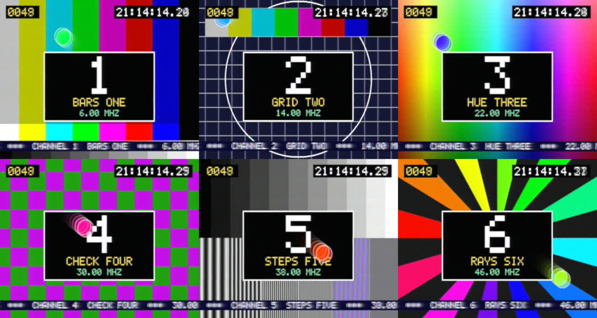

# Rabbit Ears — a multi-channel PAL "broadcast band" in pure maths, and a tuner for it

Design for the `rabbit-ears` tool (2026-09-19). Follows [`RESEARCH.md`](RESEARCH.md); decisions
confirmed with the owner: **file + live modes**, **pure C# with SIMD**, **in-process sources + network
senders**, **a new non-mod project in this repository**.

## 1. What it is

```text
source 0 ─► PAL encoder ─► CVBS 20 MS/s ─┐                       (in-process, or a `send` process over TCP)
source 1 ─► PAL encoder ─► CVBS 20 MS/s ─┤
   …                                     ├─► per channel: AM (negative) ─► VSB filter ─► ×K interpolate ─► shift to f_k
source N ─► PAL encoder ─► CVBS 20 MS/s ─┘                                   └────────── Σ ──► ONE real wideband signal
                                                                                               (file, or live ring)
wideband ─► TUNER: LO at any frequency ─► gentle low-pass ─► ÷K/2 ─► real IF, 40 MS/s, vision carrier at 8 MHz
         ─► + receiver noise ─► `palindrome render --live --input rf --carrier 8e6 --decimate 2` (native child)
         ─► RGB fields ─► browser (WebSocket → canvas), with channel buttons, a continuous tuning dial and a spectrum view
```

No pixels are ever decoded or re-encoded by the muxer: it only filters, shifts and adds sample
streams. Channel selection is genuinely done by frequency: the same wideband samples feed the
tuner whatever is being watched, and mistuning, adjacent-channel pickup and snow between channels
fall out of the maths. PALindrome's own SAW-shaped IF filter, quasi-sync detector, AFC and AGC do
the channel selectivity and demodulation, exactly as in a television.

## 2. Frequency plan (parametric)

Channel (sender) rate `Fc = 20 MS/s` real CVBS — line-locked: **1280 samples per 64 µs line**,
800,000 per frame. (16 MS/s cannot be used: PALindrome's RF front end needs ≥ ~20 MS/s at its input,
and integer ratios everywhere keep the mux exact.)

Wideband rate `Fw = K · Fc`, `K ∈ {2, 4, 6, 8}`; tuner decimation `D = K/2` → 40 MS/s IF.

| K | Fw | Nyquist | max channels N | note |
|---|---|---|---|---|
| 2 | 40 MS/s | 20 MHz | 1 | degenerate single channel |
| 4 | 80 MS/s | 40 MHz | 4 | "lite" plan |
| **6** | **120 MS/s** | 60 MHz | **6** | default |
| 8 | 160 MS/s | 80 MHz | 9 | |

System I raster: 8 MHz spacing, vision carrier `f_k = 6 MHz + 8 MHz · k`; a channel occupies
`f_k − 1.25 … f_k + 6.75 MHz` (N = 6: 4.75 … 52.75 MHz). Sound carriers (+6 MHz FM) are not
generated in v1 — the slot is left empty (future work; PALindrome notches it anyway).

Wideband sample formats: `u8` (default for files, 120 MB/s, offset 128), `s16`, and float blocks
in-process. Per-channel level in dB; mux gain normalised so the sum of N full carriers cannot clip
(`1/N` each, then per-channel attenuation), with TPDF dither when quantising to u8.

## 3. Maths

**Modulator (per channel, at Fc).** CVBS volts `v` (tip −0.3, blanking 0, white +0.7) → envelope
`e = 0.76 − 0.8·v` (negative modulation: tip 1.0, white 0.20, never below ~0.05). Complex baseband
with the vision carrier at 0 Hz: `c = VSB{e}` where VSB is a complex-tap FIR (real input): pass
`−0.75 … +5.5 MHz`, −20 dB by −1.25 MHz is the target, stop by ≈ −2.2 and +6.75 MHz. ~64 taps,
Kaiser; taps designed at start-up (windowed frequency-shifted low-pass). DC (the carrier) passes.

**Interpolate + place (per channel, at Fw).** Pre-shift `c` by −2.75 MHz at Fc so the 8 MHz slot is
centred on 0; polyphase ×K interpolation with a real prototype low-pass (pass 4.3 MHz, stop
`Fc − 4.3`: wide transition, ≈ 4–6 taps per phase); multiply by `exp(j2π(f_k + 2.75 MHz) m / Fw)`
(all LO frequencies are multiples of 0.25 MHz → short periodic LO tables); take the real part; add.
Implementation may fold the LO into per-phase complex taps.

**Tuner.** Goal: the tuned vision carrier lands at **8.0 MHz in a real 40 MS/s IF** (slot at
6.75 … 14.75 MHz, centre 10.75 MHz). `z[m] = w[m]·exp(−j2π(f_tune − 8 MHz)m/Fw)`; filter `z` with a
one-sided complex band-pass `h[j]·exp(j2π·10.75 MHz·j/Fw)`, decimate by `D`, output the real part.
Fold the LO into the taps so the filter runs on the real input at the *output* rate:
`out[i] = Re{ exp(−jθ·D·i) · Σ_j g[j]·w[D·i − j] }`, `g[j] = h[j]·exp(j(θ + φ)j)`, `θ = 2π(f_tune − 8 MHz)/Fw`,
`φ = 2π·10.75 MHz/Fw`, with the LO phase carried continuously across blocks and retunes.
`h` is a gentle real low-pass (pass ±4.5 MHz about the slot centre, stop ±14.5 MHz, ≈ 16–24 taps):
aliases can only land outside the slot, and *adjacent channels are deliberately left in* for
PALindrome's SAW filter to reject. Retuning recomputes `g` (tens of taps): instantaneous, continuous,
no decoder restart. Receiver noise (Gaussian, dB below carrier) and an "aerial" attenuator are added
here — *before* the IF filter and AGC — so weak signals degrade into snow gracefully (unlike the
composite-input cliff measured in RESEARCH §8.3).

**Decoder.** `palindrome render --live --input rf --sample-rate 40000000 --sample-format s16
--carrier 8000000 --decimate 2 --frame-fd 1 --frame-stride 2 --colour …`; frames are read from the
child's stdout (.NET cannot pass extra fds; live mode prints nothing else on stdout until exit).
Contrast/saturation/burst gate for a standard-level RF source at 20 MS/s post-decimation must be
calibrated with the bars card (start from contrast 1.0, saturation 0.2, default burst gate 0.11–0.14,
`--h-shift` as measured).

## 4. Sender stream contract (TCP, little-endian)

```text
client → server, once:   "RBE1" | u8 version=1 | u8 format (0 = cvbs_u8, 1 = cvbs_s16) | u16 reserved
                         | u32 sample_rate (20000000) | i32 requested_slot (−1 = any) | u8 name_len | name (UTF-8)
server → client, once:   "RBE1" | u8 status (0 ok, else error) | i32 assigned_slot
client → server, stream: blocks: u32 sample_count | u64 first_sample_index | samples
```

CVBS scaling: volts = (u8 − 77) / 255 · 1.4 … i.e. u8 77 = −0.3 V tip region; precisely
`u8 = round((v + 0.42) · 182)`, `s16 = round(v · 24000)`. The server paces nothing: it consumes each
sender's FIFO at the mux clock; an empty FIFO transmits an unmodulated-black "no programme" carrier
(sync only) or, if the slot was never claimed, no carrier at all. Senders pace themselves to real time
and stay ≤ 250 ms ahead. 20 MB/s per u8 sender.

## 5. Project layout

```text
rabbit-ears/                      console tool, net10.0, no KSA references, not part of the mod
  rabbit-ears.csproj              RequiresKSAAssemblies=false, AllowUnsafeBlocks, no NuGet dependencies
  README.md
  Dsp/        Fir design (Kaiser), polyphase interpolator, Nco, Fft (radix-2), SIMD dot products, Rng
  Pal/        PalTiming (1280/line), PalEncoder (RGB frame → CVBS block, streaming), TestCards (procedural, bitmap font)
  Rf/         ChannelPlan, VsbModulator, WidebandMux, Tuner, WidebandFile (+ .json sidecar)
  Sources/    IFrameSource: CardSource, FfmpegSource (file | lavfi | camera | image)
  Net/        SenderClient, SenderServer (contract above)
  Tv/         PalindromeProcess (child, stdin s16 → stdout RGB), knob table
  Web/        HttpListener server: page, /ws/video (binary frames → canvas), /api/*, spectrum JSON
  Commands/   plan | mux | play | live | send | tune (file → IF file) | bench
rabbit-ears.tests/                console Exe like the other *.tests: DSP invariants, no PALindrome needed
```

Threading (live): one worker per channel produces its wideband contribution per block (block =
multiple of a line, ~8 ms); a mixer sums; the tuner and the PALindrome feeder run on their own
threads; bounded queues with back-pressure; the mux clock is the single time base. Everything SIMD
via `System.Numerics.Vector<float>` / `Vector128/256`. `bench` prints MS/s per stage so the channel
count can be chosen per machine (`--channels`, `--k`).

## 6. Acceptance

1. `rabbit-ears.tests`: spectrum of a 2-channel mux shows carriers at f_k with the vestige ≥ 20 dB down
   at −1.25 MHz and nothing above +6.75 MHz stronger than −40 dB; tuner → simple envelope detector
   recovers the transmitted sync structure (line period 1280·2 samples at 40 MS/s) for every slot;
   block-size invariance of encoder, modulator, mux and tuner; u8 file round-trip.
2. With a PALindrome CLI available: `mux` 6 different cards → file; `tune` each slot → PALindrome PNG
   shows the right card in colour; a tuning sweep between channels shows snow/no lock.
3. `live`: web page shows the tuned channel, channel buttons and dial retune instantly, spectrum view
   shows N carriers and the tuner marker; stats report real-time factors. `send` from a second process
   appears on its slot.
4. `dotnet build` of the whole solution stays at 0 warnings / 0 errors; nothing is deployed to the mod.

## 7. As built (phase 1, verified 2026-09-19)



*One 120 MS/s u8 file; six `tune` runs at 6/14/22/30/38/46 MHz; PALindrome's RF path decodes each.*

Changes against §3, all from measurement:

| Item | Design | Built | Why |
|---|---|---|---|
| VSB filter | ~64 taps | **96 complex taps**, 0.62 MHz transition | −21.2 dB at −1.25 MHz *and* flat to ±0.75 MHz (PALindrome's Nyquist flank needs the flat part); −56 dB by −1.75 MHz, −62 dB by +6.75 MHz |
| Placement | pre-shift + high-rate LO | period-10 rotation at the low rate + fixed complex polyphase taps | same maths, no LO at Fw |
| Interpolator | 4–6 taps/phase | **8 taps/phase** | carrier images at ≈ −77 dBc |
| Tuner filter | 16–24 taps | **6·K taps** (36 at K = 6) | 24 taps gave only ~37 dB alias rejection; now −47 dB at the stop edge |
| Tuner LO | per-sample sin/cos | 64-bit NCO + interpolated sine table | fast, drift-free, block-invariant |
| Levels | — | a 0 dB carrier leaves the tuner at 0.25 full scale; envelope clamped to [0.05, 1.05] | headroom for the neighbours that are deliberately left in, plus noise |

Calibrated decoder flags (720×576, 20 MS/s after `--decimate 2`): `--contrast 1.07 --saturation 0.205
--h-shift 0.012 --v-shift 0.008`, default burst gate. Bars read white 255, 75 % grey 191.

Measured on an M4 Pro (C#, `Vector128` + FMA, other work running): one channel ≈ 0.4 core; **six
channels at 120 MS/s = 2.0× real time on 6 threads** (≈ 2.4 cores); tuner ≈ 0.23 core; u8
quantise + TPDF dither ≈ 0.07 core; offline `mux` incl. card rendering and file write 1.5× real time.
With u8 and six carriers each carrier is only ≈ ±21 LSB, yet pictures are clean (dither; ≈ 41 dB C/N).

Reception behaviour (PALindrome's, not ours): AFC catches ±300 kHz — inside that the picture is
perfect, at the edge it tears and drops colour, beyond it nothing locks; halfway between two
channels it locks to a neighbour with coloured beat stripes; snow appears only when receiver noise
is on. With receiver noise the default sync slice is too shallow (lock fails at 30 dB C/N);
`--slice-depth 0.2` holds lock with light snow at 30 dB and heavy snow with colour at 25 dB, and
the cliff is ≈ 20 dB — far more graceful than the composite input (RESEARCH §8.3).
§6.1's leakage criterion is judged as noise-like energy ≤ −40 dB relative to the sideband level;
discrete carrier images are judged in dBc (limit −70, measured −77).

## 8. As built (phase 2: `live`, `play`, `send`, web UI — verified 2026-09-19)


Added folders: `Live/` (LivePipeline = mux-clock thread → bounded queue → tuner thread → decoder
sink; MuxProducer marshals channel add/remove/level between `WidebandMux.Process` calls;
FileProducer; SpectrumMonitor; stats), `Net/` (CvbsStreamCodec, SenderProtocol, SenderSlot,
SenderServer, SenderClient), `Tv/` (PalindromeLocator, PalindromeProcess, Television with seamless
swap and refuse-and-revert, DecoderCommandLine, knob tables + looks), `Web/` (HttpListener on
127.0.0.1, `/ws/video`, `/api/*`, embedded `page.html`).

Sender contract details settled in code: status codes 0–5 (3 = slot in use, 4 = no free slot);
`sample_count ≤ 4,000,000`; `first_sample_index` is contiguous from encoder start and
`index mod 3,200,000` (the 8-field PAL sequence at 20 MS/s) defines the PAL phase; per-slot FIFO
500 ms; an empty FIFO switches to a locally generated **black picture with sync and burst** (burst
keeps the set's colour locked across a dropout) and the programme resumes after 50 ms of prefill on
the 8-field boundary, so sync, V-switch and subcarrier are continuous both ways; a claimed slot
keeps its carrier and can be re-claimed; 5 s of silence drops a sender; the listener binds to
loopback unless told otherwise. `live` fixes the reference amplitude at 1/(plan maximum channels)
so levels do not jump as senders come and go (`mux` uses 1/N).

Measured live, M4 Pro, Release, K = 6, six cards, 720×576 colour at 25 frames/s: mux 3.4–3.5 ms per
8 ms block (≈ 2.3× real time), tuner ≈ 2 ms per block, clock rate 1.000 with no resyncs over 750
consecutive frames; the tool uses 2.5–3.3 cores, the PALindrome child 1.0–1.5; a `send` process
≈ 0.1 core. Default receiver noise is 38 dB below carrier: clean on a channel, snow between them.

Open: AFC/lock state cannot be shown (the decoder CLI does not report it); `camera:` untested; no
sound carrier; the `play` loop seam is a real discontinuity; the viewer needs the PALindrome CLI,
which does not build on Windows yet (the mux, tuner, sender and file commands do not need it).
