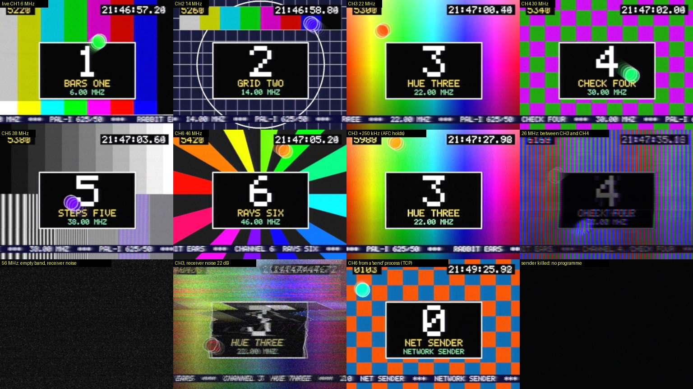

# rabbit-ears

A multi-channel PAL "broadcast band" in pure maths, a tuner for it, and a television to watch it on. **Not a KSA mod**: a
stand-alone console tool (`RabbitEars`, net10.0, no KSA references, no NuGet dependencies, never deployed to the mod folder).
Design: [`plans/palindrome-crt/RF_MUX_DESIGN.md`](../plans/palindrome-crt/RF_MUX_DESIGN.md).

N independent PAL composite signals are frequency-division-multiplexed into **one real wideband sample stream**
using only filtering, frequency shifting and addition. A software tuner then selects a channel *by frequency* and
hands a real 40 MS/s IF (vision carrier at 8 MHz) to the native PALindrome television decoder, whose own RF front
end does the IF filtering, detection, AFC and AGC. Mistuning, adjacent-channel pickup and snow fall out of the maths.

```text
RGB frames -> PalEncoder -> CVBS 20 MS/s -> VsbModulator (negative AM + VSB) -> SlotPlacer (x K, onto f_k) -+
   (in this process, or in a `send` process over TCP)                   ... one per channel, in parallel ... +-> sum = wideband, K x 20 MS/s
wideband -> Tuner (any frequency -> 40 MS/s real IF, carrier at 8 MHz, + receiver noise) -> palindrome render --live --input rf
         -> raw RGB fields -> WebSocket -> <canvas> in a TV bezel, with channel buttons, a tuning dial and a spectrum view
```



## Quick start

```sh
rabbit-ears/demo.sh                                   # builds what is missing, runs six cards, opens http://127.0.0.1:8090/
rabbit-ears/demo.sh --video ~/a.mp4 --video ~/b.mkv   # videos take CH1, CH2, ...; cards fill the rest (needs ffmpeg)
```

`demo.sh` builds the PALindrome CLI with `plans/palindrome-crt/prototype/native/build_cli.sh` when it is missing, builds
this project with `-c Release`, and runs `live`. Other arguments (`--port`, `--no-browser`, `--k`, ...) are passed on.

## The maths in brief

- **Encoder** (`Pal/`): PAL-I 625/50 on a line-locked 20 MS/s grid (1280 samples per line): sync, equalising and broad
  pulses, burst at +/-135 deg with the V switch, `0.7 (Y + U sin wt +/- V cos wt)`, one unbroken subcarrier from sample 0.
- **Modulator**: envelope `e = 0.76 - 0.8 v` (negative modulation), then a complex-tap VSB filter: upper sideband whole,
  lower vestige 0.75 MHz, carrier at 0 Hz.
- **Placement**: polyphase x K interpolation and a shift onto `f_k = 6 MHz + 8 MHz x slot`; the real parts of all channels
  are added. Reference carrier amplitude is `1 / (slots in the plan)`, so every carrier in phase still cannot clip.
- **Tuner**: `out[i] = Re{ e^{-j theta D i} sum_j g[j] w[D i - j] }`: the LO is folded into one-sided complex taps so the
  filter runs at the 40 MS/s output rate; the LO phase runs on through retunes (no clicks, no decoder restart). The filter
  is deliberately gentle: adjacent channels stay in for the television's own SAW-shaped IF filter to reject. Receiver
  noise is added *after* the aerial attenuator, so weak signals sink into snow.
- **Television**: `palindrome render --live --input rf --carrier 8000000 --decimate 2` as a child process: s16 IF in on
  stdin, raw RGB frames out on stdout.

## Commands

```text
RabbitEars plan  [--k 2|4|6|8]
RabbitEars mux   --channel <source> [--channel <source> ...] --out <file> [--seconds 4] [--k 6] [--format u8|s16]
                 [--slots 0,1,..] [--levels dB,dB,..] [--block-lines 125] [--threads n] [--no-dither]
RabbitEars tune  --in <wideband file> (--slot n | --freq MHz) --out <stem> [--sweep-to MHz] [--noise-db dB]
                 [--atten-db dB] [--start s] [--seconds s]
RabbitEars bench [--k 6] [--channels n] [--seconds 2] [--threads n]
RabbitEars live  [--channel <source> ...] [--k 6] [--levels dB,dB,..] [--listen [addr:]9000|off] [--port 8090]
                 [--palindrome path] [--threads n] [--no-browser]
RabbitEars play  <wideband file> [--port 8090] [--palindrome path] [--no-browser]
RabbitEars send  --source <source> --to host:port [--slot n] [--format u8|s16] [--name text] [--lead-ms 150]

source = card:<bars|grid|hue|checker|steps|rays>[:name] | video:<path> | image:<path> | lavfi:<spec> | camera:<n>
```

- `live`: real-time mux of in-process sources plus network senders, tuner, decoder and web page. Without `--channel` it
  runs one card per slot (six at most). Channel *i* goes on slot *i*; slots left over are free for senders (with the
  default six cards at `--k 6` the band is full: start fewer channels, or use `--k 8` for nine slots). Senders are
  accepted on `--listen` (loopback unless an address is given, e.g. `0.0.0.0:9000`).
- `play`: the same tuner / decoder / page, fed from a wideband file made by `mux`, looped and paced to real time. K, the
  sample format and the channel list come from the `<file>.json` sidecar; the loop seam is a real discontinuity.
- `send`: encodes one source to PAL *in the sender process* and streams the CVBS to a `live` server. It paces itself
  to real time and stays `--lead-ms` ahead (at most 250). `--slot` is 0-based; default is any free slot.
- `mux` writes raw samples plus a JSON sidecar `<file>.json` (format, rate, K, reference carrier amplitude, channels).
  `video` / `image` / `lavfi` / `camera` sources run `ffmpeg` (PATH, else `/opt/homebrew/bin/ffmpeg`, override with
  `RABBIT_EARS_FFMPEG`). In live use they free-run in real time (`-re`) and the encoder takes the newest frame.
- `tune` writes a SigMF pair `<stem>.sigmf-data` (real int16 LE, 40 MS/s) + `<stem>.sigmf-meta`. The stem must not contain a dot.
  `--noise-db X` adds Gaussian receiver noise whose rms, over the full 20 MHz IF, is X dB below a 0 dB channel's sync-tip
  carrier amplitude; `--atten-db` attenuates the signal but not the noise; `--sweep-to` retunes linearly across the file.
- The decoder is found via `--palindrome`, then `$PALINDROME_BIN`, then
  `plans/palindrome-crt/prototype/native/.work/bin/palindrome` (searched upwards from the executable and from the
  working directory), then `PATH`. Calibration for this signal on a 720x576 raster:
  `--colour --contrast 1.07 --saturation 0.205 --h-shift 0.012 --v-shift 0.008 --slice-depth 0.2` (default burst gate
  0.11-0.14; contrast is multiplied by `(w h / (720 x 576))^(1/gamma)` for smaller rasters).

## Band plan

Channel rate 20 MS/s (1280 samples per 64 us line). Wideband rate `K x 20 MS/s`, `K` in {2, 4, 6, 8} -> 1, 4, 6, 9
channels. System I raster: vision carrier `f_k = 6 MHz + 8 MHz x slot`, slot = `f_k - 1.25 ... f_k + 6.75 MHz`.
No sound carriers yet. `mux` uses a reference carrier amplitude of `1/N` for its N channels; `live` uses `1/(slots in
the plan)` so that a sender joining later changes nobody's level.

## Sender stream contract (TCP, little-endian)

```text
client -> server, once:   "RBE1" | u8 version=1 | u8 format (0 = cvbs_u8, 1 = cvbs_s16) | u16 reserved
                          | u32 sample_rate (20000000) | i32 requested_slot (-1 = any) | u8 name_len | name (UTF-8)
server -> client, once:   "RBE1" | u8 status | i32 assigned_slot
client -> server, stream: blocks: u32 sample_count (<= 4000000) | u64 first_sample_index | samples
status: 0 ok | 1 bad handshake | 2 unsupported format / rate | 3 slot in use | 4 no free slot | 5 slot out of range
```

- Samples are composite video in volts: `u8 = round((v + 0.42) x 182)`, `s16 = round(v x 24000)` (sync tip -0.3 V,
  blanking 0, white +0.7). 20 MB/s per u8 sender, 40 MB/s per s16 sender.
- `first_sample_index` counts samples since the sender's encoder started, without gaps; sample 0 starts line 1 of a
  frame at subcarrier phase 0, so `index mod 3,200,000` (4 frames = the 8-field PAL sequence) fixes sync, V switch and
  subcarrier phase. A jump in the index discards what the server still had queued.
- The server paces nothing. Each claimed slot has a 500 ms FIFO that the mux drains at its own clock; when it is full
  the sender's TCP writes block. An empty FIFO switches the slot to a locally generated **no programme** signal (black
  picture with sync and burst) that continues from the exact stream position, and the programme resumes only when at
  least 50 ms is queued *and* its next sample falls on the same point of the 8-field sequence (at most 160 ms later),
  so the television never sees a sync or colour-phase jump. A slot that was never claimed transmits no carrier at all;
  once claimed it keeps its carrier after the sender leaves, and another sender may claim it again.
- A slot occupied by an in-process channel or by a connected sender is refused (status 3 / 4). A sender that sends
  nothing for 5 s is dropped.

## Web UI and HTTP API

`System.Net.HttpListener` on **127.0.0.1 only**; the page is an embedded resource (`Web/page.html`).

- The picture: `/ws/video` pushes one binary WebSocket message per decoded frame: `u32 width | u32 height | u32 channels
  (3 = RGB, 1 = grey) | u32 sequence`, then the raw pixels; the page draws it on a 4:3 `<canvas>` inside a TV bezel.
  A slow viewer skips frames. 25 frames/s by default (every second field), 50 with the *Readout* knob.
- Tuning: channel buttons, a continuous dial over 0 ... Fw/2, +/- 50 kHz / 250 kHz / 1 MHz buttons, arrow keys
  (left / right fine tune, shift = 500 kHz, alt = 10 kHz, up / down = channel), and a live spectrum with slot shading
  and the receiver's 8 MHz passband; click the spectrum to tune there, double-click to snap to the nearest channel.
- Receiver: aerial attenuator and receiver noise (dB below carrier, or off). Channels: transmitter level and, for
  in-process channels, the transmitted-signal impairments (`PalSignalParams`). The set: PALindrome's knobs in collapsible
  groups with tooltips (orange = moved), looks, power cycle, reset, and the *seamless* switch: a knob change starts a
  second decoder beside the first, feeds both, and swaps after 30 fields; with seamless off you watch the set re-lock.
  A decoder that dies before its first picture (a rejected knob combination) is reported and the last good settings return.
- Stats: mux and tuner real-time factors (block time / busy time), the mux clock (signal seconds per wall second), lateness,
  clock resyncs with the signal time lost (the machine not keeping up is reported, never hidden), fields/s, decoder CPU
  (via `ps`), this process's CPU, queue depths, sender FIFO depths and underruns. AFC state is not reported by the decoder.

| Endpoint (GET) | Parameters | Answer |
|---|---|---|
| `/api/state` | | plan, channels (name, slot, carrier, level, source, signal params, sender status), tuner, stats, decoder message, set values |
| `/api/knobs` | | the SET knob table, looks and per-channel signal knob table (labels, ranges, tooltips) |
| `/api/tune` | `freq=<MHz>` or `slot=<n>` | tuner state |
| `/api/rx` | `noise_db=<dB>\|off`, `atten_db=<dB>` | tuner state |
| `/api/channel` | `slot=<n>`, `level_db=`, `pedestal= chroma_gain= chroma_phase= burst_gain= level= noise= ghost= ghost_us= hum=` | that channel |
| `/api/set` | `<knob>=<value>...`, `seamless=0\|1` | set values |
| `/api/look` | `name=<look>\|__reset__`, `seamless=0\|1` | set values |
| `/api/power` | | set values (decoder restarted, not seamless) |
| `/api/spectrum` | | JSON array of 1025 dB values over 0 ... Fw/2 (Welch, refreshed 5 times a second) |
| `/api/frame` | | the newest frame, same bytes as one `/ws/video` message |

Bad parameters answer 400 with `{"error": ...}`.

## Performance (Apple M4 Pro, 10P + 4E cores, Release)

| Live, K = 6, six cards, 720x576 colour, 25 frames/s, one WebSocket viewer | |
|---|---|
| mux (6 channels, `Parallel.For`) | 3.4-4.9 ms per 8 ms block = **1.6-2.4 x real time**, depending on what else the machine does |
| tuner incl. receiver noise and s16 conversion | 2.0 ms per block = 4 x real time, one thread |
| RabbitEars process | 2.5-3.3 cores |
| `palindrome` decoder | 1.0-1.5 cores (0.9 at 360x288 mono, 2.0 with the *Tired old set* look) |
| mux clock | 1.000, 0 ms late, 0 resyncs; 750 of 750 frames delivered to the viewer in 29.9 s |
| K = 8 (160 MS/s), six cards + one s16 network sender | mux 1.6 x real time |
| `send` process (card source) | 0.1 core; its encoder runs at 10 x real time |

## Code layout

| Folder | Contents |
|---|---|
| `Dsp/` | `FirDesign` (Kaiser low-pass, complex modulation, response), `Kernels` (Vector128 FIR / dot products, bit-exact scalar tails), `ComplexFir`, `PolyphaseUpconverter`, `Fft` (+ Welch spectrum), `Nco`, `TableNoise` (Gaussian / TPDF), `FastRng` |
| `Pal/` | `PalTiming`, `PalLinePlan` (sync templates, burst gate), `PalEncoder` (streaming RGB -> CVBS, `ICvbsSource`, `Seek`), `FrameSampler`, `PalImpairments` + `PalSignalParams`, `Canvas`, `BitmapFont`, `TestCards` |
| `Rf/` | `ChannelPlan`, `VsbModulator`, `SlotPlacer`, `WidebandMux` / `MuxChannel`, `Tuner`, `SampleCodec`, `WidebandFile` (writer, reader, sidecar), `SigMfWriter` |
| `Sources/` | `IFrameSource`, `CardSource`, `FfmpegSource`, `SourceFactory` |
| `Net/` | `CvbsStreamCodec` (u8 / s16 scaling), `SenderProtocol` (handshake, block header), `SenderSlot` (FIFO + no-programme fallback, an `ICvbsSource`), `SenderServer`, `SenderClient` |
| `Tv/` | `PalindromeLocator`, `PalindromeProcess` (child: stdin queue, frame reader, stderr tail, retire / kill), `Television` (seamless swap, failure revert), `DecoderCommandLine`, `Knob`, `SetKnobs` (+ looks), `SignalKnobs`, `FrameHub` |
| `Live/` | `LivePipeline` (mux clock thread -> bounded queue -> tuner thread -> IF sink), `PipelineStats`, `MuxProducer` (channel changes marshalled between blocks), `FileProducer`, `SpectrumMonitor`, `LiveSession`, `ProcessCpu` |
| `Web/` | `WebServer` (HttpListener, WebSocket video), `LiveApi`, `StateReport`, `page.html` |
| `Commands/` | `plan`, `mux`, `tune`, `bench`, `live`, `play`, `send`, `LiveHost` (+ `ShutdownSignals`), `Args` |

Every streaming stage is block-size invariant (encoder, modulator, placer, mux and tuner are bit-identical for any
block partitioning) and phase-continuous. `Optimize` is on in every configuration because the DSP is unusable unoptimised.
Live threads: one mux clock (paces blocks of 125 lines = 8 ms against the wall clock and fans the channels out with
`Parallel.For`), one tuner, and per decoder a stdin writer, a frame reader and a stderr reader; buffers come from fixed
pools, so a slow stage holds the previous one back. Ctrl-C, SIGTERM and SIGHUP stop everything and kill the children.

## Limitations

- **PALindrome is a separate project with no license yet. It is not bundled, and none of its code or text is in this
  repository.** The viewer (`live`, `play`) needs its CLI, built from your own checkout by
  `plans/palindrome-crt/prototype/native/build_cli.sh`; that build works on macOS and Linux but **not on Windows yet**.
  `plan`, `mux`, `tune`, `bench` and `send` need no decoder.
- No sound carrier: the +6 MHz slot of every channel is empty.
- The decoder's knobs are fixed at start-up, so every SET change costs a new decoder process (hidden by the seamless swap).
  The decoder does not report AFC or lock state; the page cannot show them.
- The mux needs about as many free cores as channels; on a loaded machine watch the stats line.
- `camera:` sources are untested (macOS asks for camera permission). The web server has no authentication: it binds
  to loopback only, and the sender port does too unless `--listen` names another address (senders are not authenticated).

## Build and test

```sh
dotnet build rabbit-ears/rabbit-ears.csproj
dotnet run --project rabbit-ears.tests        # exit code 0 = all checks passed; needs no PALindrome
```
